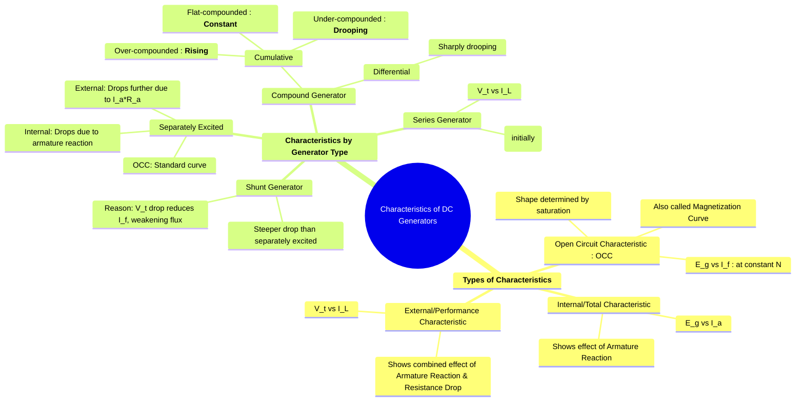

---
tags:
  - electrical-machines
  - dc-generators
  - machine-characteristics
  - performance-curves
created: 2025-09-16
aliases:
  - DC Generator Characteristics
  - Performance Curves of DC Generators
subject: "[[Electrical Machines]]"
parent:
  - DC Generators
modified: 2026-07-23T20:40:29
---
## Characteristics of DC Generators
#dc-generators #machine-characteristics

> The performance of a DC generator is described by its **characteristic curves**, which are graphs showing the relationships between key quantities like generated EMF ($E_g$), terminal voltage ($V_t$), field current ($I_f$), and load current ($I_L$). These curves are essential for understanding a generator's behavior under different operating conditions.

---
#### The Three Main Characteristics
#characteristics/dc-generators #occ 

1.  **Open Circuit Characteristic (O.C.C.) / Magnetization Curve**
    *   **Definition**: A plot of the no-load generated EMF ($E_g$) versus the field current ($I_f$) at a constant speed ($N$).
    *   **Significance**: It shows the magnetic properties of the machine. The curve is essentially a B-H curve for the machine's magnetic circuit. It does not start from the origin due to **residual magnetism**, and it flattens at the top due to **magnetic saturation**. This curve is the same for both shunt and separately excited generators.

2.  **Internal (or Total) Characteristic**
    *   **Definition**: A plot of the generated EMF *on load* ($E_g$) versus the armature current ($I_a$).
    *   **Significance**: It illustrates the effect of **[[Armature Reaction|armature reaction]]**. As the armature current increases, the demagnetizing effect of armature reaction weakens the main flux, causing the generated EMF to decrease.

3.  **External (or Performance) Characteristic**
    *   **Definition**: A plot of the terminal voltage ($V_t$) versus the load current ($I_L$).
    *   **Significance**: This is the most important characteristic as it shows how the generator's terminal voltage changes with the load. The drop in voltage from the internal characteristic is due to the ohmic drop in the armature circuit ($I_a R_a$).
    $$ V_t = E_g - I_a R_a $$

---
#### Characteristics of Different Generator Types
#characteristics/dc-generators

##### Separately Excited Generator
#separately-excited-generator 

1.  **O.C.C.**: The standard magnetization curve.
2.  **Internal Characteristic**: This curve lies below the O.C.C. The drop in $E_g$ is purely due to the demagnetizing effect of armature reaction.
3.  **External Characteristic**: This curve lies below the internal characteristic. The additional drop is due to the voltage drop across the armature resistance ($I_a R_a$).
    *   Drop = (Armature Reaction Demagnetization) + ($I_a R_a$ drop)

##### Shunt Generator
#shunt-generator 

The external characteristic of a shunt generator drops more steeply than that of a separately excited generator. This is due to a compounding effect:
1.  As load current ($I_L$) increases, the armature current ($I_a = I_L + I_{sh}$) also increases.
2.  This causes the terminal voltage ($V_t = E_g - I_a R_a$) to drop due to armature reaction and resistance drop.
3.  Since the shunt field is connected across the terminals, the field current ($I_{sh} = V_t / R_{sh}$) also decreases.
4.  This reduction in field current weakens the main flux ($\phi$), causing a further reduction in the generated EMF ($E_g$). This cycle amplifies the voltage drop.

##### Series Generator
#series-generator 

In a series generator, the flux itself is a function of the load current since the field winding is in series with the armature ($I_{se} = I_a = I_L$).
*   The external characteristic ($V_t$ vs $I_L$) initially rises as the load current increases, because both the flux and generated EMF increase.
*   After reaching a maximum value, the voltage begins to drop due to the effects of magnetic saturation, increasing armature reaction, and large voltage drops ($I_a(R_a + R_{se})$) at high currents. This gives it a distinct **rising characteristic**.

##### Compound Generator
#compound-generator 

The shape of the external characteristic depends on the degree of compounding (the strength of the series field).
*   **Cumulative Compound**: The series field aids the shunt field.
    *   **Over-compounded**: The series field is strong, causing the terminal voltage to rise as the load increases.
    *   **Flat (or Level) Compounded**: The series field is designed to exactly compensate for the voltage drops due to armature reaction and armature resistance. The terminal voltage remains nearly constant from no-load to full-load.
    *   **Under-compounded**: The series field is weak and does not fully compensate for the voltage drops. The terminal voltage drops slightly with load, but less than in a shunt generator.
*   **Differential Compound**: The series field opposes the shunt field. The terminal voltage drops very sharply with an increase in load.

---
### Related Concepts
#dc-generators/related-concepts

> [[Types of DC Generators]]

[[Voltage Build-up in a Shunt Generator]]
[[Armature Reaction]]
[[EMF and Torque Equations of a DC Machine]]