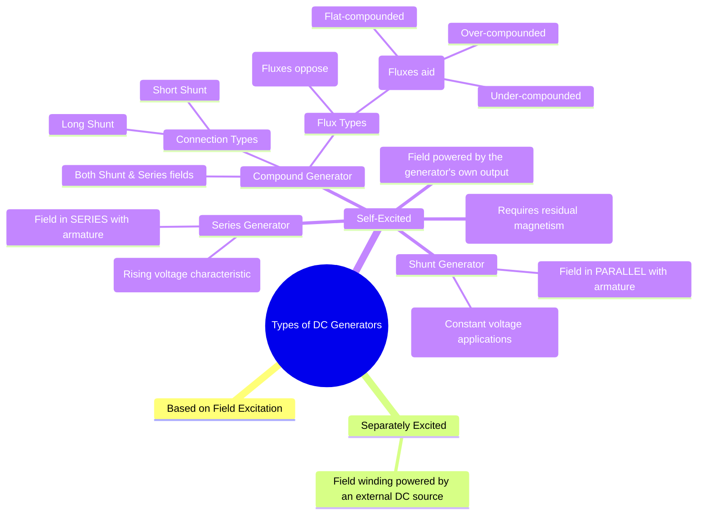

---
tags:
  - electrical-machines
  - dc-generators
  - machine-types
  - self-excitation
created: 2025-09-16
aliases:
  - DC Generator Types
  - Classification of DC Generators
subject: "[[Electrical Machines]]"
parent:
  - DC Generators
modified: 2026-07-16
---
### Types of DC Generators
#dc-generators #machine-types

> DC generators are classified based on the method used to provide excitation current to the field winding. The process of creating a magnetic field by passing current through the field winding is called **excitation**. There are two main categories: **Separately Excited** and **Self-Excited** generators.

---
#### Separately Excited DC Generator
#separately-excited-generator

In this type, the [[Constructional Features of DC Machines#Field Winding (Exciting Winding)|field winding]] is energized by an independent external DC source (e.g., a battery or a separate DC supply). There is no electrical connection between the field and armature circuits.

*   **Armature Current**: $I_a = I_L$
*   **Terminal Voltage**: The generated EMF ($E_g$) supplies the armature resistance drop and the terminal voltage ($V_t$).
    $$V_t = E_g - I_a R_a - V_{brush}$$
    (where $V_{brush}$ is the brush voltage drop, often neglected)
*   **Characteristics**: The field flux ($\phi$) is independent of the load current ($I_L$). Voltage control is flexible and wide.
*   **Applications**: Used where precise voltage control is critical, such as in Ward-Leonard systems of speed control and in laboratories for testing.

---
#### Self-Excited DC Generators
#self-excited-generator

In this type, the field winding is excited by the current supplied from the generator's own armature. These generators require **residual magnetism** in the field poles to start the [[Voltage Build-up in a Shunt Generator|voltage build-up process]]. They are further classified based on the connection of the field winding.

##### 1. Shunt Generator
#shunt-generator
The field winding is connected in parallel (or shunt) with the armature winding. The shunt field winding has many turns of thin wire, giving it a high resistance ($R_{sh}$).

*   **Currents**: $I_a = I_L + I_{sh}$
*   **Shunt Field Current**: $I_{sh} = \frac{V_t}{R_{sh}}$
*   **Terminal Voltage**: $V_t = E_g - I_a R_a$
*   **Characteristics**: Produces a nearly constant terminal voltage, although it droops slightly as the load increases.
*   **Applications**: Most common type for general-purpose power supply, battery charging, and lighting circuits.

---
##### 2. Series Generator
#series-generator

The field winding is connected in series with the armature winding. The series field winding has few turns of thick wire, giving it a very low resistance ($R_{se}$).

*   **Currents**: $I_a = I_{se} = I_L$
*   **Terminal Voltage**: $V_t = E_g - I_a(R_a + R_{se})$
*   **Characteristics**: The field flux is proportional to the load current. The terminal voltage increases as the load current increases (rising characteristic).
*   **Applications**: Rarely used for power supply. Used as DC transmission line boosters and in arc welding where a rising voltage characteristic is beneficial.

---
##### 3. Compound Generator
#compound-generator

This generator has both a shunt field winding and a series field winding. This combines the characteristics of both shunt and series generators.

###### Connection Types:
*   **Long Shunt**: The shunt field is in parallel with the series combination of the armature and the series field.
    *   $I_a = I_{se} = I_L + I_{sh}$
    *   $V_t = E_g - I_a(R_a + R_{se})$
*   **Short Shunt**: The shunt field is in parallel with the armature only. The series field is in series with the load.
    *   $I_a = I_L + I_{sh}$
    *   $V_t = E_g - I_a R_a - I_L R_{se}$

###### Flux Types (based on MMF direction):
*   **Cumulative Compound**: The series field flux ($\phi_{se}$) aids the shunt field flux ($\phi_{sh}$).
    *   **Over-compounded**: Terminal voltage rises with load.
    *   **Flat-compounded**: Terminal voltage is nearly constant from no-load to full-load.
    *   **Under-compounded**: Terminal voltage droops slightly with load (similar to a shunt generator).
    *   **Applications**: Cumulative compound generators (especially flat-compounded) are widely used for applications requiring a stable voltage supply under varying loads, such as DC power for industrial plants.
*   **Differential Compound**: The series field flux ($\phi_{se}$) opposes the shunt field flux ($\phi_{sh}$).
    *   **Characteristics**: The terminal voltage drops sharply as the load increases. This makes it unsuitable for most power applications.
    *   **Applications**: Used for special purposes like arc welding, where a large voltage drop is desirable when the arc is struck (short circuit).

---
#### Summary of Characteristics
#summary/dc-generators 

| Generator Type      | Voltage Characteristic                                     | Main Application                                       |
| ------------------- | ---------------------------------------------------------- | ------------------------------------------------------ |
| **Shunt**           | Nearly constant (slightly drooping)                        | Battery charging, lighting, general power              |
| **Series**          | Rising with load                                           | DC boosters, arc welding                               |
| **Cumulative Cmpd** | Adjustable (rising, flat, or drooping)                     | Constant voltage power supplies (e.g., factories)      |
| **Differential Cmpd**| Sharply dropping                                           | Arc welding                                            |

---
### Related Concepts
#dc-generators/related-concepts

> [[Voltage Build-up in a Shunt Generator]]

[[Characteristics of DC Generators]]
[[Armature Reaction]]
[[Principle of Operation of DC Generators]]
[[Types of DC Motors]]