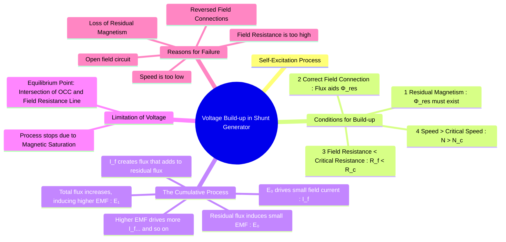

---
tags:
  - electrical-machines
  - dc-generators
  - self-excitation
  - voltage-buildup
created: 2025-09-16
aliases:
  - Shunt Generator Voltage Build-up
  - Self-Excitation Process
subject: "[[Electrical Machines]]"
parent:
  - DC Generators
modified: 2026-07-23T20:41:53
---

### Voltage Build-up in a Shunt Generator
#dc-generators #self-excitation #voltage-buildup

> The **voltage build-up** is the process by which a self-excited DC shunt generator develops its rated terminal voltage, starting from a small initial EMF generated by residual magnetism. This process is a classic example of a cumulative positive feedback action.

---

#### Conditions for Voltage Build-up
For a shunt generator to build up its voltage, four essential conditions must be met. The failure of any one of these will prevent the generator from exciting.

1.  **Presence of Residual Magnetism**: The field poles must retain some magnetism when the field current is zero. This residual flux ($\phi_{res}$) is necessary to induce the initial small EMF that starts the process.
2.  **Correct Field Winding Connection**: The shunt field winding must be connected to the armature such that the field current it produces creates a flux that *aids* the residual flux. If connected in reverse, the field flux will oppose and wipe out the residual magnetism, and the voltage will collapse to zero.
3.  **Field Circuit Resistance below Critical Resistance ($R_f < R_c$)**: For a given speed, the total resistance of the field circuit ($R_f$) must be less than a specific value called the **critical resistance**. If $R_f > R_c$, the generator will fail to excite.
4.  **Speed above Critical Speed ($N > N_c$)**: For a given field circuit resistance, the speed of the prime mover ($N$) must be greater than a specific value called the **critical speed**. If $N < N_c$, the induced EMF will be insufficient to overcome the field resistance, and the voltage will not build up.

#### The Build-up Process Explained
The voltage build-up in a shunt generator is a step-by-step cumulative process:
1.  Due to **residual magnetism**, a small initial EMF, $E_0$, is induced in the armature conductors when the generator is started ($E_0 = K \phi_{res} \omega$).
2.  This EMF, though small, is applied across the shunt field winding, driving a small field current, $I_{f1} = E_0 / R_f$.
3.  This field current produces an MMF that creates a flux, $\phi_1$, which aids the residual flux $\phi_{res}$.
4.  The total flux becomes $(\phi_{res} + \phi_1)$. This stronger flux induces a larger EMF, $E_1$.
5.  The larger EMF $E_1$ drives an even larger field current $I_{f2}$, which further increases the flux, leading to an even larger EMF $E_2$.
6.  This process continues, with the voltage and field current building on each other.

The voltage does not rise indefinitely. The build-up is limited by **magnetic saturation** of the field poles. As the field current increases, the poles begin to saturate, and a larger increase in $I_f$ produces a smaller increase in flux. The process stops when the system reaches an equilibrium point where the generated EMF is just enough to produce the field current that sustains it. This point is the intersection of the generator's **Open Circuit Characteristic (O.C.C.)** and the **Field Resistance Line**.

#### Critical Resistance ($R_c$) and Critical Speed ($N_c$)

*   **Critical Resistance ($R_c$)**: This is the maximum field circuit resistance for a given speed above which the generator will fail to excite. Graphically, it is the resistance corresponding to the slope of the tangent drawn to the O.C.C. curve from the origin. If $R_f > R_c$, the field resistance line will not intersect the O.C.C. except at the origin.
*   **Critical Speed ($N_c$)**: This is the minimum speed for a given field resistance below which the generator will not build up voltage. Since $E_g \propto N$, a lower speed results in a lower O.C.C. curve. The critical speed is the speed at which the given $R_f$ line becomes tangent to the O.C.C.

#### Reasons for Failure to Build Up Voltage
If a shunt generator fails to build up voltage, the cause is one of the following:
$$\boxed{\begin{align}
\textbf{1. Loss of Residual Magnetism:} \\ \text{Remedy: Flash the field by connecting it to an external DC source for a short time.}
\end{align}}$$
$$\boxed{\begin{align}
\textbf{2. Reversed Field Connection:} \\ \text{The field flux opposes residual flux. Remedy: Reverse the field terminals (F1, F2).}
\end{align}}$$
$$\boxed{\begin{align}
\textbf{3. Field Resistance Too High ($R_f > R_c$):} \\ \text{This could be due to an open circuit or too much external resistance.} \\ \text{Remedy: Reduce the resistance in the field rheostat.}
\end{align}}$$
$$\boxed{\begin{align}
\textbf{4. Speed Too Low ($N < N_c$):} \\ \text{Remedy: Increase the speed of the prime mover.}
\end{align}}$$

---
### Related Concepts
#voltage-buildup/related-concepts

> [[Characteristics of DC Generators]]

[[Types of DC Generators]]
[[Principle of Operation of DC Generators]]