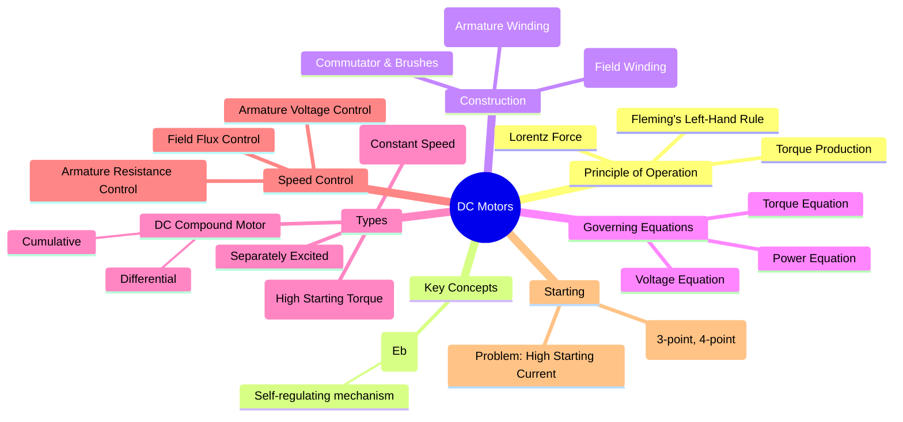

---
tags:
  - dc-machines
  - electrical-machines
  - dc-motor
  - motor-principle
created: 2025-09-08
aliases:
  - DC Motor
  - Direct Current Motor
subject:
  - "[[Electrical Machines]]"
parent:
  - DC Machines
modified: 2026-07-16
---
### DC Motors
#dc-motor #electrical-machines

> A DC motor is a rotary electrical machine that converts direct current (DC) electrical energy into mechanical energy. Its operation is based on the principle that a current-carrying conductor placed in a magnetic field experiences a mechanical force. DC motors are highly valued for their excellent speed control characteristics.

---
#### Principle of Operation
#motor-principle #lorentz-force

When the armature windings are supplied with a DC voltage, current flows through them. These current-carrying conductors are situated within the magnetic field produced by the field windings. According to the **Lorentz Force principle**, each conductor experiences a force.
$$\boxed{\quad F = BIL\sin\theta \quad}$$
The direction of this force is given by **Fleming's Left-Hand Rule**. The collective force on all the armature conductors produces a torque, causing the armature to rotate.

---
#### Back EMF ($E_b$)
#back-emf

This is the most critical concept in DC motor operation. As the armature rotates, its conductors cut the magnetic flux lines of the stator field. This induces a voltage in the armature conductors, according to Faraday's law of electromagnetic induction. By Lenz's law, this induced voltage, known as **Back EMF** or counter-EMF, opposes the main supply voltage ($V_t$).
$$\boxed{\quad E_b = \frac{\phi Z N}{60} \left( \frac{P}{A} \right) \quad \implies \quad E_b \propto \phi N \quad}$$
Where:
* $\phi$ = Flux per pole
* $Z$ = Total number of armature conductors
* $N$ = Speed in RPM
* $P$ = Number of poles
* $A$ = Number of parallel paths in the armature winding

The back EMF acts as a self-regulating mechanism. If the motor speeds up, $E_b$ increases, reducing the armature current ($I_a$), which in turn reduces torque, causing the speed to settle.

---
#### Governing Equations
#dc-motor/equations

1. **Voltage Equation**: Applying KVL to the armature circuit gives the fundamental voltage equation.
    $$\boxed{\quad V_t = E_b + I_a R_a \quad}$$
    From this, the armature current is:
    $$I_a = \frac{V_t - E_b}{R_a}$$

2. **Torque Equation**: The electromagnetic torque ($T_e$) developed by the motor is proportional to the product of flux and armature current.
    $$\boxed{\quad T_e \propto \phi I_a \quad}$$

3. **Power Equation**: Multiplying the voltage equation by $I_a$:
    $$V_t I_a = E_b I_a + I_a^2 R_a$$
    This equation represents the power balance:
    * $V_t I_a$ = Electrical power input to the armature.
    * $E_b I_a$ = **Gross mechanical power developed by the armature ($P_m$)**.
    * $I_a^2 R_a$ = Power loss in the armature (copper loss).

---
#### Types of DC Motors
#dc-motor/types

DC motors are classified based on the connection of the field winding with respect to the armature.

1. **[[DC Shunt Motor]]**: The field winding is connected in parallel (shunt) with the armature. Known as a "constant speed" motor.
2. **[[DC Series Motor]]**: The field winding is connected in series with the armature. Known for its extremely high starting torque.
3. **DC Compound Motor**: Has both a shunt and a series field winding.
    * **Cumulative Compound**: Shunt and series fields aid each other.
    * **Differential Compound**: Shunt and series fields oppose each other. (Rarely used due to instability).
4. **Separately Excited Motor**: The field winding is supplied by an independent DC source.

---
#### Starting of DC Motors
#dc-motor-starters

At the moment of starting, the speed $N=0$, which means the back EMF $E_b=0$. The armature current is given by:
$$I_{a(start)} = \frac{V_t}{R_a}$$
Since the armature resistance $R_a$ is very small, the starting current is dangerously high (10-20 times the full load current). To limit this current, a **starter** is used, which adds external resistance to the armature circuit during startup. This resistance is gradually removed as the motor builds up speed and back EMF.

---
### Related Concepts
#related-concepts

> [[DC Shunt Motor]]

[[DC Series Motor]]
[[Speed Control of DC Motors]]
[[Starters for DC Motors]]
[[EMF and Torque Equations of a DC Machine|Back EMF]]
[[Types of DC Generators]] (The counterpart machine)
