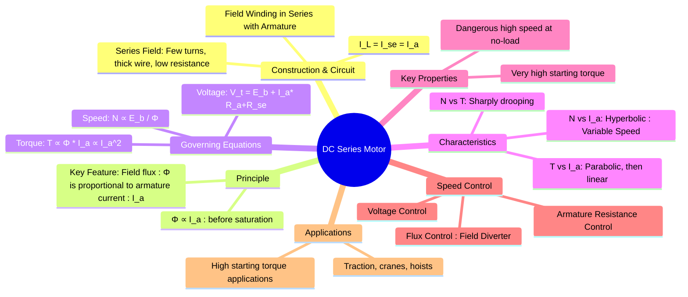

---
tags:
  - dc-machines
  - electrical-machines
  - dc-motor
  - series-motor
created: 2025-09-08
aliases:
  - Series Motor
  - DC Series Wound Motor
subject:
  - "[[Electrical Machines]]"
parent: "[[DC Motors]]"
modified: 2026-07-23T20:42:19
---
### DC Series Motor
#dc-series-motor #high-starting-torque

> ==A DC series motor is a type of DC motor where the field winding is connected in series with the armature winding.== This means the entire armature current flows through the field winding. ==This configuration gives the motor a unique set of characteristics, most notably a very high starting torque and a highly variable speed.==

> [!memory]
> ==The series field winding is designed with a few turns of thick wire to have a low resistance, as it must carry the full armature current.==

---
#### Circuit Diagram and Governing Equations
#dc-series-motor/equations

The series connection is the defining feature.

![[DC Series Motor.jpg]]

* **Current Equation**: The line current, series field current, and armature current are all identical.
    $$\boxed{\quad I_L = I_{se} = I_a \quad}$$
* **[[EMF and Torque Equations of a DC Machine#Terminal Voltage and EMF Relationship|Voltage Equation (KVL)]]**: The supply voltage ($V_t$) must overcome the back EMF ($E_b$) and the voltage drops across both the armature resistance ($R_a$) and the series field resistance ($R_{se}$).
    $$\boxed{\quad V_t = E_b + I_a (R_a + R_{se}) \quad}$$

* **Flux-Current Relation**: ==Unlike a [[DC Shunt Motor#^constant-flux|shunt motor]], the field flux ($\phi$) is not constant. It is produced by the armature current. Before the magnetic core saturates:==
    $$\boxed{\quad \phi \propto I_a \quad}$$
^flux-current-relation

* **[[EMF and Torque Equations of a DC Machine#Torque Equation|Torque Equation]]**: Torque is proportional to flux and armature current, $T \propto \phi I_a$. Substituting the flux relation:
    $$\boxed{\quad T \propto I_a^2 \quad \text{(Before saturation)}}$$
    After saturation, the flux $\phi$ becomes constant, and the torque becomes directly proportional to the armature current, $T \propto I_a$.
* **[[Speed Control of DC Motors|Speed Equation]]**: Speed is proportional to back EMF and inversely proportional to flux.
    $$\boxed{\quad N \propto \frac{E_b}{\phi} \propto \frac{V_t - I_a(R_a + R_{se})}{I_a} \quad}$$

---
#### Key Characteristics of a DC Series Motor
#dc-series-motor/characteristics

1. **Torque vs. Armature Current ($T$ vs $I_a$)**:
    * At low currents (before saturation), $T \propto I_a^2$, so the characteristic is a **parabola**. This is why the motor has extremely high torque at starting, when $I_a$ is large.
    * At high currents (after saturation), $\phi$ becomes constant, and the characteristic becomes a **straight line** ($T \propto I_a$).

2. **Speed vs. Armature Current ($N$ vs $I_a$)**:
    * From the speed equation, $N \propto 1/I_a$ (approximately). The characteristic is **hyperbolic**.
    * As the load increases, $I_a$ increases, and the speed drops sharply. It is a variable speed motor.
    * At very light loads, $I_a$ is small, and the speed becomes dangerously high.

3. **Speed vs. Torque ($N$ vs $T$)**:
    * This curve is also a **sharply drooping characteristic**. High torque is produced at low speed and vice-versa.

---
#### Danger of No-Load Operation
#dc-motor/no-load-danger

> [!memory] Warning
> A DC series motor must **never** be started without a mechanical load connected to it.

At no-load, the armature current $I_a$ is very small. Since $\phi \propto I_a$, the flux becomes extremely weak. From the speed equation $N \propto E_b/\phi$, a very small flux results in a theoretically infinite speed. In practice, the motor will accelerate to a dangerously high speed until it is destroyed by the large centrifugal forces. For this reason, series motors are directly coupled to their loads and are not used in applications where the load can be disconnected (e.g., via a belt drive that could snap).

---
#### Speed Control Methods
#speed-control/dc-series-motor

1. **Flux Control**:
    * **Field Diverter**: A variable resistor is connected in parallel with the series field winding. Some of the armature current is "diverted" away from the field, weakening the flux and increasing the speed.
    * **Tapped Field**: The field winding can be tapped at various points, allowing the number of turns to be changed. Reducing the turns weakens the flux and increases the speed.
2. **Armature Resistance Control**: A variable resistor is connected in series with the armature to reduce the voltage across it, thus decreasing the speed. This method is used for speeds below the rated speed and is inefficient.
3. **Armature Voltage Control**: Varying the terminal voltage $V_t$ applied to the motor (using a power electronic converter) provides efficient and smooth speed control.

---
#### Applications
#applications/dc-series-motors

The defining characteristic is extremely high starting torque. This makes the DC series motor ideal for applications that require moving heavy loads from rest.
* **Electric Traction**: Trains, trams, electric locomotives.
* **Cranes and Hoists**.
* **Elevators**.
* Electric Vehicles.
* Conveyors.

---
### Related Concepts
#related-concepts

> [[DC Motors]] (Parent category)

[[DC Shunt Motor]] (The "constant speed" counterpart)
[[Speed Control of DC Motors]]
[[Starters for DC Motors]]
[[Back EMF]]
