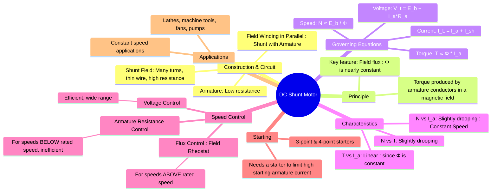

---
tags:
  - dc-machines
  - electrical-machines
  - dc-motor
  - shunt-motor
created: 2025-09-08
aliases:
  - Shunt Motor
  - DC Shunt Wound Motor
subject: "[[Electrical Machines]]"
parent: "[[DC Motors]]"
modified: 2026-07-23T20:42:28
---
### DC Shunt Motor
#dc-shunt-motor #constant-speed-motor

> ==A DC shunt motor is a type of DC motor where the field winding is connected in parallel (in shunt) with the armature winding across a common DC supply.== It is renowned for its excellent speed regulation, earning it the name =="constant speed motor"==.

> [!memory]
> ==The shunt field winding has a high resistance (many turns of fine wire) to draw only a small fraction of the total current.==

---
#### Circuit Diagram and Governing Equations
#dc-shunt-motor/equations

The parallel connection dictates the current and voltage relationships.

* **[[EMF and Torque Equations of a DC Machine#Terminal Voltage and EMF Relationship|Voltage Equation (KVL in armature circuit)]]**: The supply voltage ($V_t$) must overcome the back EMF ($E_b$) and the voltage drop across the armature resistance ($R_a$).
    $$\boxed{\quad V_t = E_b + I_a R_a \quad}$$

* **Current Equations (KCL at input)**: The line current ($I_L$) from the supply splits into the armature current ($I_a$) and the shunt field current ($I_{sh}$).
    $$\boxed{\quad I_L = I_a + I_{sh} \quad}$$
    ==Since the shunt winding is connected directly across the supply, its current is constant as long as the supply voltage is constant:==
    $$\boxed{\quad I_{sh} = \frac{V_t}{R_{sh}} \quad}$$
^constant-flux

* **[[Speed Control of DC Motors|Speed]] and [[EMF and Torque Equations of a DC Machine#EMF Equation|Back EMF]]**: Speed ($N$) is directly proportional to back EMF and inversely proportional to flux ($\phi$).
    $$\boxed{\quad N \propto \frac{E_b}{\phi} = \frac{V_t - I_a R_a}{\phi} \quad}$$
* **[[EMF and Torque Equations of a DC Machine#Torque Equation|Torque Equation]]**: The electromagnetic torque ($T$) is proportional to the product of flux and armature current.
    $$\boxed{\quad T \propto \phi I_a \quad}$$

> [!pyq]- PYQ : GATE EE 2020, 2019
> ![[ee_2020#^q28]]
> 
> ---
> ![[ee_2019#^q46]]

---
#### Key Characteristics of a DC Shunt Motor
#dc-shunt-motor/characteristics

==The behavior of the shunt motor is dominated by the fact that its **field flux ($\phi$) is [[DC Shunt Motor#^constant-flux|practically constant]]**, because $V_t$ and $R_{sh}$ are constant.==

1. **Torque vs. Armature Current ($T$ vs $I_a$)**:
    * Since flux $\phi$ is constant, the torque equation becomes $T \propto I_a$.
    * The relationship is a **straight line** passing through the origin. Torque is directly proportional to the armature current.

2. **Speed vs. Armature Current ($N$ vs $I_a$)**:
    * From the speed equation, $N \propto (V_t - I_a R_a)$. As the motor load increases, the armature current $I_a$ increases to produce more torque.
    * This causes the voltage drop $I_a R_a$ to increase, which in turn causes the back EMF $E_b$ to decrease slightly.
    * As a result, the speed **drops slightly** as the load increases. This slight drop gives the motor excellent speed regulation, making it a constant speed motor.

3. **Speed vs. Torque ($N$ vs $T$)**:
    * This characteristic combines the previous two. Since $T \propto I_a$, the shape of the N vs T curve is the same as the N vs $I_a$ curve: a **slightly drooping characteristic**.

---
#### Speed Control Methods
#speed-control/dc-shunt-motor

The speed of a DC shunt motor can be controlled very effectively.
1.  **Field Flux Control**:
    * **Method**: A variable resistor (field rheostat) is connected in series with the shunt field winding.
    * **Principle**: Increasing the rheostat resistance decreases the field current ($I_{sh}$), which weakens the flux ($\phi$). Since $N \propto 1/\phi$, **decreasing the flux increases the speed**.
    * **Range**: This method is used for speeds **above the rated (base) speed**. Weakening the flux too much can lead to instability.

2.  **Armature Resistance Control**:
    * **Method**: A variable resistor is connected in series with the armature.
    * **Principle**: Increasing the armature circuit resistance increases the voltage drop for a given $I_a$. This reduces the back EMF ($E_b$) and, consequently, the speed ($N \propto E_b$).
    * **Range**: This method is used for speeds **below the rated speed**. It is highly inefficient due to large power loss ($I_a^2 R_{rheostat}$) in the control resistor.

3.  **Armature Voltage Control**:
    * **Method**: The voltage ($V_t$) supplied to the armature is varied, while the field voltage is kept constant. This is typically achieved using a dedicated variable DC supply (e.g., Ward-Leonard system or a power electronic converter).
    * **Principle**: The speed is varied by changing $V_t$ in the speed equation. This is the most efficient and versatile method, providing smooth control over a wide range.

---
#### Starting
#dc-motor-starters

At the moment of starting, the motor is stationary ($N=0$), so the back EMF is zero ($E_b=0$). The armature current would be $I_{a(start)} = V_t / R_a$. Since $R_a$ is very small, this starting current would be dangerously high. To prevent this, a **starter** (e.g., a 3-point starter) is used to insert a high resistance in series with the armature at startup, which is gradually cut out as the motor speeds up and develops back EMF.

---
#### Applications
#applications/dc-shunt-motor 

The constant speed characteristic makes the DC shunt motor suitable for applications requiring stable speed under varying loads, such as:
* Machine tools (lathes, drills, milling machines)
* Centrifugal and reciprocating pumps
* Fans and blowers
* Conveyors

---
### Related Concepts
#related-concepts

> [[DC Motors]] (Parent category)

[[DC Series Motor]] (Provides a key contrast in characteristics)
[[Speed Control of DC Motors]]
[[Armature Reaction]]
[[Starters for DC Motors]]
[[EMF and Torque Equations of a DC Machine|Back EMF]]
