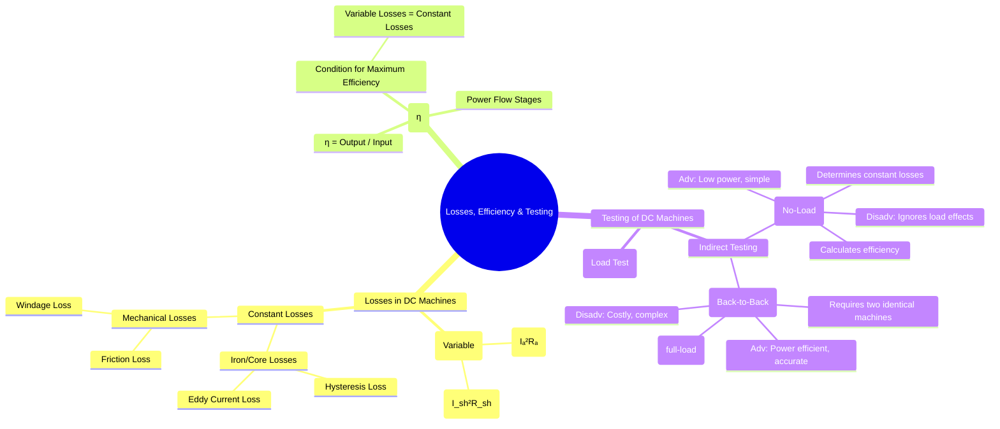

---
tags:
  - electrical-machines
  - dc-machines
  - efficiency
  - machine-testing
  - losses
  - swinburnes-test
  - hopkinsons-test
created: 2025-09-16
aliases:
  - DC Machine Losses
  - DC Machine Efficiency
  - DC Machine Testing
  - Swinburne's Test
  - Hopkinson's Test
subject: "[[Electrical Machines]]"
parent:
  - DC Machines
modified: 2026-07-23T20:42:34
---
### Losses, Efficiency, and Testing of DC Machines
#dc-machines #efficiency #losses #machine-testing

> Understanding the various power losses in a DC machine is fundamental to determining its efficiency and performance. Testing methods are employed to measure these losses and predict the machine's behavior under different load conditions without necessarily having to perform a full-load test.

---
### Losses in a DC Machine
#losses

The losses in a DC machine can be broadly classified into three categories:

#### 1. Copper Losses (or Electrical Losses)
These are variable losses that depend on the load current. They are due to the heating effect of current flowing through the windings.
*   **Armature Copper Loss**: $P_{a,cu} = I_a^2 R_a$
*   **Shunt Field Copper Loss**: $P_{sh,cu} = I_{sh}^2 R_{sh} = V I_{sh}$ (This is constant for a shunt machine).
*   **Series Field Copper Loss**: $P_{se,cu} = I_{se}^2 R_{se}$

#### 2. Iron Losses (or Core Losses)
These losses occur in the armature core due to the rotation of the core in the magnetic field. They are largely independent of the load and are considered constant if the speed and flux are constant.
*   **Hysteresis Loss ($P_h \propto B^{1.6} f$)**: Energy lost in repeatedly magnetizing and demagnetizing the armature core.
*   **Eddy Current Loss ($P_e \propto B^2 f^2 t^2$)**: Power lost due to circulating currents induced in the laminated armature core.

#### 3. Mechanical Losses
These losses are due to mechanical friction and are also considered constant if the speed is constant.
*   **Friction Loss**: Losses in bearings and brushes.
*   **Windage Loss**: Loss due to air friction of the rotating armature.

For practical analysis, losses are often grouped into two types:
*   **Constant Losses ($P_{const}$)**: Losses that are independent of the load.
    $$\boxed{\quad P_{const} = \text{Iron Losses} + \text{Mechanical Losses} + \text{Shunt Field Copper Loss} \quad}$$
*   **Variable Losses ($P_{var}$)**: Losses that vary with the load. For a shunt machine, this is primarily the armature copper loss.
    $$\boxed{\quad P_{var} = I_a^2 R_a \quad}$$

---
### Efficiency of a DC Machine
#efficiency

Efficiency ($\eta$) is the ratio of output power to input power.
$$\eta = \frac{\text{Output Power}}{\text{Input Power}} = \frac{\text{Output Power}}{\text{Output Power} + \text{Losses}} = \frac{\text{Input Power} - \text{Losses}}{\text{Input Power}}$$

#### Condition for Maximum Efficiency
The efficiency of a DC machine is maximum when the variable losses are equal to the constant losses.
Let's consider a DC shunt motor:
Input Power = $V I_L$
Losses = $P_{const} + P_{var} = P_{const} + I_a^2 R_a$
Output Power = $V I_L - (P_{const} + I_a^2 R_a)$
Efficiency $\eta = \frac{V I_L - (P_{const} + I_a^2 R_a)}{V I_L}$
For a shunt motor, $I_a = I_L - I_{sh}$. Assuming $I_L \approx I_a$, the condition for maximum efficiency is found by differentiating the efficiency with respect to the load current and setting the result to zero. This yields:
$$\boxed{\quad \text{Variable Losses} = \text{Constant Losses} \quad}$$
$$\boxed{\quad I_a^2 R_a = P_{const} \quad}$$

---
### Testing of DC Machines
#machine-testing

#### 1. Swinburne's Test (No-Load Test)
#swinburnes-test

This is an indirect method of testing applicable to DC shunt and compound machines. It is used to determine the constant losses of the machine, from which its efficiency at any load can be pre-determined.

*   **Procedure**: The machine is run as a motor at no-load, at its rated voltage and speed. The no-load line current ($I_{L0}$) and shunt field current ($I_{sh}$) are measured.
*   **Calculations**:
    1.  No-load input power: $P_{in,0} = V I_{L0}$
    2.  No-load armature current: $I_{a0} = I_{L0} - I_{sh}$
    3.  No-load armature copper loss: $P_{a,cu,0} = I_{a0}^2 R_a$ (This is very small).
    4.  The no-load input power supplies the constant losses and the no-load armature copper loss. Therefore, constant losses are:
        $$\boxed{\quad P_{const} = P_{in,0} - P_{a,cu,0} = V I_{L0} - I_{a0}^2 R_a \quad}$$
*   **Advantages**: Simple, economical (low power consumption).
*   **Disadvantages**: Does not account for changes in iron losses or commutation effects due to armature reaction under load. Temperature rise is not accounted for. Not applicable to series motors.

#### 2. Hopkinson's Test (Back-to-Back or Regenerative Test)
#hopkinsons-test

This is a full-load test that is very power-efficient because it operates on a regenerative principle.

*   **Procedure**: It requires two identical DC shunt machines mechanically coupled and electrically connected in parallel. One machine acts as a motor, driving the other as a generator. The generator's output is fed back to the motor's input. The external power supply only needs to provide the total losses of the motor-generator set.
*   **Calculations**: The total power drawn from the supply, $P_{in}$, is equal to the total losses of both machines.
    $$\text{Total Losses} = P_{in} = V \times (\text{Current from supply})$$
    By making the reasonable assumption that the losses are split equally between the two machines, the efficiency of each machine can be calculated.
*   **Advantages**:
    1.  Extremely power-efficient as power is recirculated.
    2.  Machines are tested under full-load conditions, so effects like armature reaction, commutation, and temperature rise are included.
    3.  Losses can be separated.
*   **Disadvantages**: Requires two identical machines, which may not be available. The setup is more complex.

---
### Related Concepts
#dc-machines/related-concepts

> [[EMF and Torque Equations of a DC Machine]]

[[Types of DC Motors]]
[[Characteristics of DC Motors]]
[[Types of DC Generators]]