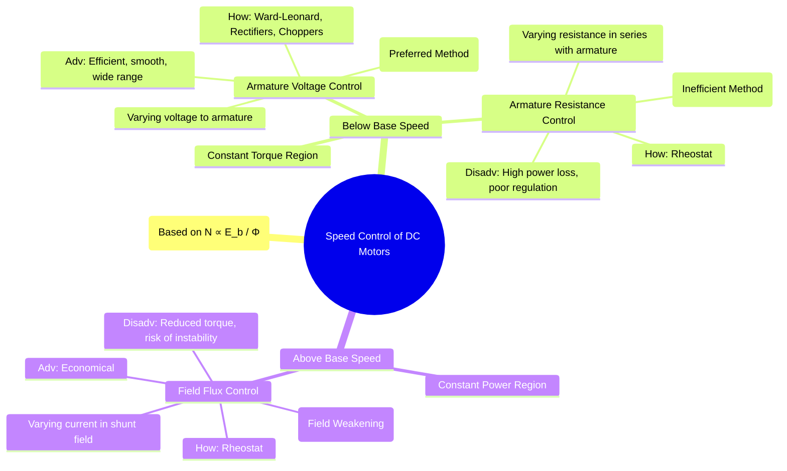

---
tags:
  - electrical-machines
  - dc-motors
  - speed-control
  - power-electronics
created: 2025-09-16
aliases:
  - DC Motor Speed Control
  - Speed Regulation of DC Motors
  - Armature Voltage Speed Control of DC Motors
  - Field Flux Speed Control of DC Motors
  - Armature Resistance Speed Control of DC Motors
subject: "[[Electrical Machines]]"
parent: "[[DC Motors]]"
modified: 2026-07-16
---
### Speed Control of DC Motors
#dc-motors #speed-control

> The speed of a DC motor can be controlled with great precision, making it suitable for a wide range of industrial applications. ==The control methods are derived from the fundamental speed equation, which is a rearrangement of the [[EMF and Torque Equations of a DC Machine#Speed Equation (Derived from EMF)|EMF Equation]].==

$$N \propto \frac{E_b}{\phi} \quad \text{and} \quad E_b = V - I_a R_a$$
Combining these gives the core relationship for speed:
$$N \propto \frac{V - I_a R_a}{\phi}$$

This equation shows that the motor speed ($N$) can be varied by changing:
1. **Field Flux ($\phi$)** - Field Flux Control
2. **Armature Circuit Resistance ($R_a$)** - Armature Resistance Control
3. **Applied Armature Voltage ($V$)** - Armature Voltage Control

> [!definition] Base Speed
> ==This is the rated speed of the motor obtained at rated voltage, rated current, and rated field flux.== Speed control is often classified as being "below base speed" or "above base speed".

> [!info]
> [[DC Shunt Motor#^constant-flux]]
> [[DC Series Motor#^flux-current-relation]]

> [!pyq]- PYQ : GATE EE 2020, 2019
> ![[ee_2020#^q28]]
> 
> ---
> ![[ee_2019#^q46]]

---
#### 1. Field Flux Control (Field Weakening)
#field-flux-control #field-weakening

This method involves changing the flux ($\phi$) by varying the current ($I_{sh}$) in the shunt field winding using a variable resistor (rheostat) in series with it. This method is applicable to shunt and compound motors.

*   **Principle**: From $N \propto 1/\phi$, decreasing the flux increases the speed, and increasing the flux decreases the speed. This method is primarily used to achieve speeds **above the base speed**.
*   **Characteristics**:
    *   This is a **constant power drive**. As speed increases (by decreasing $\phi$), the maximum allowable torque decreases ($T \propto \phi I_a$), keeping the power ($P \approx T \omega$) roughly constant.
    *   It is a highly efficient and economical method because the power lost in the field rheostat is very small (since $I_{sh}$ is small).
*   **Limitations**:
    *   Speed can only be increased, not decreased below the base speed (as flux cannot be increased beyond the value at rated voltage due to saturation).
    *   Excessive weakening of the flux can lead to poor commutation and mechanical instability.

---
#### 2. Armature Resistance Control (Rheostatic Control)
#armature-resistance-control #rheostatic-control

In this method, a variable resistor (rheostat) is connected in series with the armature circuit. This method is used to obtain speeds **below the base speed**.

*   **Principle**: From $N \propto (V - I_a (R_a + R_{ext}))$, by increasing the external resistance ($R_{ext}$), the voltage drop across it increases, which reduces the back EMF and consequently the speed.
*   **Characteristics**:
    *   This is a **constant torque drive**. For a given load torque, the motor needs to produce a constant electromagnetic torque. Since $T \propto \phi I_a$ and flux $\phi$ is constant, the armature current $I_a$ remains constant.
    *   The speed regulation is poor, meaning the speed changes significantly with load.
*   **Limitations**:
    *   **Very Inefficient**: A large amount of power, $P_{loss} = I_a^2 R_{ext}$, is wasted as heat in the external resistor. The efficiency decreases significantly as the speed is reduced. For this reason, it is generally used for short-duration speed control or in small motors.

---
#### 3. Armature Voltage Control
#armature-voltage-control

This method involves keeping the field flux constant and varying the voltage ($V$) applied to the armature circuit. It is the most common and effective method for achieving a wide range of speed control **below the base speed**.

*   **Principle**: From $N \propto V - I_a R_a$, if the $I_a R_a$ drop is neglected, the speed is directly proportional to the applied armature voltage ($N \propto V$).
*   **Implementation**:
    1.  **Ward-Leonard System**: A classic method using a dedicated motor-generator set to provide a variable DC voltage. It offers very smooth and precise control but is bulky and expensive.
    2.  **Power Electronic Converters**: The modern standard.
        *   **Controlled Rectifiers**: Convert a fixed AC supply to a variable DC voltage.
        *   **DC-DC Converters (Choppers)**: Convert a fixed DC supply to a variable DC voltage.
*   **Characteristics**:
    *   This is a **constant torque drive**. Since flux is kept at its maximum rated value, the motor can supply its rated torque at any speed from zero to base speed.
    - It provides a wide range of smooth, stable, and efficient speed control.

#### Summary of Speed Control Methods

| Feature             | Field Flux Control                | Armature Resistance Control       | Armature Voltage Control                |
| ------------------- | --------------------------------- | --------------------------------- | --------------------------------------- |
| **Speed Range**     | Above Base Speed                  | Below Base Speed                  | Below Base Speed                        |
| **Drive Type**      | Constant Power                    | Constant Torque                   | Constant Torque                         |
| **Efficiency**      | High                              | Very Low                          | High                                    |
| **Speed Regulation**| Good                              | Poor                              | Very Good                               |
| **Key Limitation**  | Reduced Torque, Stability Issues  | High Power Loss                   | Requires Variable Voltage Source        |

---
### Related Concepts
#speed-control/related-concepts

> [[Characteristics of DC Motors]]
> [[Speed Regulation]]

[[Types of DC Motors]]
[[Starting of DC Motors]]
[[EMF and Torque Equations of a DC Machine]]
[[Speed Control of Induction Motors]]