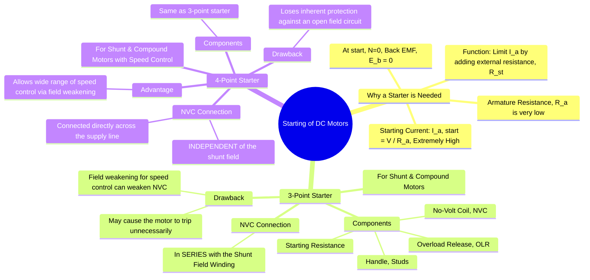

---
tags:
  - electrical-machines
  - dc-motors
  - motor-starters
  - 3-point-starter
  - 4-point-starter
created: 2025-09-16
aliases:
  - DC Motor Starter
  - Three-Point Starter
  - Four-Point Starter
  - 3-Point Starters
  - 4-Point Starters
subject: "[[Electrical Machines]]"
parent: "[[DC Motors]]"
modified: 2026-07-23T20:43:23
---
### Starting of DC Motors
#dc-motors #motor-starters

> A **starter** is a device used to limit the high starting current in a DC motor to a safe value. It achieves this by adding a variable external resistance in series with the armature circuit, which is gradually cut out as the motor accelerates and develops its own back EMF.

---
#### Why is a Starter Necessary?
The voltage equation for a DC motor is $V = E_b + I_a R_a$. The armature current is given by:
$$ I_a = \frac{V - E_b}{R_a} $$
At the instant of starting, the motor is stationary ($N=0$), so the back EMF is zero ($E_b \propto \phi N \implies E_b = 0$). The equation for the starting current becomes:
$$\boxed{\quad I_{a(start)} = \frac{V}{R_a} \quad}$$
The armature resistance ($R_a$) of a DC motor is very low by design (typically < 1 Ω). Therefore, the starting current would be dangerously high (15 to 20 times the full-load current).

**Consequences of High Starting Current:**
1.  Damage to the armature winding and commutator due to excessive heat.
2.  Large voltage drop in the supply line, affecting other connected equipment.
3.  Heavy sparking at the brushes.

A starter inserts an external resistance ($R_{st}$) in series with the armature at start, so the starting current is limited to a safe value (typically 1.5 to 2 times the full-load current).
$$\boxed{\quad I_{a(start)} = \frac{V}{R_a + R_{st}} \quad}$$
As the motor speeds up, $E_b$ increases, and the external resistance can be gradually removed.

---
### 3-Point Starter
#3-point-starter
This starter is widely used for starting DC shunt and compound motors. It provides both starting and protective functions. It has three terminals: **L** (Line), **A** (Armature), and **F** (Field).

**Protective Features:**
1.  **No-Volt Coil (NVC)**: An electromagnet connected in series with the shunt field winding. It holds the starter handle in the 'RUN' position against a spring force. If the supply fails, the NVC is de-energized, and the spring returns the handle to the 'OFF' position. This prevents the motor from automatically restarting on full voltage when power is restored.
2.  **Overload Release (OLR)**: An electromagnet connected in series with the motor line current. If the motor is overloaded, it draws excessive current. The OLR plunger is lifted, which shorts the NVC. The NVC is de-energized and releases the handle, shutting down the motor.

**Drawback of the 3-Point Starter:**
The main disadvantage is related to speed control using the field weakening method.
*   To increase the motor's speed, resistance is added to the field circuit, which weakens the field current ($I_{sh}$).
*   Since the NVC is in series with the field, its magnetic strength is also reduced.
*   If the field current is weakened too much, the NVC may become too weak to hold the handle, causing the starter to trip and shut down the motor.
*   Therefore, a 3-point starter is unsuitable for motors that require a wide range of speed control above the base speed.

---
### 4-Point Starter
#4-point-starter
A 4-point starter is an extension of the 3-point starter designed to overcome its limitation regarding speed control. It has four terminals: **L+** (Line), **L-** (Line), **A** (Armature), and **F** (Field).

**Key Modification:**
The No-Volt Coil (NVC) circuit is made **independent** of the shunt field circuit. The NVC is connected directly across the supply line in series with a protective current-limiting resistor.

**Advantages:**
*   **Wide Speed Control**: Since the NVC holding current is independent of the shunt field current, the motor's speed can be varied over a very wide range by field weakening without affecting the NVC's operation.
*   It performs all the functions of a 3-point starter (current limiting and protection) without the limitation on speed control.

**Disadvantage:**
*   It loses the inherent protection against an open field circuit that a 3-point starter provides. In a 4-point starter, if the field circuit accidentally opens, the NVC remains energized, but the flux drops to almost zero. This causes the motor speed to rise to a dangerously high value. In a 3-point starter, an open field circuit would de-energize the NVC and stop the motor.

---
### Related Concepts
#motor-starters/related-concepts

> [[Types of DC Motors]]

[[Principle of Operation of DC Motors]]
[[Speed Control of DC Motors]]
[[Characteristics of DC Motors]]