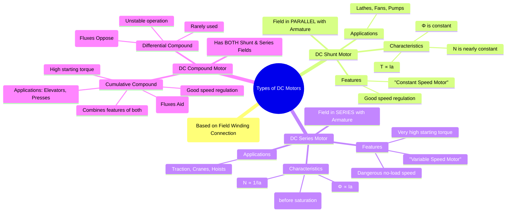

---
tags:
  - electrical-machines
  - dc-motors
  - machine-types
created: 2025-09-16
aliases:
  - DC Motor Types
  - Classification of DC Motors
  - Shunt DC Motors
  - Series DC Motors
  - Compound DC Motors
subject: "[[Electrical Machines]]"
parent: "[[DC Motors]]"
modified: 2026-07-23T20:43:40
---
### Types of DC Motors
#dc-motors #machine-types

> Similar to DC generators, DC motors are classified based on the way their field winding is connected to the armature winding. This connection determines the motor's performance characteristics, particularly its speed-torque and speed-current relationships, making each type suitable for different applications.

![[DC Motor Connections.png]]

---
#### DC Shunt Motor
#shunt-motor

In a shunt motor, the field winding is connected in parallel (or shunt) with the armature winding across the DC supply voltage. The shunt field winding has a high resistance (many turns of fine wire).

| ![[DC Shunt Motor.png]] | ![[DC Shunt Motor Diagram.png]] |
| ----------------------- | ------------------------------- |

* **Connections & Equations**:
    * Supply Voltage: $V = E_b + I_a R_a$
    * Load Current: $I_L = I_a + I_{sh}$
    * Shunt Field Current: $I_{sh} = V / R_{sh}$
* **[[Characteristics of DC Motors#Characteristics of a DC Shunt Motor|Characteristics]]**:
    * **Flux ($\phi$)**: Since the supply voltage $V$ and shunt field resistance $R_{sh}$ are constant, the field current $I_{sh}$ and thus the flux $\phi$ are practically constant.
    * **Torque**: We know $T_a \propto \phi I_a$. Since $\phi$ is constant:
        $$\boxed{\quad T_a \propto I_a \quad}$$
        The torque is directly proportional to the armature current.
    * **Speed**: We know $N \propto E_b / \phi$. Since $\phi$ is constant, $N \propto E_b$. As load increases, $I_a$ increases, causing a small drop in $E_b = V - I_a R_a$. Therefore, the speed drops slightly.
* **Key Features**:
    * It is considered a **constant speed motor**.
    * It has excellent speed regulation.
    * Starting torque is moderate.
* **Applications**: Used where a nearly constant speed is required regardless of the load. Examples include machine tools (lathes, drills), centrifugal pumps, fans, blowers, and conveyors.

---
#### DC Series Motor
#series-motor

In a series motor, the [[Constructional Features of DC Machines#Field Winding (Exciting Winding)|field winding]] is connected in series with the armature winding. The series field winding has a very low resistance (few turns of **thick** wire) as it must carry the full armature current.

![[Connection of Series Field DC Motor.jpeg]]

* **Connections & Equations**:
    * Supply Voltage: $V = E_b + I_a(R_a + R_{se})$
    * Current: $I_L = I_a = I_{se}$
* **[[Characteristics of DC Motors#Characteristics of a DC Series Motor|Characteristics]]**:
    * **Flux ($\phi$)**: The flux is produced by the armature current, so $\phi \propto I_a$ (before saturation).
    * **Torque**: We know $T_a \propto \phi I_a$. Substituting $\phi \propto I_a$:
        $$\boxed{\quad T_a \propto I_a^2 \quad (\text{before saturation})}$$
        After saturation, $\phi$ becomes constant, and then $T_a \propto I_a$. The torque-current characteristic is a parabola initially, then becomes a straight line.
    * **Speed**: We know $N \propto E_b / \phi$. Since $E_b \approx V$ (at most loads) and $\phi \propto I_a$:
        $$\boxed{\quad N \propto \frac{1}{I_a} \quad}$$
        The speed is inversely proportional to the armature current.
* **Key Features**:
    * It is a **variable speed motor**.
    * It has a very **high starting torque** (since $T \propto I_a^2$).
    * **Dangerous No-Load Speed**: At no-load, $I_a$ is very small, so the speed $N$ can become dangerously high. **Therefore, a series motor must never be started without a mechanical load attached.**
* **Applications**: Used where high starting torque is required. Examples include electric traction (trains, trams), cranes, hoists, elevators, and automotive starters.

---
#### DC Compound Motor
#compound-motor

A compound motor has both a shunt and a series field winding, combining the features of both motor types.

![[Connecting Compound Wound DC Motor.jpeg]]
##### 1. Cumulative Compound Motor
#compound-motor/cumulative #cumulative-compound-motor

The series field flux aids the shunt field flux.
* **Characteristics**:
    * It has a high starting torque (due to the series field).
    * It has good speed regulation, and it does not run away at no-load (due to the shunt field).
    * The speed drops more than a shunt motor but less than a series motor as the load increases.
* **Applications**: Used for loads that require high starting torque and are subject to sudden heavy application, such as elevators, conveyors, presses, shears, and rolling mills.

##### 2. Differential Compound Motor
#compound-motor/differential #differential-compound-motor

The series field flux opposes the shunt field flux.
* **Characteristics**:
    * As the load increases, the series field flux increases, which weakens the total flux. This causes the speed ($N \propto 1/\phi$) to increase.
    * This can lead to unstable operation, as an increase in load could cause the motor to speed up until it destroys itself.
    * The starting torque is very low.
* **Applications**: Due to its instability, it is very rarely used in any practical application.

---
### Related Concepts
#dc-motors/related-concepts

> [[Principle of Operation of DC Motors]]

[[Characteristics of DC Motors]]
[[Starting of DC Motors]]
[[Speed Control of DC Motors]]
[[Types of DC Generators]]