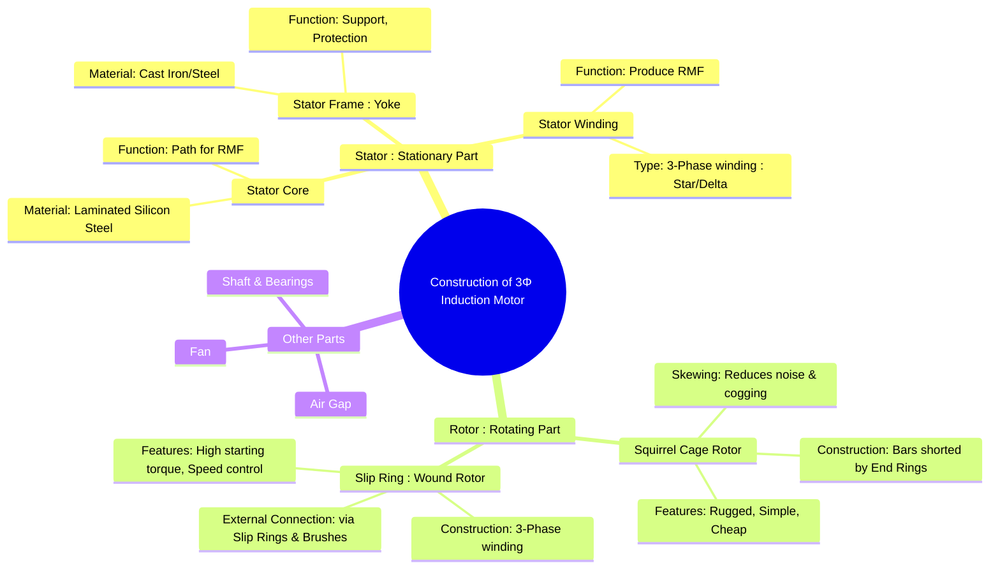

---
tags:
  - electrical-machines
  - induction-motors
  - machine-construction
  - squirrel-cage
  - slip-ring
created: 2025-09-17
aliases:
  - 3-Phase Induction Motor Construction
  - IM Construction
  - Squirrel Cage IM Construction
  - Slip Ring IM Construction
  - squirrel cage motor
  - slip-ring motor
  - Constructional Features of Induction Motors
  - Double Squirrel-Cage Induction Motor
  - Wound Rotor Induction Motor
subject: "[[Electrical Machines]]"
parent:
  - Three-Phase Induction Motors
  - "[[Induction Machines]]"
modified: 2026-07-21T15:02:19
---
### Construction of Three-Phase Induction Motors
#induction-motors #machine-construction

> The three-phase induction motor is the most widely used AC motor in the industry, often called the =="workhorse of the industry"==. It is a [[Singly and Doubly Excited Systems#Doubly Excited Systems|doubly-excited]] machine that operates on the principle of electromagnetic induction. Its construction consists of two main parts: a stationary **stator** and a rotating **rotor**.

> [!warning] Correction: Excitation Classification
> An induction motor is fundamentally a **[[Singly and Doubly Excited Systems|doubly-excited]]** system. Although it has only one physical connection to an external supply (the stator), the rotor establishes its own independent magnetic field through induced currents. Because torque is produced by the interaction of these two distinct fields ($T_f = i_1 i_2 \frac{dM_{12}}{d\theta}$), it operates as an *inductively* doubly-excited machine.
^excitation-classification

> [!concept] Conceptual Bridge: The Rotating Transformer
> A 3-phase induction motor operates on the exact same principles as a transformer. ==It is essentially a generalized transformer where the stator acts as the **primary winding** and the short-circuited rotor acts as a **rotating secondary winding**.== The primary differences are the presence of an air gap and the conversion of electrical energy into mechanical rotation.
> 
> > [!refer]
> > [[Ideal and Practical Transformers]]

---
#### Stator Construction
#stator

The stator is the stationary part of the motor and is common to both squirrel cage and slip ring types. It consists of the following components:

##### 1. Stator Frame (Yoke)
#stator-frame

* **Function**: The outer body of the motor. Its purpose is to provide mechanical support to the inner components, protect them from the environment, and carry the magnetic flux.
* **Material**: Made of **cast iron** for small to medium-sized machines and **fabricated welded steel** for larger machines.

---
##### 2. Stator Core
#stator-core

* **Function**: To carry the alternating magnetic flux which produces the [[Rotating Magnetic Field (RMF)|Rotating Magnetic Field (RMF)]].
* **Construction**: It is a hollow cylinder built up of thin **laminations of high-grade silicon steel** (0.35 to 0.5 mm thick). The laminations are insulated from each other with a varnish coating to minimize **eddy current loss**. Slots are punched on the inner periphery of the core to house the stator winding.

---
##### 3. Stator Winding
#stator-winding

* **Function**: When supplied with a 3-phase AC voltage, this winding produces the [[Rotating Magnetic Field (RMF)|rotating magnetic field (RMF)]].
* **Construction**: It is a 3-phase winding, typically made of insulated copper wire, placed in the stator slots. The windings are distributed and connected for a specific number of poles ($P$), which determines the synchronous speed of the motor according to the formula:
    $$ N_s = \frac{120 f}{P} $$
    The windings can be connected in either [[Star and Delta Connections|Star (Y)]] or [[Star and Delta Connections|Delta (Δ)]].

---
#### Rotor Construction
#rotor

The rotor is the rotating part of the motor. The type of rotor used defines the two main classifications of induction motors.

##### 1. Squirrel Cage Rotor
#squirrel-cage-rotor

| ![[Squirrel Cage - Diagram.png\|300]] | ![[Squirrel Cage Rotor.png\|300]] |
| ------------------------------------- | --------------------------------- |
^squirrel-cage-rotor

This is the most common type of rotor due to its simple, rugged, and almost unbreakable construction.
* **Construction**: It consists of a laminated cylindrical core with semi-closed slots. Instead of a winding, heavy bars of copper, aluminum, or brass are placed in these slots. The bars are permanently short-circuited at both ends by thick **end rings**. This forms a structure resembling a squirrel's cage.
* **Skewing**: ==The rotor bars are not placed parallel to the shaft axis but are deliberately skewed.== This is done to:
    1. ==Reduce magnetic humming (noise).==
    2. ==Prevent **[[Cogging and Crawling Phenomena#Cogging (Magnetic Locking)|cogging]]** (magnetic locking between stator and rotor teeth at startup).==
    3. ==Produce a more uniform torque.==
* **Key Features**: Simple construction, low cost, high reliability, low maintenance. There are no external electrical connections.

> [!pyq]- PYQ : 2021
> ![[ee_2021#^q8]]

> [!important] Important
> The starting torque for Squirrel Cage Motor is fixed by its design.

> [!concept]- Double Squirrel Cage Induction Motor
> 
> > [!pyq]- PYQ : GATE EE 2026
> > ![[ee_2026#^q21]]
> 
> **Definition:** A type of rotor having **two parallel cages** (outer + inner) with different electrical characteristics to improve starting and running performance.
> 
> 
> ![[Torque-Slip Characteristics of Induction Motor#^dsctsc|Characteristic Curve]]
> 
> **Construction:**
> - **Outer Cage:**
>   - High resistance (R ↑)
>   - Low reactance (X ↓)
> - **Inner Cage:**
>   - Low resistance (R ↓)
>   - High reactance (X ↑)
> 
> ---
> 
> **Working Principle:**
> 
> - **At Starting (s = 1):**
>   - Rotor frequency high → reactance dominates  
>   - Inner cage (high X) blocks current  
>   - Current flows mainly in outer cage (high R)  
>   - ⇒ **High starting torque**
> 
> - **At Running (s → 0):**
>   - Rotor frequency low → reactance negligible  
>   - Inner cage (low R) carries most current  
>   - ⇒ **High efficiency + good speed regulation**
> 
> ---
> 
> **Key Idea (Exam Point):**
> - High R needed for starting torque  
> - Low R needed for efficiency  
> → Double cage provides **both simultaneously**
> 
> ---
> 
> **Torque Insight:**
> Starting torque ∝ R / (R² + X²)  
> - Outer cage → better starting  
> - Inner cage → better running
> 
> ---
> 
> **Advantages:**
> - High starting torque  
> - Better efficiency during normal operation  
> - Improved speed regulation  
> 
> ---
> 
> **Disadvantages:**
> - More complex construction  
> - Costlier than single cage rotor  
> 
> ---
> 
> **Applications:**
> - Cranes  
> - Elevators  
> - Compressors  
> - Heavy starting load drives  

---
##### 2. Slip Ring (or Wound) Rotor
#slip-ring-rotor #wound-rotor

| ![[Slip Ring (or Wound) Rotor Skeletal.png\|300]] | ![[Slip Ring (or Wound) Rotor.png\|300]] |
| ----------------------------------------- | ----------------------------------------- |
^slip-ring-rotor

This rotor is used in applications requiring high starting torque and speed control.
* **Construction**: It has a laminated cylindrical core with slots that carry a 3-phase, distributed winding, similar to the stator. The winding is usually connected in a Star (Y) configuration.
* **External Connection**: The three terminals of the rotor winding are brought out and connected to three insulated **slip rings** mounted on the motor shaft. **Carbon brushes** ride on these slip rings, providing a connection to an external stationary circuit.
* **Purpose**: The slip rings and brushes allow an external variable resistance to be added in series with the rotor circuit.
###### Function of External Resistance
#slip-ring/external-resistance/function

> [!refer]
> [[Effect of Rotor Resistance on Torque-Slip Curve]]

1. Increase [[Effect of Rotor Resistance on Torque-Slip Curve#3. Effect on Starting Torque ($T_{st}$)|Starting Torque]]
2. Decrease Starting Current
3. Provide a method for speed control (though [[Induction Motor Drives#Other Speed Control Methods|inefficient]])

During normal operation, the slip rings are short-circuited.

---
#### Comparison of Squirrel Cage and Slip Ring Motors
#comparison/squirrel-cage-with-slip-ring-motors 

| Feature             | Squirrel Cage Induction Motor                | Slip Ring (Wound Rotor) Induction Motor      |
| ------------------- | -------------------------------------------- | -------------------------------------------- |
| **Construction**    | Simple and rugged (bars and end rings)       | Complex (3-phase winding, slip rings, brushes) |
| **Starting Torque** | Moderate                                     | Very High (can be controlled)                |
| **Starting Current**| High (5-7 times full load current)           | Low (can be controlled)                      |
| **Speed Control**   | Not easily possible from the rotor side      | Possible by adding external resistance       |
| **Cost**            | Lower                                        | Higher                                       |
| **Maintenance**     | Low (no brushes or slip rings)               | Higher (due to brushes and slip rings)       |
| **Applications**    | Fans, pumps, lathes, general industry        | Cranes, hoists, elevators, conveyors         |

---
### Related Concepts
#induction-motors/related-concepts

> [[Rotating Magnetic Field (RMF)]]

[[Ideal and Practical Transformers]]
[[Equivalent Circuit of a Three-Phase Induction Motor]]
[[Torque-Slip Characteristics of Induction Motor]]
[[Starting Methods for Induction Motors]]