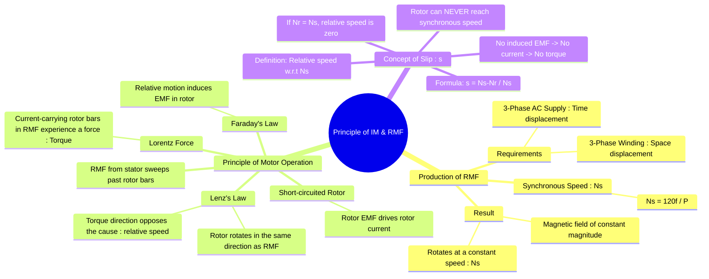

---
tags:
  - electrical-machines
  - induction-motors
  - rmf
  - motor-principle
  - lenzs-law
created: 2025-09-17
aliases:
  - Induction Motor Principle
  - Rotating Magnetic Field
  - RMF
  - Production of RMF
  - RMF Principle of Operation
  - Principle of Operation and Production of Rotating Magnetic Field (RMF)
subject: "[[Electrical Machines]]"
parent:
  - Three-Phase Induction Motors
  - "[[Synchronous Machines]]"
modified: 2026-07-23T20:44:14
---
### Principle of Operation and Production of Rotating Magnetic Field (RMF)
#induction-motors #rmf #motor-principle

> The operation of a three-phase induction motor is based on two key principles: the production of a **Rotating Magnetic Field (RMF)** by the stator, and the subsequent induction of current and torque in the rotor by this field. The motor is often described as a "rotating transformer" where the stator is the primary and the short-circuited rotor is the secondary.

> [!warning] Revolving Magnetic Field
> There is **no difference** between <u>revolving</u> and <u>rotating magnetic field</u>; both refer to the same phenomenon of a constant-magnitude magnetic field rotating at synchronous speed in AC machines.

---

#### Production of the Rotating Magnetic Field (RMF)
#rmf #synchronous-speed

The RMF is the foundation of the induction motor's operation. It is produced when the stator winding is energized by a balanced three-phase AC supply.

**Two conditions are essential for the production of an RMF:**
1. The stator must be supplied with a **three-phase AC voltage**, where the currents are displaced from each other by 120° in time.
2. The stator must have a **three-phase winding**, with the windings of each phase spatially displaced from each other by 120° around the stator core.

When these conditions are met, the three pulsating magnetic fields produced by the individual phase currents combine to create a resultant magnetic field that has two key properties:
* Its magnitude remains **constant** and is equal to **1.5 times the maximum flux** ($\phi_m$) produced by a single phase winding. $(B_r = 1.5 \times B_m)$
* It **rotates** around the stator at a constant speed called the **synchronous speed ($N_s$)**.

The synchronous speed is determined by the frequency of the AC supply ($f$) and the number of poles ($P$) for which the stator is wound.
$$\boxed{\quad N_s = \frac{120 f}{P} \quad}$$
Where:
- $N_s$ is the synchronous speed in revolutions per minute (RPM).
- $f$ is the supply frequency in Hertz (Hz).
- $P$ is the number of stator poles.

> [!warning] Direction of Rotation of RMF
> The direction of rotation of the RMF is determined by the **phase sequence** of the power supply (e.g., R-Y-B or R-B-Y). To reverse the direction of rotation of an AC motor, one can simply interchange any two of the three supply lines, which reverses the phase sequence.

---
#### Principle of Motor Operation
#motor-principle #lenzs-law #electromagnetic-induction

The torque is produced in the motor through the following steps:

1. **Stator Produces RMF**: The stator winding, when connected to a 3-phase supply, creates the RMF which rotates at synchronous speed ($N_s$).
2. **Relative Motion and Induced EMF**: At standstill, the RMF sweeps past the stationary rotor conductors. According to **Faraday's Law of Electromagnetic Induction**, this relative motion between the magnetic field and the conductors induces an EMF in the rotor conductors.
3. **Rotor Current**: The rotor conductors are short-circuited (either by [[Construction of Three-Phase Induction Motors#1. Squirrel Cage Rotor|end rings in a squirrel cage rotor]] or externally in a [[Construction of Three-Phase Induction Motors#2. Slip Ring (or Wound) Rotor|slip ring rotor]]). The induced EMF therefore drives a large current through the rotor.
4. **Force and Torque Production**: Now, the current-carrying rotor conductors are situated within the magnetic field of the stator. According to the **Lorentz Force principle**, these conductors experience a mechanical force ($F = BIL$). The sum of the forces on all conductors produces a torque, which causes the rotor to rotate.

The direction of this torque is determined by **Lenz's Law**. The induced currents in the rotor create their own magnetic field that tries to oppose the cause of their induction. The cause is the **relative speed** between the RMF and the rotor conductors. To reduce this relative speed, the rotor must rotate in the **same direction as the RMF**.

---
#### The Concept of Slip ($s$)
#slip #asynchronous-motor

A crucial aspect of an induction motor's operation is that the rotor can never rotate at the synchronous speed.
* If the rotor speed ($N_r$) were to become equal to the synchronous speed ($N_s$), the relative speed between the RMF and the rotor would be zero.
* With no relative speed, no EMF would be induced in the rotor, leading to zero rotor current and, consequently, zero torque.
* If the torque is zero, the rotor will slow down due to friction and windage losses.

Therefore, to produce torque, the rotor must always rotate at a speed slightly less than the synchronous speed. This difference in speed is called **slip**.

![[Concept of Slip#Definition of Slip]]

---
### Related Concepts
#induction-motors/related-concepts

> [[Construction of Three-Phase Induction Motors]]

[[Concept of Slip]]
[[Equivalent Circuit of a Three-Phase Induction Motor]]
[[Torque-Slip Characteristics of Induction Motor]]