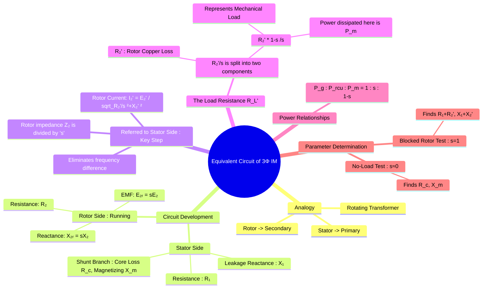

---
tags:
  - electrical-machines
  - induction-motors
  - equivalent-circuit
  - machine-modeling
created: 2025-09-17
aliases:
  - Induction Motor Equivalent Circuit
  - IM Per-Phase Equivalent Circuit
  - Approximate Equivalent Circuit
  - Starting Current Approximation Analysis
subject: "[[Electrical Machines]]"
parent:
  - Three-Phase Induction Motors
modified: 2026-07-23T20:44:54
---
### Equivalent Circuit of a Three-Phase Induction Motor
#induction-motors #equivalent-circuit

> An induction motor can be modeled as a =="rotating transformer"==. The stator acts as the primary winding, and the rotor acts as the secondary winding, which is short-circuited and rotates. The **per-phase equivalent circuit** is a powerful tool used to analyze the motor's performance, including torque, power, current, and efficiency, under various operating conditions.

---

#### Development of the Equivalent Circuit

==The circuit is developed by considering the stator and rotor sides separately and then referring the rotor parameters to the stator side.==

##### 1. Rotor Circuit Model
#rotor-circuit-model 

At standstill ($s=1$), the motor is a static transformer. The induced EMF in the rotor is $E_2$ and [[Frequency of Rotor Current and EMF#At Standstill ($s=1$)|its frequency is the supply frequency]] $f$. The rotor impedance is $Z_2 = R_2 + jX_2$.

When the motor is running with a slip $s$:
* The [[Frequency of Rotor Current and EMF#^relative-speed|relative speed]] is $s N_s$, so the induced EMF is $E_{2r} = s E_2$. ^induced-rotor-emf
* The [[Frequency of Rotor Current and EMF#^rotor-frequency|rotor frequency]] is $f_r = s f$, so the rotor reactance is $X_{2r} = s X_2$. $$X_{2r} = 2\pi f_r L_2 = 2\pi (sf)L_2 = s(2\pi f L_2) = sX_2$$
* The rotor resistance $R_2$ is unchanged.
The running rotor current $I_{2r}$ is therefore: $$ I_{2r} = \frac{E_{2r}}{Z_{2r}} = \frac{s E_2}{\sqrt{R_2^2 + (sX_2)^2}} $$ ^rotor-current

---
##### 2. Equivalent Circuit Referred to Stator
#equivalent-circuit/referred/stator 

To create a single circuit, we refer the rotor quantities to the stator side, just as in a transformer. This also resolves the issue of different frequencies in the stator ($f$) and rotor ($f_r$).

The key step is to divide the [[#^rotor-current|rotor current]] equation by slip $s$:
$$ I_{2r} = \frac{E_2}{\sqrt{(\frac{R_2}{s})^2 + X_2^2}} $$
This equation shows that from the stator's perspective (where the frequency is always $f$ and the induced EMF is $E_2$), ==the rotor can be modeled as a stationary circuit with a fixed reactance $X_2$ and a **variable resistance of $R_2/s$**==.

The complete per-phase equivalent circuit referred to the stator is shown below.

![[Per-Phase Equivalent Circuit Referred to Stator Induction Motor.png]]

* $R_1$, $X_1$: Stator resistance and leakage reactance.
* $R_c$, $X_m$: Core loss resistance and magnetizing reactance.
* ==$R_2'$, $X_2'$: Rotor resistance and leakage reactance referred to the stator.==
* $s$: Slip.

> [!important] Voltage sensitivity of equivalent circuit parameters
> At constant supply frequency:
> - $R_s,\ R_r$ depend on material → constant
> - $X_{l}$ depends on frequency → constant
> - $\boxed{\quad X_m\ \text{depends on air-gap flux} \quad}$
> 
> Therefore, reducing RMS stator voltage changes only $X_m$.

> [!warning] Frequency Scaling of Impedance
> > [!pyq]- PYQ : 2019, 2017
> > ![[ee_2019#^q47]]
> > 
> > ---
> > ![[ee_2017(2)#^q43]]
> 
> When an induction motor or transformer operates at a frequency ($f_{\text{new}}$) different from its rated frequency ($f_{\text{rated}}$), the circuit parameters change as follows:
> 
> 1. **Resistances ($R_1, R_2'$)**: Remain **unchanged** (neglecting skin effect).
> 2. ==**Reactances ($X_1, X_2'$)**: Scale **linearly** with frequency because $X = 2\pi f L$.==
> 
> $$\text{Scaling Factor} = k = \frac{f_{\text{new}}}{f_{\text{rated}}}$$
> $$X_{\text{new}} = k \cdot X_{\text{rated}}$$
> 
> > [!mistake]
> > Failure to scale the reactances before calculating the starting impedance ($Z_{\text{st}}$) or starting current ($I_{\text{st}}$) is a common trap!

---
#### Analysis of the Load Resistance
#analysis/load-resistance 

The variable rotor resistance term $\frac{R_2'}{s}$ is the most important part of the circuit. ==It represents the total power transferred to the rotor. We can split this resistance into two parts:==
$$\begin{align}
\boxed{\quad \frac{R_2'}{s} = R_2' + R_2' \left(\frac{1}{s} - 1\right) = R_2' + R_2' \left(\frac{1-s}{s}\right) \quad}
\end{align}$$
* **$R_2'$**: ==This represents the actual resistance of the rotor winding.== The power dissipated in this resistance, $I_2'^2 R_2'$, is the **[[Losses and Efficiency of Induction Motors#^rotor-copper-loss|rotor copper loss]] ($P_{rcu}$)**.
* **$R_L' = R_2' \left(\frac{1-s}{s}\right)$**: ==This is a fictitious variable resistance that represents the **mechanical load** on the motor.== The power consumed by this resistance is the [[Power Flow Diagram and Torque Development#^gross-mechanical-power|gross mechanical power]] developed by the motor ($P_m$).
    $$\boxed{\quad P_m = I_2'^2 R_L' = I_2'^2 R_2' \left(\frac{1-s}{s}\right) \quad}$$

> See [[Starting Torque, Maximum Torque and Full Load Torque#^exact-condition-for-max-torque|Exact vs. Approximated Resistance]]

---
#### Power Flow and Key Relationships
#power-flow #slip-power

The equivalent circuit allows us to easily visualize the power flow in the motor.

1.  **Air Gap Power ($P_g$)**: This is the power transferred from the stator to the rotor across the air gap. It is the power dissipated in the [[#Analysis of the Load Resistance|total rotor resistance]] $\frac{R_2'}{s}$.
    $$ P_g = I_2'^2 \left(\frac{R_2'}{s}\right) $$
2.  **Rotor Copper Loss ($P_{rcu}$)**:
    $$ P_{rcu} = I_2'^2 R_2' $$
3.  **Gross Mechanical Power Developed ($P_m$)**:
    $$ P_m = P_g - P_{rcu} $$

From these equations, we can derive a fundamental power relationship: $$\begin{align}
P_{rcu} &= I_2'^2 R_2' = s \left(I_2'^2 \frac{R_2'}{s}\right) = s P_g \\
P_m &= P_g - s P_g = P_g(1-s)
\end{align}$$ ^rotor-copper-loss-and-gross-meechanical-power-developed

This leads to the crucial ratio:
$$\begin{align}
\boxed{\quad P_g : P_{rcu} : P_m = 1 : s : (1-s) \quad}
\end{align}$$
==This relationship is extremely useful for solving problems related to efficiency and power in induction motors.==

==The torque developed can also be found from the air gap power:== $$\begin{align}
\boxed{\quad T_{dev} = \frac{P_g}{\omega_s} = \frac{P_m}{\omega_r} \quad}
\end{align}$$
where $\omega_s = 2\pi N_s/60$ is the synchronous angular speed.

---
#### Approximate Equivalent Circuit
#approximate-equivalent-circuit

> [!pyq]- PYQ : 2010
> ![[ee_2010#^q15]]

For simplifying calculations, the shunt magnetizing branch ($R_c$ and $X_m$) is often moved to the input terminals. This **approximate equivalent circuit** is less accurate but much easier to solve, especially for calculating the full-load current and torque.

> [!info] Starting Current Approximation Analysis
> At the instant of starting ($s = 1$), the [[#Analysis of the Load Resistance|mechanical load resistance]] $R_L' = R_2' \left(\frac{1-s}{s}\right)$ drops to $0\ \Omega$, minimizing the rotor branch impedance to just $(r_r' + jx_r')$.
> 
> Because the magnetizing reactance satisfies $X_m \gg (x_s + x_r')$, the parallel shunt branch acts as a relative open-circuit compared to the low-impedance series path. Neglecting the shunt current yields the classic short-circuit calculation model: $$I_{st} \approx \frac{V}{\sqrt{(r_s + r_r')^2 + (x_s + x_r')^2}}$$
> 
> > [!pyq]- PYQ : 2016
> > *(same frequency but different voltage)*
> > 
> > ---
> > ![[ee_2016(2)#^q43]]

> See [[Starting Torque, Maximum Torque and Full Load Torque#^exact-condition-for-max-torque|Exact vs. Approximate Condition]]

---
#### Parameter Determination
#no-load-test #blocked-rotor-test

The parameters of the equivalent circuit are determined experimentally using two tests analogous to the OC and SC tests on a transformer:
1. **[[No-Load and Blocked Rotor Tests#No-Load Test|No-Load Test]]**: The motor is run at rated voltage without any mechanical load ($s \approx 0$). The term $R_2'/s$ becomes very large (open circuit). This test is used to determine the parameters of the shunt branch ($R_c$ and $X_m$) and the rotational losses.
2. **[[No-Load and Blocked Rotor Tests#Blocked Rotor Test|Blocked Rotor Test]]**: The rotor is prevented from rotating ($s=1$), and a reduced voltage is applied to the stator to circulate the full-load current. The shunt branch has a very high impedance compared to the series branch, so it can be neglected. This test is used to determine the series parameters ($R_1+R_2'$) and ($X_1+X_2'$).

---
### Related Concepts
#equivalent-circuit/related-concepts

> [[Concept of Slip]]

[[Power Flow Diagram and Torque Development]]
[[Torque-Slip Characteristics of Induction Motor]]
[[No-Load and Blocked Rotor Tests]]
[[Principle of Operation of a Transformer]]