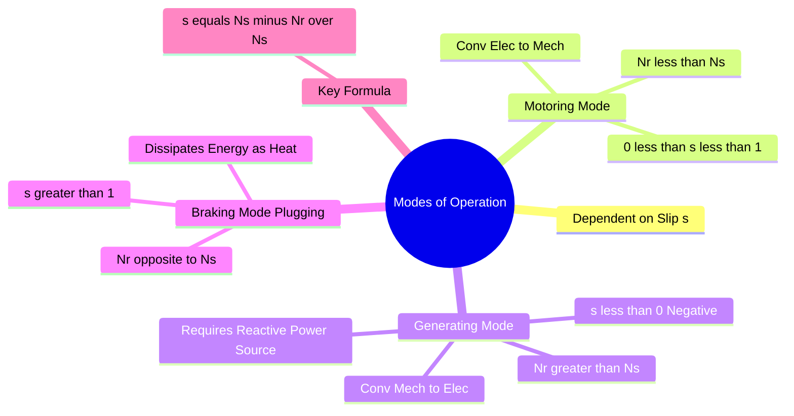

---
tags:
  - electrical-machines
  - induction-machine
  - gate
  - torque-slip
created: 2026-07-23T20:45:34
aliases:
  - Motoring Generating and Braking
  - Slip Ranges
  - Induction Generator Principle
  - Motoring Mode of Three-Phase Induction Machines
  - Generating Mode of Three-Phase Induction Machines
  - Plugging (Braking) Mode of Three-Phase Induction Machines
subject: "[[Electrical Machines]]"
parent:
  - Three-Phase Induction Motors
  - "[[Induction Machines]]"
modified: 2026-07-23T20:45:34
---
### Modes of Operation of Induction Machines
#electrical-machines/induction-machine #torque-slip

> ==The operation of an Induction Machine is fundamentally determined by the relative speed between the rotating magnetic field (Synchronous Speed, $N_s$) and the Rotor Speed ($N_r$).== This relative speed is quantified by the **[[Concept of Slip|Slip]] ($s$)**. Ideally, the machine can operate in three distinct regions based on the value of $s$.

$$s = \frac{N_s - N_r}{N_s} \quad \text{and} \quad N_r = N_s(1-s)$$

![[Modes of Operation of Induction Machines.png]]
^induction-machine-operation-modes

---

#### 1. Motoring Mode
#induction-machine/motoring

This is the standard operation where the machine converts Electrical Energy into Mechanical Energy.

*   **Speed Range:** $0 \le N_r \le N_s$ (Sub-synchronous speed).
*   **Slip Range:** $\boxed{\quad 0 \le s \le 1 \quad}$
*   **Torque:** Positive (Acts in the direction of rotation).
*   **Mechanism:**
    *   The rotor rotates in the same direction as the magnetic field but slightly slower.
    *   The relative velocity ($N_s - N_r$) induces currents in the rotor that produce a torque trying to "catch up" to the field (Lenz's Law).
*   **Power Flow:** Source $\rightarrow$ Stator $\rightarrow$ Air Gap $\rightarrow$ Rotor $\rightarrow$ Mechanical Load.
    *   Stator Input: $P_{in}$ (Positive).
    *   Rotor Copper Loss: $s P_g$.
    *   Mechanical Power Developed: $P_m = (1-s)P_g$.

---
#### 2. Generating Mode (Induction Generator)
#induction-machine/generating

> See [[Induction Generator Operation#Induction Generator Operation|Induction Generator Operation]]

The machine converts Mechanical Energy (from a prime mover) into Electrical Energy.

*   **Speed Range:** $N_r > N_s$ (Super-synchronous speed).
*   **Slip Range:** $\boxed{\quad s < 0 \quad}$ (Negative Slip).
*   **Torque:** Negative (Electromagnetic torque opposes the prime mover).
*   **Mechanism:**
    *   The rotor is driven faster than the synchronous speed by an external prime mover (e.g., Wind Turbine).
    *   The relative velocity reverses direction ($N_s - N_r$ is negative).
    *   The induced voltage and current in the rotor reverse phase, causing active power to flow *out* of the stator terminals.
*   **Excitation Requirement:**
    *   An Induction Generator **cannot** generate its own magnetizing current.
    *   It **consumes Reactive Power (Q)** from the grid (or capacitor banks) to set up the magnetic field, even while it **delivers Active Power (P)**.
*   **Application:** Wind mills (DFIG), Micro-hydro plants.

---
#### 3. Braking Mode (Plugging)
#induction-machine/braking

This mode is used to stop the motor quickly.

*   **Speed Range:** $N_r$ is in the **opposite direction** to $N_s$.
    *   Usually achieved by swapping two phases of the supply while the motor is running, reversing the direction of the Rotating Magnetic Field.
*   **Slip Range:** $\boxed{\quad s > 1 \quad}$
    *   Since $N_r$ is negative relative to the new field direction: $s = \frac{N_s - (-N_r)}{N_s} = \frac{N_s + N_r}{N_s}$.
    *   Typically, $s$ ranges from $2$ (at the instant of switching) to $1$ (at zero speed).
*   **Torque:** Positive (relative to field), but since rotation is opposite, the torque acts as a **Braking Torque**.
*   **Energy Dissipation (Critical):**
    *   In this mode, the machine absorbs power from the electrical supply ($P_{elec}$) **AND** absorbs kinetic energy from the mechanical load ($P_{mech}$).
    *   **Total Energy dissipated in Rotor Circuit** $= P_{elec} + P_{mech}$.
    *   This causes massive heat generation ($I^2R$ loss). External resistors are often required to limit current and dissipate heat.

---
#### Summary Table for GATE
#summary-table 

| Mode | Rotor Speed ($N_r$) | Slip ($s$) | Torque ($T_e$) | Air Gap Power ($P_g$) | Mech Power ($P_m$) |
| :--- | :--- | :--- | :--- | :--- | :--- |
| **Motoring** | $0 < N_r < N_s$ | $0 < s < 1$ | +ve (Driving) | +ve (Source to Rotor) | +ve (Output) |
| **Generating** | $N_r > N_s$ | $s < 0$ | -ve (Opposing) | -ve (Rotor to Source) | -ve (Input) |
| **Braking** | Opposite to $N_s$ | $s > 1$ | +ve (Braking) | +ve (Source to Rotor) | -ve (Input) |

---
### Related Concepts
#topic/related-concepts

> [[Torque-Slip Characteristics of Induction Motor]]

[[Power Flow Diagram and Torque Development]]
[[Equivalent Circuit of a Three-Phase Induction Motor]]
[[Equivalent Circuit of a Single-Phase Induction Motor]]
[[Starting Methods for Induction Motors]]
[[Speed Control of Induction Motors]]
[[Induction Generator Operation]]
