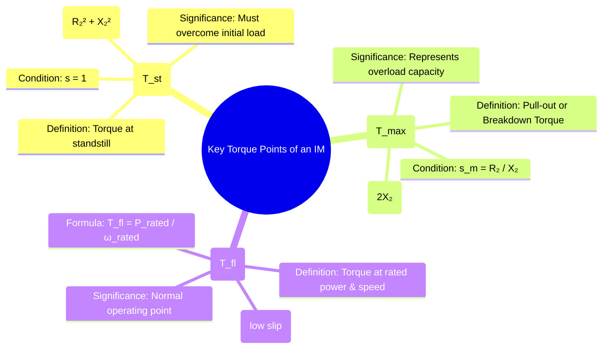

---
tags:
  - electrical-machines
  - induction-motors
  - motor-torque
  - motor-performance
created: 2025-09-17
aliases:
  - Key Torques of an Induction Motor
  - Starting, Max, and Full Load Torque
  - Pull-out Torque Induction Motor
  - Full Load Torque Induction Motor
  - Maximum Torque Induction Motor
  - Starting Torque Induction Motor
  - Torque in Induction Motor
  - Condition for Maximum Torque
subject: "[[Electrical Machines]]"
parent:
  - Three-Phase Induction Motors
formula:
  - "Starting Torque (induction motor) : $$T_{st} = K \\frac{E_2^2 R_2}{R_2^2 + X_2^2}$$"
  - "Maximum Torque (induction motor) : $$T_{max} = K \\frac{E_2^2}{2X_2}$$"
  - "Condition for Maximum Torque (induction motor) : $$R_2 = s_m X_2$$"
  - "Slip at Maximum Torque (induction motor) : $$s_m = \\frac{R_2}{X_2}$$"
  - "Full-Load Torque (induction motor) : $$T_{fl} = \\frac{P_{out(rated)}}{\\omega_{r(rated)}} = \\frac{P_{out(rated)}}{2\\pi N_{r(rated)} / 60}$$"
  - "Ratio of Full-Load Torque to Maximum Torque : $$\\frac{T_{fl}}{T_{max}} = \\frac{2 s_m s_{fl}}{s_m^2 + s_{fl}^2}$$"
  - "Ratio of Starting Torque to Maximum Torque : $$\\frac{T_{st}}{T_{max}} = \\frac{2 s_m}{1 + s_m^2} \\quad \\text{where } s_m = \\frac{R_2}{X_2}$$"
modified: 2026-07-23T20:46:34
---
### Starting Torque, Maximum Torque (Pull-out Torque), and Full Load Torque
#induction-motors #motor-torque

> The [[Torque-Slip Characteristics of Induction Motor|torque-slip curve]] of an induction motor is defined by several key operating points that are critical for motor selection and application analysis. The three most important are the **Starting Torque**, the **Maximum Torque**, and the **Full-Load Torque**. All these torques are highly dependent on the square of the applied voltage ($T \propto V^2$).

---
##### Starting Torque ($T_{st}$)
#starting-torque

**Definition**: The starting torque is the torque developed by the motor at the instant it is energized from standstill.

* **Condition**: This occurs when the rotor speed $N_r = 0$, which corresponds to a slip of **$s=1$**.
> [!pyq]- PYQ : GATE EE 2021
> ![[ee_2021#^q45]]
* **Formula**: By substituting $s=1$ into the general torque equation:
    $$\begin{align}\boxed{\quad T_{st} = K \frac{E_2^2 R_2}{R_2^2 + X_2^2} \quad}\end{align}$$
* **Significance**: For a motor to start, its starting torque must be greater than the static friction and load torque at that instant. For a [[Construction of Three-Phase Induction Motors#1. Squirrel Cage Rotor|squirrel cage motor]], the starting torque is fixed by its design. For a [[Construction of Three-Phase Induction Motors#2. Slip Ring (or Wound) Rotor|slip-ring motor]], it can be maximized by adding external resistance until $R_2 = X_2$.

---
##### Maximum Torque ($T_{max}$)
#maximum-torque #pull-out-torque #breakdown-torque

**Definition**: Also known as **pull-out torque** or **breakdown torque**, this is the highest torque the motor can produce.

![[Effect of change of load on an induction motor.png]]

* **Condition**: Maximum torque occurs at a specific slip, $s_m$, where the rotor resistance equals the rotor reactance at that slip ($R_2 = s_m X_2$). The slip at which this occurs is:
    $$\boxed{\quad s_m = \frac{R_2}{X_2} \quad}$$

> [!warning] Exact vs. Approximate Condition for Maximum Torque
> 
> > [!pyq]- PYQ : 2024
> > ![[ee_2024#^q54]]
> 
> The standard conditions $s_m = \frac{R_2}{X_2}$ and $R_2 = X_2$ (for max starting torque) are **approximations** that neglect stator impedance. 
> 
> When stator resistance ($R_1$) and leakage reactance ($X_1$) are significant, the **exact conditions** derived via the Thevenin equivalent circuit (referred to the stator) must be used:
> 
> **1. Exact Slip at Maximum Torque ($s_m$):**
> $$s_m = \frac{R_2'}{\sqrt{R_1^2 + (X_1 + X_2')^2}}$$
> 
> **2. Exact Condition for Maximum Starting Torque ($s=1$):**
> $$R_{2(\text{total})}' = \sqrt{R_1^2 + (X_1 + X_2')^2}$$
> 
> *   $R_{2(\text{total})}'$ is the total rotor resistance (inherent $R_2'$ + external $R_{\text{ext}}'$) referred to the stator.
> *   To find the physical external resistance to add per phase on the rotor, calculate $R_{\text{ext}}' = R_{2(\text{total})}' - R_2'$, then transfer it to the rotor side using the effective turns ratio ($a$): $R_{\text{ext}} = \frac{R_{\text{ext}}'}{a^2}$.
> 
> > See [[Derivation of Exact Condition for Maximum Torque]]
> 
^exact-condition-for-max-torque

* **Formula**: The value of the maximum torque is given by:
    $$\boxed{\quad T_{max} = K \frac{E_2^2}{2X_2} \quad}$$
* **Significance**:
    1. It represents the **overload capacity** of the motor. If the load torque exceeds $T_{max}$, the motor will rapidly slow down and stall.
    2. The magnitude of $T_{max}$ is **independent of rotor resistance ($R_2$)**, but the slip at which it occurs depends directly on $R_2$.
    3. A typical motor has a maximum torque that is 2 to 3 times its full-load torque.

> [!info]- Optimal Drive Voltage and Drive Frequency for Maximum Starting Torque under Constant $V/f$ Control
> ![[Speed Control of Induction Motors#^optimal-v-f]]

---
##### Full-Load Torque ($T_{fl}$)
#full-load-torque

**Definition**: The full-load torque is the torque required by the motor to produce its rated power output at its rated speed.

* **Condition**: This is the normal, continuous operating point of the motor. It occurs at a small value of slip called the full-load slip, $s_{fl}$ (typically 0.02 to 0.05).
* **Formula**: It is calculated directly from the motor's nameplate rating for power and speed:
    $$\boxed{\quad T_{fl} = \frac{P_{out(rated)}}{\omega_{r(rated)}} = \frac{P_{out(rated)}}{2\pi N_{r(rated)} / 60}\quad}$$
    Where $P_{out(rated)}$ is in Watts and $N_{r(rated)}$ is in RPM.

---
#### Important Ratios and Relationships
#motor-torque-ratios

Relationships between these torques are often required for analysis.

##### Ratio of Starting Torque to Maximum Torque
Dividing the equation for $T_{st}$ by the equation for $T_{max}$ gives a useful relationship:
$$\begin{align}\boxed{\quad \frac{T_{st}}{T_{max}} = \frac{2 s_m}{1 + s_m^2} \quad} \quad \text{where } s_m = \frac{R_2}{X_2}\end{align}$$
This ratio shows how the starting performance compares to the peak capability of the motor.

---
##### Ratio of Full-Load Torque to Maximum Torque
#ratio/T-fl-on-T-m 

> [!pyq]- PYQ : 2014
> ![[ee_2014(1)#^q48]]

A similar ratio can be derived for the full-load torque, which is useful for assessing the motor's operating point relative to its breakdown point:
$$\boxed{\quad \frac{T_{fl}}{T_{max}} = \frac{2 s_m s_{fl}}{s_m^2 + s_{fl}^2} \quad}$$

---
### Related Concepts
#motor-torque/related-concepts

> [[Torque-Slip Characteristics of Induction Motor]]

[[Power Flow Diagram and Torque Development]]
[[Modes of Operation of Induction Machines]]
[[Equivalent Circuit of a Three-Phase Induction Motor]]
[[Effect of Rotor Resistance on Torque-Slip Curve]]
[[Starting Methods for Induction Motors]]