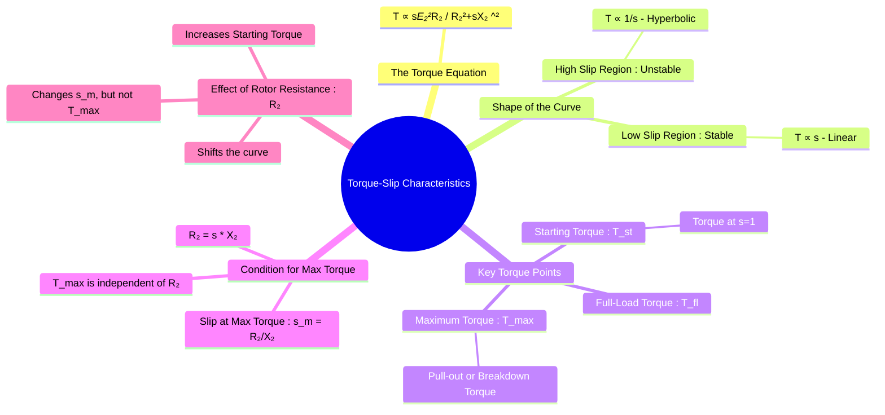

---
tags:
  - electrical-machines
  - induction-motors
  - torque-slip
  - motor-performance
created: 2025-09-17
aliases:
  - Torque-Slip Curve
  - T-s Characteristic of Induction Motor
subject: "[[Electrical Machines]]"
parent:
  - Three-Phase Induction Motors
formula:
  - "Gross Torque Equation (induction motor) : $$T_g = K \\frac{s E_2^2 R_2}{R_2^2 + (sX_2)^2}$$"
  - "Low Slip Region (stable operation - induction motor) : $$T_g \\approx K \\frac{s E_2^2 R_2}{R_2^2} \\implies \\boxed{\\quad T_g \\propto s \\quad}$$"
  - "High Slip Region (unstable operation - induction motor) : $$T_g \\approx K \\frac{s E_2^2 R_2}{(sX_2)^2} \\implies \\boxed{\\quad T_g \\propto \\frac{1}{s}\\quad}$$"
modified: 2026-07-16
---
### Torque-Slip Characteristics
#induction-motors #torque-slip

> The **Torque-Slip Characteristic** is ==a graphical representation of the relationship between the torque developed by an induction motor and its slip==. It is arguably the most important characteristic of an induction motor as it defines its performance from standstill ($s=1$) to synchronous speed ($s=0$).

![[Torque-slip or torque-speed characteris c of a three-phase induc on motor.png]]

> [!warning]- Double Squirrel-Cage Induction Motor Characteristic Curve
> 
> Torque-Speed characteristics of double-cage induction motors
> 
> ![[Torque-Speed Characteristics of Double-Cage Induction Motors.png]]
> 
> > [!refer]
> > [[Construction of Three-Phase Induction Motors#1. Squirrel Cage Rotor|Double Squirrel-Cage Induction Motor]]
^dsctsc

---
#### The Torque Equation
#torque-equation 

The gross torque ($T_g$) developed by an induction motor is proportional to the air gap power ($P_g$). Using the [[Equivalent Circuit of a Three-Phase Induction Motor|equivalent circuit]], the torque can be expressed as a function of slip. A common form of the torque equation is ==(from unreferred rotor parameters)==:
$$\boxed{\quad T_g = K \frac{s E_2^2 R_2}{R_2^2 + (sX_2)^2} \quad}$$

> [!abstract]- Derivation of Gross Torque from Unreferred Rotor Parameters
> #torque-equation #derivation 
> 
> To derive the Torque-Slip equation $T_g = K \frac{s E_2^2 R_2}{R_2^2 + (sX_2)^2}$, we must start from the actual rotor circuit (not referred to the stator) and use 3-phase power.
> 
> **1. Rotor Current ($I_2$)**
> From the basic rotor circuit, the actual rotor current per phase is:
> $$I_2 = \frac{sE_2}{\sqrt{R_2^2 + (sX_2)^2}}$$
> 
> **2. Rotor Copper Loss ($P_{rcu}$)**
> The total copper loss for all 3 phases is $P_{rcu} = 3 I_2^2 R_2$. Substituting the current equation:
> $$P_{rcu} = 3 \left( \frac{sE_2}{\sqrt{R_2^2 + (sX_2)^2}} \right)^2 R_2 = \frac{3s^2 E_2^2 R_2}{R_2^2 + (sX_2)^2}$$
> 
> **3. Air Gap Power ($P_g$)**
> We know from the fundamental power-slip relationship that $P_{rcu} = s P_g$. Therefore, $P_g = \frac{P_{rcu}}{s}$:
> $$P_g = \frac{3sE_2^2 R_2}{R_2^2 + (sX_2)^2}$$
> 
> **4. Gross Torque ($T_g$)**
> Gross torque is the air gap power divided by synchronous speed in radians per second ($\omega_s$):
> $$T_g = \frac{P_g}{\omega_s} = \frac{3}{\omega_s} \left( \frac{sE_2^2 R_2}{R_2^2 + (sX_2)^2} \right)$$
> 
> By replacing the constant term $\frac{3}{\omega_s}$ with $K$, we arrive at the standard torque equation:
> $$\boxed{\quad T_g = K \frac{s E_2^2 R_2}{R_2^2 + (sX_2)^2} \quad}$$

Where:
-   $K$ is a constant ($K = \frac{3}{2\pi n_s}$, where $n_s$ is synchronous speed in rps).
-   $s$ is the slip.
-   $E_2$ is the standstill rotor induced EMF per phase.
-   $R_2$ is the rotor resistance per phase.
-   $X_2$ is the standstill rotor reactance per phase.

> [!derivation] Full Equation
> → $\omega_s = 2\pi n_s$ ($n_s$ is in RPS)
> → $\omega_s = 2\pi N_s$ ($n_s$ is in RPM)
> → $\tau = \frac{P}{\omega}$
> 
> $$P_{g} = 3 \frac{s E_2^2 R_2}{R_2^2 + (sX_2)^2}$$
> $$T_g = \frac{3}{\omega_s} \frac{s E_2^2 R_2}{R_2^2 + (sX_2)^2}$$

![[Modes of Operation of Induction Machines#^induction-machine-operation-modes]]

---
#### Analysis of the Torque-Slip Curve
#torque-slip-curve/analysis 

The shape of the T-s curve can be analyzed by considering different slip regions.

![[Torque-slip characteris cs showing the stable and unstable region of opera on of an induc on motor.png]]

##### 1. Low Slip Region (Stable Operation)
#low-slip-region #stable-operation 

*   This is the normal operating region of the motor, where slip is very small (e.g., $s=0.01$ to $0.05$).
*   In this region, the term $(sX_2)^2$ is very small compared to $R_2^2$ and can be neglected.
*   The torque equation simplifies to:
    $$T_g \approx K \frac{s E_2^2 R_2}{R_2^2} \implies \boxed{\quad T_g \propto s \quad}$$
*   Therefore, ==in the stable operating range, the torque is directly proportional to the slip. The characteristic is a **nearly straight line**==.

---
##### 2. High Slip Region (Unstable Operation)
#high-slip-region #unstable-operation 

*   This region is near [[Frequency of Rotor Current and EMF#At Standstill ($s=1$)|standstill]], where slip is high (approaching 1).
*   In this region, the term $R_2^2$ is very small compared to $(sX_2)^2$ and can be neglected.
*   The torque equation simplifies to:
    $$T_g \approx K \frac{s E_2^2 R_2}{(sX_2)^2} \implies \boxed{\quad T_g \propto \frac{1}{s}\quad}$$
*   Therefore, at high slips, ==the torque is inversely proportional to the slip. The characteristic is a **rectangular hyperbola**==.

---

#### Maximum Torque (Pull-out or Breakdown Torque)
#maximum-torque #pull-out-torque

![[Starting Torque, Maximum Torque and Full Load Torque#Maximum Torque ($T_{max}$)]]

#### Starting Torque ($T_{st}$)
#starting-torque

![[Starting Torque, Maximum Torque and Full Load Torque#Starting Torque ($T_{st}$)]]

#### Effect of Rotor Resistance on Torque-Slip Curve
#rotor-resistance-effect

![[Effect of Rotor Resistance on Torque-Slip Curve#Analysis of the Effects]]

---
### Related Concepts
#torque-slip/related-concepts

> [[Power Flow Diagram and Torque Development]]

[[Modes of Operation of Induction Machines]]
[[Equivalent Circuit of a Three-Phase Induction Motor]]
[[Starting Torque, Maximum Torque and Full Load Torque]]
[[Starting Methods for Induction Motors]]
[[Induction Generator Operation]]