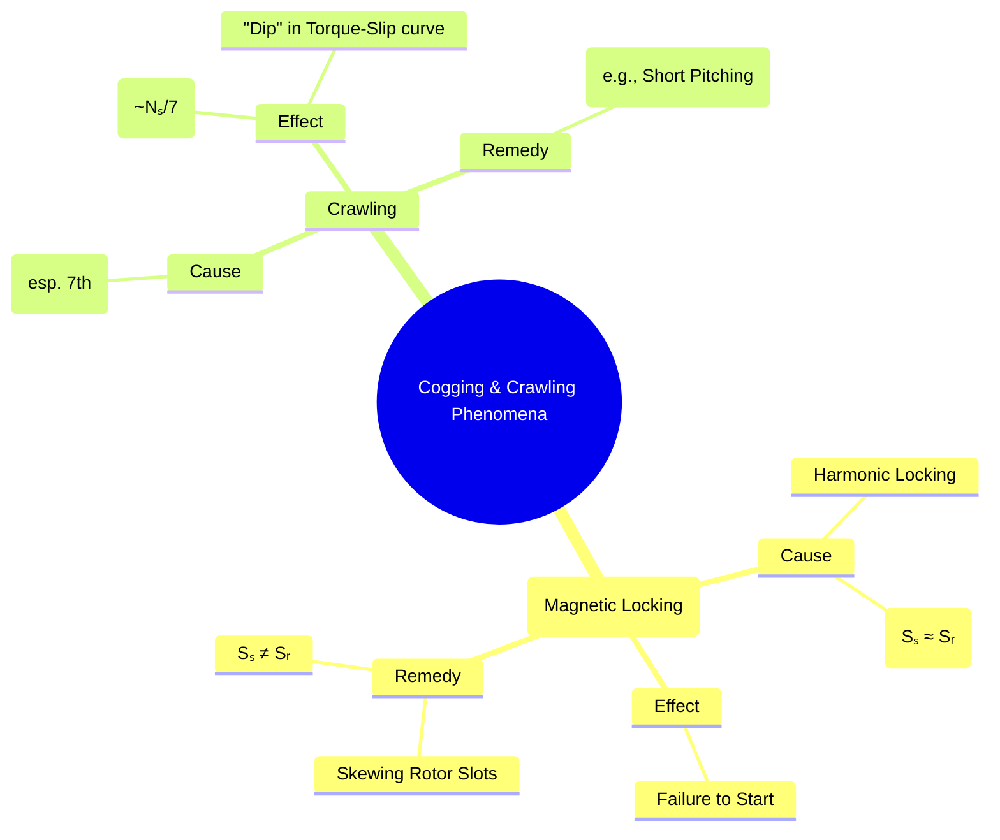

---
tags:
  - electrical-machines
  - induction-motors
  - motor-phenomena
  - harmonics
  - cogging
  - crawling
created: 2025-09-17
aliases:
  - Cogging
  - Crawling
  - Magnetic Locking in Induction Motors
  - Crawling Torque or Subsynchronous Oscillation in Three-phase Squirrel Cage Induction Motors
subject: "[[Electrical Machines]]"
parent:
  - Three-Phase Induction Motors
modified: 2026-07-22T17:44:32
---
### Cogging and Crawling Phenomena
#induction-motors #motor-phenomena

> **Cogging** and **crawling** are two undesirable phenomena sometimes observed in three-phase [[Construction of Three-Phase Induction Motors#1. Squirrel Cage Rotor|squirrel cage induction motors]]. Both result in the motor exhibiting abnormal starting or running behavior.

---

#### Cogging (Magnetic Locking)
#cogging #magnetic-locking

**Definition**: Cogging is the phenomenon where an induction motor refuses to start, particularly when a low voltage is applied. The rotor seems to be "locked" or "stuck" to the stator.

##### Cause
#cogging/cause

Cogging is a magnetic phenomenon. It occurs due to the harmonic torques produced by the interaction between the stator and rotor MMF waves. The magnetic reluctance of the air gap is minimized when the stator teeth and rotor teeth are directly aligned and facing each other. This creates an alignment torque that tries to maintain this position of minimum reluctance.
The effect is most pronounced when the number of stator slots ($S_s$) is equal to, or an integer multiple of, the number of rotor slots ($S_r$).
$$\boxed{\quad \text{Condition for Cogging: } S_s = S_r \text{ or } S_s = k S_r \text{ where k is an integer} \quad}$$

---
##### Effect
#cogging/effect 

A strong alignment torque can exist at standstill, which may be greater than the starting torque produced by the motor. As a result, the motor fails to start.

---
##### Remedies
#cogging/remedies 

1. **Skewing**: ==The rotor slots or bars are skewed (twisted at an angle to the shaft axis).== This ensures that the alignment force on the rotor is not uniform along its length, effectively averaging out the locking tendency.
2. **Proper Slot Selection**: The number of rotor slots is never made equal to the number of stator slots. A suitable difference is maintained in the design.

> [!pyq]- PYQ : 2021
> ![[ee_2021#^q8]]

---
#### Crawling
#crawling #harmonics

**Definition**: Crawling is the tendency of a squirrel cage induction motor to run at a very low, stable speed, typically around one-seventh of its synchronous speed ($N_s/7$), and failing to accelerate up to its rated speed.

##### Cause
#crawling/cause 

Crawling is caused by **space harmonics** in the air gap flux wave. The MMF wave produced by the stator winding is not a perfect sinusoid and contains odd harmonics (3rd, 5th, 7th, etc.).
* The **3rd harmonics** are absent in the line voltage of a balanced 3-phase system.
* The **5th harmonic** rotates in the backward direction at a speed of $N_s/5$.
* The **7th harmonic** rotates in the forward direction at a speed of $N_s/7$.

---
##### Effect
#crawling/effect 

The 7th harmonic produces its own small induction motor torque curve, which has its peak at a slip corresponding to the harmonic speed ($N_s/7$). The net torque produced by the motor is the sum of the fundamental torque and all the harmonic torques. The 7th harmonic torque creates a significant **"dip"** or **"saddle"** in the main torque-slip curve. If the load torque is greater than the value of the torque at this dip, the motor will accelerate up to a speed just below $N_s/7$ and then continue to run at this low, stable speed. This is crawling.

---
##### Remedies
#crawling/remedies 

1. **Winding Design**: The most effective method is to use a proper winding design to minimize the magnitude of the lower-order harmonics (especially the 5th and 7th).
2. **Short-Pitching**: Using a short-pitched stator winding with an appropriate pitch factor can significantly reduce or eliminate the most troublesome harmonics.

---
### Related Concepts
#motor-phenomena/related-concepts

> [[Construction of Three-Phase Induction Motors]]

[[Rotating Magnetic Field (RMF)]]
[[Torque-Slip Characteristics of Induction Motor]]