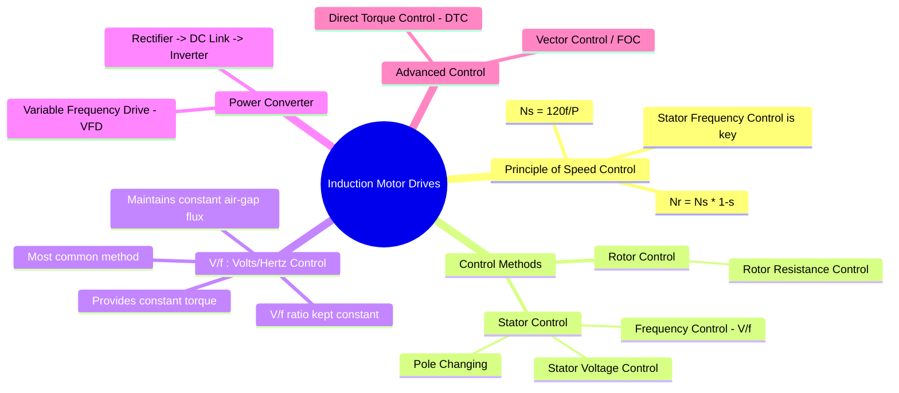

---
tags:
  - induction-motor
  - motor-drives
  - power-electronics
  - speed-control
  - vfd
  - inverters
created: 2025-09-17
aliases:
  - AC Drives
  - Variable Frequency Drives (VFD)
  - Induction Motor Speed Control
subject: "[[Power Electronics]]"
parent:
  - Motor Drives
modified: 2026-07-23T20:47:19
---
### Induction Motor Drives
#induction-motor-drives #vfd

> ==An **Induction Motor Drive**, commonly known as a **Variable Frequency Drive (VFD)**, is a system that controls the speed of an AC induction motor by varying the frequency and voltage of the electrical power supplied to it.== Due to the robustness and low cost of induction motors, VFDs are the most widely used variable-speed drives in industrial applications.

---

#### Principle of Speed Control
#ac-motor-speed-control

The speed of an induction motor is determined by its synchronous speed ($N_s$) and the slip ($s$).
$$\boxed{\quad N_r = N_s (1 - s) \quad \text{where} \quad N_s = \frac{120 f_s}{P} \quad}$$
* $N_r$ is the rotor speed.
* $f_s$ is the stator supply frequency.
* $P$ is the number of poles.

From the equation, it is clear that the most effective and efficient way to control the motor's speed over a wide range is by varying the **stator frequency ($f_s$)**.

---
#### Scalar Control: V/f (Volts per Hertz) Method
#v-f-control

The **V/f control** method is the most common and simplest scalar control strategy for induction motor drives. To maintain a constant, rated torque capability at all speeds, the air-gap flux must be kept constant.

![[Speed Control of Induction Motors#1. V/f Control (Variable Frequency Control)]]

*(Note: Ensure your `Drive Torque-Speed Curve.png` is placed here instead of the generic `Pasted image...` link)*

![[Pasted image 202509171000.png]]

---
#### The Variable Frequency Drive (VFD)
#vfd

A VFD is the power electronic converter that implements the speed control. A typical VFD consists of three main stages:
1. **Rectifier**: An uncontrolled [[Full-Bridge Uncontrolled Rectifier]] converts the fixed-frequency AC input from the mains into a DC voltage.
2. **DC Link**: A large capacitor (and sometimes an inductor) smooths the rectified DC voltage, creating a stable DC bus.
3. **Inverter**: An [[Inverters|inverter]] (typically a PWM-controlled IGBT-based voltage source inverter) converts the DC voltage back into a variable-frequency, variable-voltage AC output that is fed to the motor. The inverter's switching pattern is controlled to maintain the desired V/f ratio.

---
#### Other Speed Control Methods

* **Stator Voltage Control**: Varying only the stator voltage while keeping frequency constant. This is simple (can be done with TRIACs) but highly inefficient, as it works by increasing slip. It offers poor speed regulation and is only suitable for small fan and pump loads.
* **Rotor Resistance Control**: Applicable only to **wound rotor (slip ring) induction motors**. By adding external resistance to the rotor circuit, the torque-slip characteristic can be modified to achieve speed control. This method is also very inefficient as significant power is dissipated as heat in the external resistors.

---
#### Advanced Control Strategies (Vector Control)
#vector-control #foc

While V/f control is simple, it provides sluggish dynamic performance. Advanced control strategies treat the induction motor like a separately excited DC motor for high-performance applications.
* **Vector Control** or **Field-Oriented Control (FOC)**: This method independently controls the two components of the stator current: the flux-producing component and the torque-producing component. This decoupling allows for fast and precise torque control, providing dynamic performance comparable to that of DC motor drives. It requires feedback from a speed sensor (or sophisticated estimation algorithms).

---
### Related Concepts
#related-concepts

> [[Induction Machines#Induction Machines|Induction Machines]] (The motor being controlled)

[[Inverters]] (The core component of a VFD)
[[Power Electronics]]
[[Rectifiers]] (The front-end of a VFD)
[[DC Motor Drives]] (The main alternative)
[[Pulse Width Modulation (PWM)]] (The technique used to control the inverter)