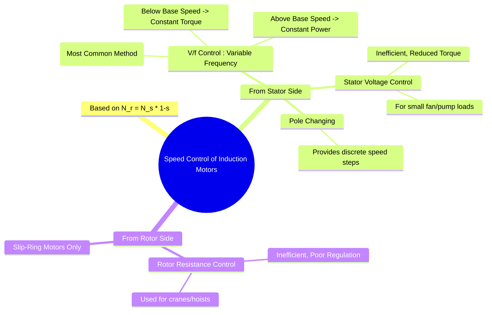

---
tags:
  - electrical-machines
  - induction-motors
  - speed-control
  - v-f-control
  - power-electronics
created: 2025-09-17
aliases:
  - IM Speed Control
  - Speed Control of 3-Phase Induction Motor
  - Stator Voltage Induction Motor Speed Control
  - V/f Induction Motor Speed Control
  - Rotor Resistance Induction Motor Speed Control
subject: "[[Electrical Machines]]"
parent:
  - Three-Phase Induction Motors
modified: 2026-07-23T20:47:46
---
### Speed Control of Induction Motors
#induction-motors #speed-control

> The speed of an induction motor is determined by its synchronous speed and slip. The relationship is given by:
> $$ N_r = N_s (1 - s) = \frac{120 f}{P} (1 - s) $$
> From this equation, it is clear that the rotor speed ($N_r$) can be controlled by varying:
> 1.  The supply frequency ($f$).
> 2.  The number of stator poles ($P$).
> 3.  The slip ($s$).

**Base Speed**: The motor's rated speed at rated voltage and frequency. Control methods are often categorized by their ability to operate below or above this speed.
^base-speed

---

#### Control from the Stator Side

##### 1. V/f Control (Variable Frequency Control)
#v-f-control

This is the most common and efficient method for speed control of induction motors, made possible by modern power electronic devices ([[Induction Motor Drives|Variable Frequency Drives (VFDs)]]).

*   **Principle**: The flux ($\phi$) in an induction motor is approximately proportional to the ratio of applied voltage to frequency ($\phi \propto V/f$). To avoid magnetic saturation (if $f$ is decreased at constant $V$) and excessive weakening of the flux (if $f$ is increased at constant $V$), the ratio $V/f$ is kept constant.
*   **Operating Regions**:
    1.  **Below [[#^base-speed|Base Speed]] (Constant Torque Region)**: Both voltage ($V$) and frequency ($f$) are varied such that the ratio $V/f$ is kept constant. Since the flux is constant, ==the motor can deliver a constant [[Starting Torque, Maximum Torque and Full Load Torque#Maximum Torque ($T_{max}$)|maximum torque]] at any speed in this range==.
    2.  **Above [[#^base-speed|Base Speed]] (Constant Power Region)**: The voltage is kept constant at its rated value, and only the frequency ($f$) is increased. This causes the flux to weaken ($\phi \propto 1/f$). The maximum torque decreases ($T_{max} \propto 1/f^2$), but since speed increases, the maximum output power ($P \approx T \omega$) remains roughly constant. This is analogous to field weakening in a DC motor.
	    > See the [[Torque-Slip Characteristics of Induction Motor|T-s Curve]] for a visual representation of these boundaries
*   **Advantages**: Provides a wide range of smooth, continuous, and highly efficient speed control.

> [!theorem] PYQ Concept: Maximum Starting Torque under Constant V/f Control
> #pyq-concept #v-f-control #starting-torque
> 
> Under constant $V/f$ control from a variable frequency drive (VFD), the starting torque ($s=1$) varies with the operating frequency. To find the exact frequency that yields the absolute **maximum possible starting torque**, we analyze the circuit parameters scaling with the frequency ratio $k = \frac{f}{f_{\text{rated}}}$.
> 
> Assuming stator resistance is negligible ($R_s \approx 0$), the maximum starting torque condition is satisfied when the standalone rotor resistance matches the total frequency-scaled loop reactance:
> 
> $$\text{Real Part of Impedance} = \text{Reactive Part of Impedance}$$
> 
> ###### 1. General Framework (Stator-Referred Parameters)
> 
> > See [[ee_2025#^q45]]
> 
> When both stator reactance ($X_s$) and referred rotor reactance ($X'_r$) are given:
> $$R'_r = k(X_s + X'_r) \implies \boxed{\quad k = \frac{R'_r}{X_s + X'_r} \quad}$$
> 
> ###### 2. Simplified Framework (Rotor-Isolated Parameters)
> If stator parameters are neglected entirely and only standalone standstill rotor values ($R_2, X_2$) are provided:
> $$R_2 = k X_2 \implies \boxed{\quad k = \frac{R_2}{X_2} \quad}$$
> 
> ---
> ###### Operational Drive Outputs
> Once the optimal frequency ratio $k$ is determined, the required drive outputs are calculated as:
> * **Optimal Output Frequency:** $$f_{\text{optimal}} = k \cdot f_{\text{rated}}$$
> * **Optimal Output Voltage:** $$V_{\text{optimal}} = k \cdot V_{\text{rated}}$$
^optimal-v-f

---
##### 2. Stator Voltage Control
#stator-voltage-control

*   **Principle**: The torque developed by an induction motor is proportional to the square of the applied voltage ($T \propto V^2$). By reducing the stator voltage, the developed torque decreases. For a given load torque, the motor slip must increase to produce the required torque, thus decreasing the speed.
*   **Implementation**: Achieved using AC voltage controllers (thyristor-based).
*   **Characteristics**:
    *   This is a **constant torque** type control.
    *   **Inefficient**: A higher slip means higher rotor copper losses ($P_{rcu} = s P_g$), leading to significant power wastage and heating.
    *   **Reduced Torque Capability**: The maximum torque ($T_{max}$) is severely reduced as voltage is decreased.
*   **Application**: Only suitable for simple loads like fans and pumps where the load torque decreases significantly with speed.

> [!important] Effect of stator voltage reduction (f = rated)
> - $R_s$ : unchanged  
> - $R_r$ : unchanged  
> - $X_{lr}$ : unchanged  
> - $\boxed{\quad X_m\ \text{changes} \quad}$

> See [[Equivalent Circuit of a Three-Phase Induction Motor]]

---
#### Control from the Rotor Side

##### Rotor Resistance Control
#rotor-resistance-control

> [!warning] Slip-ring
> This method is applicable **only to [[Construction of Three-Phase Induction Motors#2. Slip Ring (or Wound) Rotor|slip-ring (wound rotor)]] induction motors**.

*   **Principle**: As established in the [[Effect of Rotor Resistance on Torque-Slip Curve#Analysis of the Effects|effect of rotor resistance]], adding external resistance to the rotor circuit shifts the torque-slip curve. For a constant load torque, the motor must operate at a higher slip to produce that torque. An increase in slip means a decrease in speed ($N_r = N_s (1-s)$).
*   **Implementation**: A variable rheostat is connected to the rotor circuit via the slip rings.
*   **Characteristics**:
    *   This is a **constant torque** type control.
    *   **Inefficient**: The slip power ($sP_g$), which represents the rotor copper loss, is dissipated as heat in the external resistors, leading to very low efficiency at low speeds.
    *   **Poor Speed Regulation**: The speed changes significantly with any change in load.
*   **Application**: Used in applications requiring high torque at low speeds for short durations, such as cranes, hoists, and elevators.

---
### Related Concepts
#speed-control/related-concepts

> [[Torque-Slip Characteristics of Induction Motor]]
> [[Speed Regulation]]

[[Starting Methods for Induction Motors]]
[[Effect of Rotor Resistance on Torque-Slip Curve]]
[[Power Electronics]]
[[Speed Control of DC Motors]]