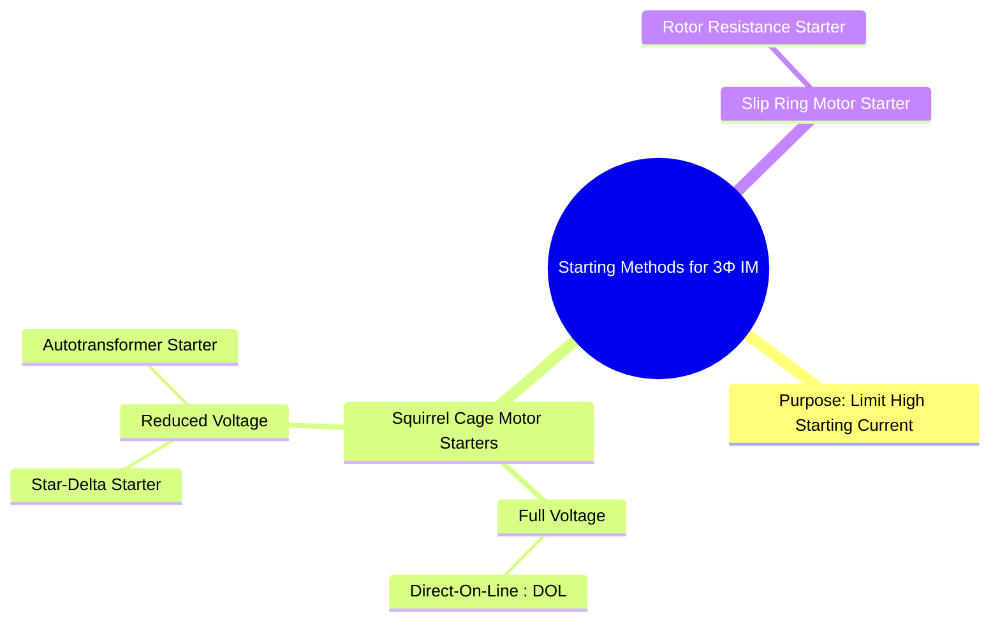

---
tags:
  - electrical-machines
  - induction-motors
  - motor-starters
  - starting-methods
created: 2025-09-17
aliases:
  - IM Starting Methods
  - Methods of Starting Induction Motors
  - DOL Induction Motor Starting Method
  - Star-Delta Induction Motor Starting Method
  - Autotransformer Induction Motor Starting Method
  - Rotor Resistance Induction Motor Starting Method
  - Direct-On-Line Method Induction Motor
  - Star-Delta Starter in 3 Phase Induction Motor
subject: "[[Electrical Machines]]"
parent:
  - Three-Phase Induction Motors
modified: 2026-07-23T20:48:25
---
### Starting Methods for Induction Motors
#induction-motors #motor-starters

> A three-phase induction motor at standstill acts like a transformer with a short-circuited secondary. This causes it to draw a very high starting current (typically 5 to 8 times the full-load current) when connected directly to the full supply voltage. This high current can cause a significant voltage dip in the supply line and may damage the motor windings. Therefore, **starters** are used to limit this inrush current for all but the smallest motors.

---
#### Methods for Squirrel Cage Motors

![[Construction of Three-Phase Induction Motors#^squirrel-cage-rotor]]

These methods focus on reducing the voltage applied to the stator during starting, since torque and current are highly dependent on voltage.

##### 1. Direct-On-Line (DOL) Starting
#dol-starter
*   **Principle**: The motor is connected directly across the full 3-phase supply.
*   **Characteristics**:
    *   **Starting Current**: Very high, equal to the short-circuit current ($I_{st} = I_{sc}$).
    *   **Starting Torque**: Full starting torque is available. $T_{st} \propto V^2$.
*   **Application**: Used for small motors (typically up to 7.5 kW) where the high starting current is acceptable to the supply network.

---
##### 2. Star-Delta (Y-$\Delta$) Starter
#star-delta-starter
*   **Principle**: The motor is started with its stator winding connected in a **Star (Y)** configuration. Once the motor reaches about 80% of its rated speed, a changeover switch reconnects the winding in its normal **Delta ($\Delta$)** configuration.
*   **Analysis**:
    *   In Star connection, the voltage across each phase is $V_{ph(Y)} = V_L / \sqrt{3}$.
    *   In Delta connection, the voltage across each phase is $V_{ph(\Delta)} = V_L$.
    *   The line current drawn during starting in Star ($I_{L(Y)}$) is **1/3** of the line current it would draw if started directly in Delta ($I_{L(\Delta)}$).
        $$\boxed{\quad I_{st(Y)} = \frac{1}{3} I_{st(DOL, \Delta)} \quad}$$
    *   Since torque is proportional to the square of the applied phase voltage ($T \propto V_{ph}^2$), the starting torque is also reduced to **1/3**.
        $$\boxed{\quad T_{st(Y)} = \frac{1}{3} T_{st(DOL, \Delta)} \quad}$$
*   **Application**: Suitable for motors designed to run in Delta, where a lower starting torque is acceptable (e.g., pumps, fans, compressors).

---
##### 3. Autotransformer Starter
#autotransformer-starter

> [!pyq]- PYQ : 2022
> ![[ee_2022#^q65]]

*   **Principle**: A three-phase [[Autotransformers|autotransformer]] is used to apply a reduced voltage to the motor during starting. The motor is then switched to the full supply voltage once it has accelerated.
*   **Analysis**:
    *   Let the autotransformer tapping be at a fraction '$x$' of the full voltage. The voltage applied to the motor is $xV_L$.
    *   The motor starting current is reduced to $I_{motor} = x \cdot I_{sc}$.
    *   Due to transformer action, the current drawn from the supply line is further reduced: $I_{line} = x \cdot I_{motor} = x^2 \cdot I_{sc}$.
        $$\boxed{\quad I_{st(line)} = x^2 \cdot I_{st(DOL)} \quad}$$
    *   Since torque is proportional to the square of the voltage ($T \propto V^2$), the starting torque is also reduced by $x^2$.
        $$\boxed{\quad T_{st} = x^2 \cdot T_{st(DOL)} \quad}$$
*   **Advantage**: More flexible than the star-delta method as multiple tappings can be provided. For the same starting current drawn from the line, it provides a higher starting torque.

---
#### Method for Slip-Ring (Wound Rotor) Motors

![[Construction of Three-Phase Induction Motors#^slip-ring-rotor]]

##### Rotor Resistance Starter
#rotor-resistance-starter
*   **Principle**: This method is **exclusively for slip-ring motors**. It involves adding external resistance to the rotor circuit via the slip rings during startup.
* **Analysis**:
    ![[Effect of Rotor Resistance on Torque-Slip Curve#3. Effect on Starting Torque ($T_{st}$)]]
*   **Procedure**: A high resistance is inserted at start and is then gradually cut out in steps as the motor gains speed.
*   **Advantage**: Allows for very high starting torque with low starting current, providing excellent starting performance for heavy loads.

---
### Related Concepts
#motor-starters/related-concepts

> [[Construction of Three-Phase Induction Motors]]

[[Modes of Operation of Induction Machines]]
[[Torque-Slip Characteristics of Induction Motor]]
[[Starting Torque, Maximum Torque and Full Load Torque]]
[[Effect of Rotor Resistance on Torque-Slip Curve]]
[[Autotransformers]]
