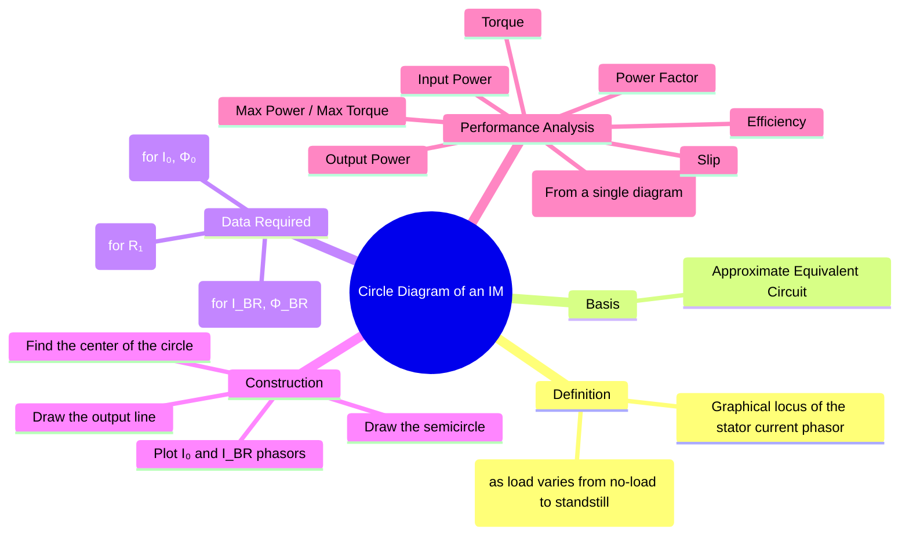

---
tags:
  - electrical-machines
  - induction-motors
  - circle-diagram
  - graphical-analysis
  - machine-testing
created: 2025-09-17
aliases:
  - IM Circle Diagram
  - Heyland Diagram
subject: "[[Electrical Machines]]"
parent:
  - Three-Phase Induction Motors
  - "[[Induction Machines]]"
modified: 2026-07-23T20:49:45
---
### Circle Diagram of an Induction Motor
#induction-motors #circle-diagram

> The **circle diagram** is a graphical method for determining the complete performance characteristics of a three-phase induction motor from the data obtained in the [[No-Load and Blocked Rotor Tests|no-load and blocked-rotor tests]]. It is the locus of the tip of the stator current phasor as the slip varies from zero (no-load) to one (standstill). It provides a visual representation of quantities like torque, power, slip, and efficiency without complex calculations.

---
#### Basis of the Circle Diagram
#circle-diagram/basis 

The circle diagram is based on the [[Equivalent Circuit of a Three-Phase Induction Motor#Approximate Equivalent Circuit|approximate equivalent circuit]] of the induction motor. The stator current $I_1$ is the phasor sum of the no-load current $I_0$ and the rotor current referred to the stator, $I_2'$. The expression for the current can be shown to be the equation of a circle. As the slip '$s$' (the only variable) changes, the tip of the stator current phasor $I_1$ traces a circular path.

---
#### Data Required for Construction
1. **No-Load Test**: 
   ![[No-Load and Blocked Rotor Tests#No-Load Test]]
2. **Blocked Rotor Test**: 
   ![[No-Load and Blocked Rotor Tests#Blocked Rotor Test]]
3. **Stator Resistance Test**: A DC test to measure the per-phase stator resistance ($R_1$).

---
#### Construction of the Circle Diagram
1.  **Draw Axes**: Choose a suitable current scale. Draw horizontal and vertical axes. The vertical axis represents the voltage phasor $V$. All currents are plotted with respect to this reference.
2.  **Plot No-Load Current**: Draw the no-load current phasor **OA** = $I_0$ at an angle $\phi_0$ lagging the voltage vector.
3.  **Plot Blocked Rotor Current**: Draw the blocked rotor current phasor (scaled to rated voltage) **OB** = $I_{BR}$ at an angle $\phi_{BR}$ lagging the voltage vector.
4.  **Draw the Output Line**: Join points **A** and **B**. This line **AB** is called the output line.
5.  **Find the Center**: Draw the perpendicular bisector of the output line **AB**. The center of the circle, **C**, must lie on this bisector. The center also lies on a horizontal line drawn from point A. The intersection of these two lines gives the center **C**.
6.  **Draw the Circle**: With **C** as the center and **CA** (or **CB**) as the radius, draw a semicircle passing through A and B. This semicircle is the locus of the stator current.

---
#### Interpreting the Diagram
For any operating point **P** on the circle:
*   The phasor **OP** represents the stator current $I_1$.
*   The power factor is $\cos(\phi)$, where $\phi$ is the angle between **OP** and the vertical voltage axis.
*   Draw a vertical line from point P down to the horizontal line from A. Let this line be **PM**. This vertical line represents the power drawn by the motor, scaled appropriately.

**Power Scale**: The vertical components of current represent active power. Power (in Watts) = $\sqrt{3} V_L \times (\text{Vertical Component of Current})$.

1.  **Input and Output Power**: For point P, draw the vertical line **PG**.
    *   **PG**: Represents the total electrical input power ($P_{in}$).
    *   **PF**: Represents the rotor copper loss ($P_{rcu}$).
    *   **FG**: Represents the stator copper loss ($P_{s,cu}$).
    *   **EF**: Represents the constant losses (core + mechanical).
    *   **PE**: Represents the net mechanical output power ($P_{out}$).

2.  **Torque Line**: The line **AB** is the output line. To find the torque, we must first separate the stator and rotor copper losses at standstill. The total copper loss at standstill is given by the vertical line **BH**. This loss is divided at point **D** such that **BD** represents rotor copper loss and **DH** represents stator copper loss. The line **AD** is called the **Torque Line**.
    *   The length **PF** now represents the **gross torque** developed by the rotor (in synchronous watts).

3.  **Slip, Efficiency, and Maximum Values**:
    *   **Slip ($s$)**: $s = \frac{\text{Rotor Copper Loss}}{\text{Air Gap Power}} = \frac{PF}{PG-FG}$
    *   **Efficiency ($\eta$)**: $\eta = \frac{\text{Output Power}}{\text{Input Power}} = \frac{PE}{PG}$
    *   **Maximum Output Power**: Occurs at the point where the tangent to the circle is parallel to the output line **AB**.
    *   **Maximum Torque**: Occurs at the point where the tangent to the circle is parallel to the torque line **AD**.

---
#### Advantages and Limitations

*   **Advantages**:
    *   Provides a complete performance summary in a single plot.
    *   Offers a clear visual understanding of how performance parameters change with load.
*   **Limitations**:
    *   It is based on the approximate equivalent circuit and assumes constant parameters, leading to some inaccuracy.
    *   It is less accurate than modern computational methods but remains a valuable educational tool.

---
### Related Concepts
#circle-diagram/related-concepts

> [[No-Load and Blocked Rotor Tests]]

[[Equivalent Circuit of a Three-Phase Induction Motor]]
[[Power Flow Diagram and Torque Development]]
[[Losses and Efficiency of Induction Motors]]