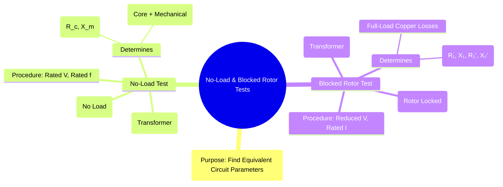

---
tags:
  - electrical-machines
  - induction-motors
  - machine-testing
  - no-load-test
  - blocked-rotor-test
created: 2025-09-17
aliases:
  - Induction Motor Tests
  - OC and SC Test of IM
  - Blocked Rotor Test
  - No-Load Test
subject: "[[Electrical Machines]]"
parent:
  - "[[Induction Machines]]"
  - Three-Phase Induction Motors
modified: 2026-07-23T20:50:13
---
### No-Load and Blocked Rotor Tests
#induction-motors #machine-testing

> The **No-Load Test** and the **Blocked Rotor Test** are two indirect testing methods performed on a three-phase induction motor to determine the parameters of its [[Equivalent Circuit of a Three-Phase Induction Motor|equivalent circuit]]. These tests are analogous to the Open-Circuit (OC) and Short-Circuit (SC) tests on a transformer and are crucial for predicting the motor's performance without having to load it to its full capacity.

---

#### No-Load Test
#no-load-test

**Purpose**: To determine the rotational losses (friction, windage, and core loss) and the parameters of the shunt magnetizing branch ($R_c$ and $X_m$) of the equivalent circuit.

*   **Analogy**: This test is equivalent to the **Open-Circuit (OC) test** of a transformer.
*   **Procedure**: The motor is run at its rated voltage ($V_{NL}$) and rated frequency with no mechanical load connected to its shaft. The input line voltage, line current ($I_{NL}$), and total input power ($P_{NL}$) are measured.
*   **Analysis**:
    *   At no-load, the motor runs at a speed very close to synchronous speed, so the slip is extremely small ($s \approx 0$).
    *   In the equivalent circuit, the load resistance term $\frac{R_2'(1-s)}{s}$ becomes very large, effectively making the rotor branch an **open circuit**.
    *   The no-load input current ($I_{NL}$) is therefore very small and flows mainly through the shunt magnetizing branch.
    *   The total input power ($P_{NL}$) supplies the stator copper loss and the constant losses.
        $$ P_{NL} = \text{Stator Copper Loss} + \text{Constant Losses} $$
        $$ P_{NL} = 3 I_{NL,ph}^2 R_1 + (P_{core} + P_{mech}) $$
    *   The constant (rotational) losses can be found by subtracting the small stator copper loss:
        $$\boxed{\quad P_{const} = P_{core} + P_{mech} = P_{NL} - 3 I_{NL,ph}^2 R_1 \quad}$$
    *   The parameters of the shunt branch can then be calculated from the no-load readings.

---
#### Blocked Rotor Test
#blocked-rotor-test

> See [[ee_2012#^q46]] #marks-to-all 

**Purpose**: To determine the series parameters of the equivalent circuit, which are the equivalent resistance ($R_{eq} = R_1 + R_2'$) and the equivalent leakage reactance ($X_{eq} = X_1 + X_2'$).

*   **Analogy**: This test is equivalent to the **Short-Circuit (SC) test** of a transformer.
*   **Procedure**: The rotor is physically locked or blocked so that it cannot rotate. A reduced voltage ($V_{BR}$) is applied to the stator terminals, just enough to circulate the rated full-load current ($I_{BR}$). The input line voltage, line current, and total input power ($P_{BR}$) are measured.
*   **Analysis**:
    *   Since the rotor is blocked, its speed is zero ($N_r=0$), which means the slip is exactly **$s=1$**.
    *   At $s=1$, the load resistance term in the rotor circuit is zero. The impedance of the rotor branch is low.
    *   The shunt magnetizing branch has a very high impedance compared to the series impedance, so the current flowing through it is negligible. The circuit effectively consists only of the series parameters.
    *   The input power ($P_{BR}$) supplies the total copper losses of the stator and rotor.
        $$ P_{BR} = 3 I_{BR,ph}^2 (R_1 + R_2') = 3 I_{BR,ph}^2 R_{eq} $$
    *   From this, the equivalent resistance referred to the stator can be found:
        $$\boxed{\quad R_{eq} = R_1 + R_2' = \frac{P_{BR}}{3 I_{BR,ph}^2} \quad}$$
    *   The equivalent impedance and reactance can be calculated as:
        $$\begin{align}
        Z_{eq} &= \frac{V_{BR,ph}}{I_{BR,ph}} \\
        X_{eq} &= X_1 + X_2' = \sqrt{Z_{eq}^2 - R_{eq}^2}
        \end{align}$$
    *   The stator resistance ($R_1$) is typically measured separately using a DC test (voltmeter-ammeter method), which allows for the calculation of the rotor resistance ($R_2' = R_{eq} - R_1$).

---
### Related Concepts
#machine-testing/related-concepts

> [[Equivalent Circuit of a Three-Phase Induction Motor]]

[[Losses and Efficiency of Induction Motors]]
[[Power Flow Diagram and Torque Development]]