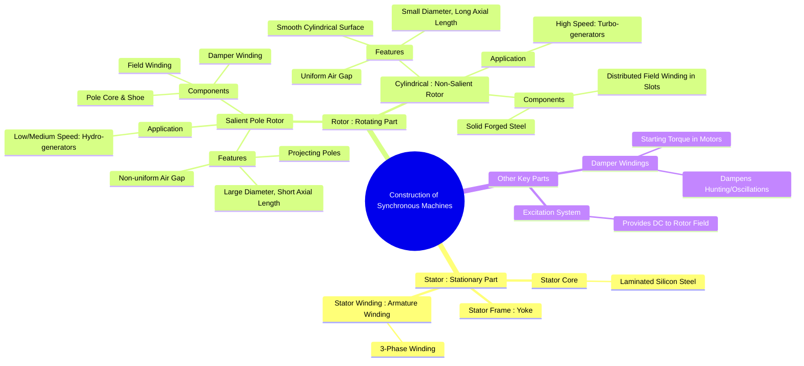

---
tags:
  - electrical-machines/synchronous-machines
  - alternator
  - synchronous-motor
  - machine-construction
created: 2025-07-16
aliases:
  - Synchronous Machine Construction
  - Alternator Construction
subject: "[[Electrical Machines]]"
parent: "[[Synchronous Machines]]"
modified: 2026-07-23T20:51:09
---
### Constructional Features of Synchronous Machines
#synchronous-machine #alternator #construction #electrical-machines

> A synchronous machine, whether operating as a generator (alternator) or a motor, consists of a stationary part called the **stator** and a rotating part called the **rotor**. The stator houses the armature winding (typically 3-phase), and the rotor houses the field winding which is supplied with DC to create a magnetic field. The construction of the rotor is the most significant differentiating feature and is primarily determined by the speed of the prime mover.

> [!info] Electromechanical Classification
> A synchronous machine is a **[[Singly and Doubly Excited Systems#Doubly Excited Systems|conductively doubly-excited]]** system. The stator receives AC power, while the rotor's excitation system physically conducts a separate DC supply into the field winding. This creates two independently controlled, interacting magnetic fields, allowing for continuous energy conversion and independent control of the rotor's magnetic strength.

The synchronous speed is given by:
$$\boxed{\quad N_s = \frac{120f}{P} \quad}$$
where $f$ is the supply frequency and $P$ is the number of poles. High-speed machines require fewer poles, while low-speed machines require many poles.

---
#### Stator Construction
#stator #armature

The stator construction is similar for both salient and cylindrical rotor machines. It consists of:
1. **Stator Frame (Yoke)**: The outer hollow cylindrical frame made of cast iron or welded steel. It provides mechanical protection and support for the stator core.
2. **Stator Core**: Built up of high-grade silicon steel laminations (0.5 mm thick) to minimize eddy current losses. The inner periphery has slots to house the armature winding.
3. **Stator Winding (Armature Winding)**: A three-phase distributed winding (star or delta connected) is placed in the stator slots. This is where the EMF is generated (in an alternator) or which interacts with the rotor field to produce torque (in a motor).

---
#### Rotor Construction
#rotor #salient-pole #cylindrical-rotor

The rotor carries the field winding, which is excited by a DC source. Based on the construction, rotors are of two types:

##### 1. Salient Pole Rotor
#salient-pole-rotor

![[Salient Pole Rotor.png]]

* ==**"Salient"** means projecting or protruding. The poles project out from the rotor core.==
* **Construction**:
    * Made of laminated steel to reduce eddy current losses.
    * The concentrated field winding is wound around the pole body.
    * Pole faces are shaped to make the air-gap flux distribution more sinusoidal.
    * They are equipped with [[Damper Windings]] in the pole faces.
* **Characteristics**:
    * ==**Large diameter** and **short axial length**.==
    * Mechanically less robust, hence ==suitable for **low and medium speeds** (typically 120 rpm to 1000 rpm)==.
    * Requires a large number of poles to achieve the required frequency (e.g., a 50 Hz, 600 rpm generator needs $P=10$ poles).
    * ==The air gap is **non-uniform** (minimum under pole centers, maximum between poles).== This is the basis for [[Salient Pole Machines - Two Reaction Theory|Two Reaction Theory]].
* **Prime Mover/Application**: Used in low-speed applications, primarily driven by water turbines in **hydro-electric power plants** (hydro-generators).

##### 2. Cylindrical (Non-Salient) Rotor
#cylindrical-rotor #turbo-generator

![[Synchronous Machine - Cylindrical Pole Rotor.png]]

* **Construction**:
    * The rotor is a smooth, solid cylinder forged from high-grade nickel-chrome-molybdenum steel for high mechanical strength.
    * The field winding is a distributed winding placed in slots milled on the outer surface of the cylinder. About two-thirds of the rotor periphery is slotted.
    * The unslotted solid portion of the rotor acts as the pole face.
* **Characteristics**:
    * ==**Small diameter** and **long axial length**.==
    * Mechanically very strong, capable of withstanding high centrifugal forces, hence ==suitable for **very high speeds** (1500 rpm or 3000 rpm for 50 Hz; 1800 rpm or 3600 rpm for 60 Hz)==.
    * Requires only 2 or 4 poles.
    * ==The air gap is **uniform** all around.==
* **Prime Mover/Application**: Used in high-speed applications, driven by steam or gas turbines in **thermal and nuclear power plants** (turbo-generators).

---
#### Damper Windings
#damper-winding #hunting

> See [[Hunting in Synchronous Machines#Damper Windings (Amortisseur Windings) - The Remedy|Damper Windings in Synchronous Machines]] in details

![[Damper Winding & DQ-Axis.png]]

* **Construction**: Copper or aluminum bars are placed in slots on the rotor pole faces and are short-circuited at both ends by end rings, similar to a squirrel cage rotor. They are always present in salient pole machines.
* **Functions**:
    1. **Motor Starting**: A synchronous motor is not self-starting. The damper winding provides the starting torque by induction motor action.
    2. **Suppress Hunting**: During sudden load changes, the rotor may oscillate about its equilibrium position. This is called **hunting**. The damper winding produces a torque that opposes these oscillations, thus damping them out.
    3. **Reduce Harmonics**: Damper windings can help suppress negative sequence fields caused by unbalanced loads.

---
#### Excitation System
#excitation-system

* The system that provides the necessary DC current to the rotor field winding.
* It can be a small DC generator (exciter) mounted on the same shaft as the main machine or a static system using rectifiers (e.g., Brushless Excitation System).

---
### Related Concepts
#synchronous-machine/related-concepts

> [[Principle of Operation as a Generator (Alternator)]]

[[EMF Equation of an Alternator]]
[[Armature Winding Factors in Synchronous Machines]]
[[Armature Reaction and Synchronous Reactance]]
[[Salient Pole Machines - Two Reaction Theory]]
[[Principle of Operation of Synchronous Motors]]
[[Hunting in Synchronous Machines]]
