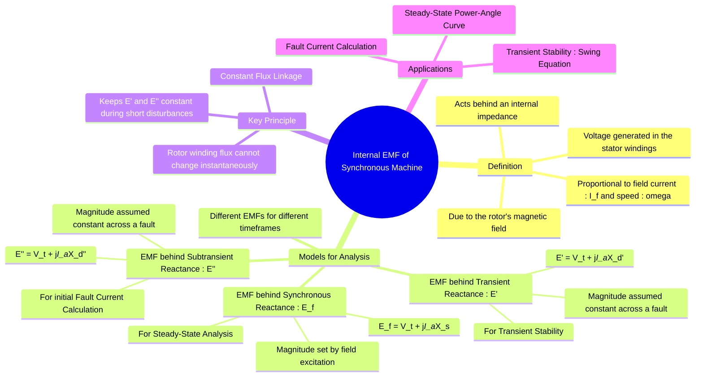

---
tags:
  - power-system
  - electrical-machines
  - fault-analysis
  - stability
  - gate
created: 2025-07-21
aliases:
  - Internal EMF
  - Internal Generated Voltage
  - Excitation Voltage
  - Eg
  - Ef
  - The Principle of Constant Flux Linkage
  - Internal Voltage
subject: "[[Electrical Machines]]"
parent:
  - "[[Synchronous Machines]]"
formula:
  - "EMF behind Synchronous Reactance : $$\\vec{E}_f = \\vec{V}_t + j\\vec{I}_a X_s$$"
  - "EMF behind Transient Reactance : $$\\vec{E}' = \\vec{V}_t + j\\vec{I}_a X_d'$$"
  - "EMF behind Subtransient Reactance : $$\\vec{E}'' = \\vec{V}_t + j\\vec{I}_a X_d''$$"
modified: 2026-07-21T08:52:12
---
### Internal EMF of a Synchronous Machine
#synchronous-machine/emf #power-system/modeling

> ==The Internal EMF (or Internal Generated Voltage) is the voltage generated in the stator armature windings of a synchronous machine by the magnetic field of the rotor.== This voltage is not directly accessible at the terminals; it is an internal quantity that acts behind an effective internal impedance (reactance).

The magnitude of this EMF is directly proportional to the rotor speed and the magnetic flux produced by the field current ($I_f$). ==In steady-state analysis, this is often called the **Excitation Voltage**.==

---
#### Different Models for Internal EMF
#synchronous-machine/modeling

The concept and value of ==the "internal EMF" depend on the timeframe of the analysis== <u>because the machine's effective internal impedance changes after a disturbance</u>.

> [!info] A Note on Armature Resistance ($R_a$)
> While armature resistance is strictly present in all states, it is almost universally neglected in **transient** and **subtransient** fault calculations because $X_d \gg R_a$. However, for **steady-state** calculations, it must be included if explicitly given.

---
##### 1. EMF behind Synchronous Impedance ($E_f$)
#synchronous-impedance/emf 

This model is used for **steady-state** power flow and steady-state stability analysis. $E_f$ is the voltage behind the full [[Armature Reaction and Synchronous Reactance#Synchronous Reactance ($X_s$) and Impedance ($Z_s$)|synchronous impedance]] ($Z_s = R_a + jX_s$). ==Its magnitude is directly controlled by the DC field excitation.==

> [!concept]- Origin of Synchronous Reactance ($X_s$)
    > ![[Armature Reaction and Synchronous Reactance#Synchronous Reactance ($X_s$) and Impedance ($Z_s$)]]

* **Generator Convention:** #synchronous-generator/internal-emf $$\boxed{\quad \vec{E}_f = \vec{V}_t + \vec{I}_a Z_s \quad}$$
> [!pyq]- PYQ : 2019
> ![[ee_2019#^q51]]

* **Motor Convention:** #synchronous-motor/internal-emf $$\boxed{\quad \vec{V}_t = \vec{E}_f + \vec{I}_a Z_s \quad}$$
==*(Note: If $R_a$ is negligible, simply replace $Z_s$ with $jX_s$)*==
> [!pyq]- PYQ : 2019
> ![[ee_2019#^q48]]

> [!related]
> [[Equivalent Circuit and Phasor Diagram of an Alternator]]
> [[Power-Angle Characteristics for Synchronous Machines]]
> [[Machine Excitation Convention]] (for how this dictates leading/lagging behavior)

> [!examtip] Constant Excitation / Internal EMF Problems
> **Exam Trigger:** "Constant field excitation" + a change in load/power factor.
> 
> **Strategy:** Unchanged field current means $|E_f|$ is **constant**. 
> 1. Find initial $|E_f|$ using pre-change conditions.
> 2. Lock $|E_f|$ and solve the new operating state using the phasor triangle:
> $$(X_sI_a)^2 = V_t^2 + E_f^2 - 2V_tE_f\cos\delta$$
> *(where $\delta$ is the load angle between $\vec{E}_f$ and $\vec{V}_t$)*
> 
> **Phasor Basics:**
> Gen: $\vec{E}_f = \vec{V}_t + jX_s\vec{I}_a$  |  Motor: $\vec{V}_t = \vec{E}_f + jX_s\vec{I}_a$

---
##### 2. EMF behind Transient Reactance ($E'$)
#transient-reactance/emf 

This model is used for **transient stability** studies. $E'$ is the voltage behind the transient reactance ($X_d'$). Its magnitude is proportional to the field winding flux linkage. Due to the **Principle of Constant Flux Linkage**, the magnitude of $E'$ remains nearly constant immediately before, during, and after a short circuit.
$$\boxed{\quad \vec{E}' = \vec{V}_t + j\vec{I}_a X_d' \quad}$$
This is the voltage used as the machine's internal source in the network model for transient stability simulations (e.g., in the swing equation).

---
##### 3. EMF behind Subtransient Reactance ($E''$)
#subtransient-reactance/emf 

> [!refer]
> [[Sub-transient Reactance]]

This model is used to calculate the **initial fault current** in the subtransient period. $E''$ is the voltage behind the subtransient reactance ($X_d''$). Its magnitude is proportional to the flux linkage of both the field and [[damper windings]], and it also remains nearly constant across a fault.
$$\boxed{\quad \vec{E}'' = \vec{V}_t + j\vec{I}_a X_d'' \quad}$$

> [!pyq]- PYQ : 2020
> ![[ee_2020#^q49]]

> [!formula] Loaded Pre-Fault Magnitude Formula
> If the generator is supplying a pre-fault current $I_a$ at a lagging power factor angle $\phi$, the magnitude of the subtransient internal EMF can be calculated directly using: $$E'' = \sqrt{(V_t \cos\phi)^2 + (V_t \sin\phi + I_a X_d'')^2}$$

---
#### The Principle of Constant Flux Linkage
#synchronous-machine/flux-linkage

> [!note] Chronological Trapped Flux Decay
> While the **Principle of Constant Flux Linkage** keeps the initial magnitudes of $E''$ and $E'$ constant *at the exact instant* of a fault ($t = 0^+$), they behave differently as time progresses:
> * **$\vec{E}''$ (Subtransient):** Constant only while currents are trapped in both damper and field windings. Decays rapidly ($\approx 2$-$3$ cycles) as damper winding flux dissipates.
> * **$\vec{E}'$ (Transient):** Constant over a longer window ($\approx 1$-$2$ seconds) because the main field winding has a much higher inductance-to-resistance ($L/R$) ratio.

The basis for assuming $E'$ and $E''$ are constant across a disturbance is the electromagnetic principle that the flux linkage ($\lambda = L \cdot i$) of a closed, low-resistance inductive circuit cannot change instantaneously. The rotor field and [[damper windings]] are such circuits. Since the magnitudes of $E'$ and $E''$ are proportional to these trapped flux linkages, they are considered constant for the duration of the transient and subtransient periods, respectively.

---
#### Application in Power System Analysis
#power-system/analysis

* **Power Factor Control:** By varying the DC field excitation ($I_f$), the magnitude of $E_f$ changes. In a [[synchronous motors|synchronous motor]] operating at constant power, this altering of $E_f$ governs the armature current and power factor, yielding the characteristic [[V-Curves]].
- **Fault Calculation**: To find the fault current, the pre-fault state of the machine is first determined to calculate the internal EMF. This pre-fault EMF is then used as the voltage source that drives the current through the appropriate machine reactance ($X_d''$ for initial current) and system impedance to the point of the fault. For simplicity, it is often assumed that the machine is operating at no-load and rated voltage, so the pre-fault internal EMF is just the terminal voltage (e.g., $1.0 \angle 0^\circ$ pu).

- **Transient Stability**: The pre-fault operating conditions determine the initial value of $E'$ and the power angle $\delta$. After a fault occurs, the system configuration changes, but the magnitude of $E'$ is assumed to remain constant. The analysis then proceeds to solve the swing equation to see how the power angle $\delta$ changes over time.

> [!examtip] GATE Exam Shortcut: Pre-Fault vs. Post-Fault Calculation
> When calculating fault currents, always use the **pre-fault** terminal voltage ($\vec{V}_{t0}$) and line current ($\vec{I}_{a0}$) to lock down your internal EMF phasor *before* the fault:
> 
> $$\vec{E}'' = \vec{V}_{t0} + j\vec{I}_{a0}X_d''$$
> $$\vec{E}' = \vec{V}_{t0} + j\vec{I}_{a0}X_d'$$
> 
> **No-Load Simplification:** If the machine is explicitly stated to be operating at **no-load** before the fault, then $\vec{I}_{a0} = 0$. This gives you the ultimate problem-solving shortcut:
> $$\vec{E}'' = \vec{E}' = \vec{E}_f = \vec{V}_{t0} = 1.0 \angle 0^\circ \text{ pu}$$

---
### Related Concepts
#topic/related-concepts

> [[Phasor Diagram of Synchronous Machine]]

[[Effect of Excitation on Armature Current]]
[[Automatic Voltage Regulator (AVR)]]
[[Synchronous Machines]]
[[Sub-transient Reactance]] & [[Transient Reactance]]
[[Armature Reaction and Synchronous Reactance|Synchronous Reactance]]
[[Swing Equation]]
[[Analysis of Symmetrical Faults]]
[[Power-Angle Curve]]
