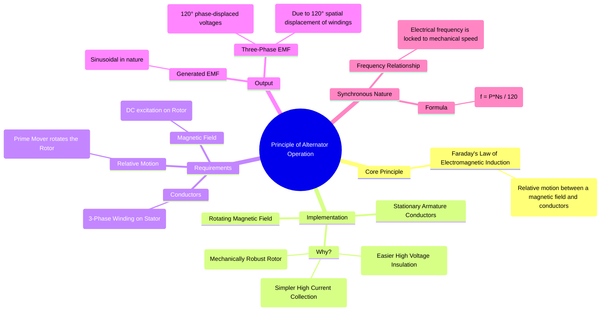

---
tags:
  - electrical-machines/synchronous-machines
  - alternator
  - generator
  - emf-generation
created: 2025-07-16
aliases:
  - Alternator Operation
  - Principle of Alternator
  - Synchronous Generator Principle
subject: "[[Electrical Machines]]"
parent: "[[Synchronous Machines]]"
formula:
  - "Frequency of the Generated EMF (Alternator) : $$f = \\frac{P N_s}{120} \\quad \\text{Hz}$$"
modified: 2026-07-23T20:51:38
---
### Principle of Operation as a Generator (Alternator)
#alternator #generator-principle #faradays-law #emf-induction

> The operation of a synchronous generator, or alternator, is based on **Faraday's Law of Electromagnetic Induction**. This law states that an electromotive force (EMF) is induced in a conductor whenever it is subjected to a changing [[magnetic flux]]. In an alternator, this is achieved by creating relative motion between a magnetic field and a set of armature conductors. The standard practice in almost all alternators is to have a **[[Rotating Magnetic Field (RMF)|rotating magnetic field]]** and a **stationary set of armature conductors**.

---
#### Fundamental Requirements for EMF Generation
#emf-generation

To generate an EMF, three things are essential:
1. **Magnetic Field**: Produced by a field winding on the rotor, excited by a DC source.
2. **Conductors**: Housed in the stationary stator, known as the armature winding.
3. **Relative Motion**: Provided by a prime mover (like a turbine) which rotates the rotor (and its magnetic field).
> [!related]-
> [[Speed Regulation (Droop)]] (in power system)

As the rotor turns, its magnetic flux sweeps across the stationary armature conductors, inducing an EMF in them.

---
#### Generation of Three-Phase EMF
#three-phase-emf #phase-sequence

1. **Field Excitation**: A DC current is passed through the field winding on the rotor, creating a magnetic field with distinct North and South poles.
2. **Rotation**: A prime mover rotates the rotor at a constant speed, called the **synchronous speed ($N_s$)**.
3. **EMF Induction**: As the rotating magnetic field cuts through the stationary stator conductors, a sinusoidally varying EMF is induced in each conductor.
4. **Three-Phase System**: The stator contains three separate windings (or phases), physically displaced from each other by **120 mechanical degrees**. As the rotor's field passes each winding in sequence, it induces three separate EMFs. Due to the spatial displacement of the windings, the induced EMFs are also displaced in time by **120 electrical degrees**.

This results in a balanced three-phase voltage system:
$$\begin{align}
e_A(t) &= E_m \sin(\omega t) \\
e_B(t) &= E_m \sin(\omega t - 120^\circ) \\
e_C(t) &= E_m \sin(\omega t - 240^\circ)
\end{align}$$

---
#### Synchronous Speed and Frequency
#synchronous-speed #frequency-relation

The frequency of the generated EMF is directly proportional to the speed of the rotor and the number of poles on the rotor. For a rotor with $P$ poles rotating at $N_s$ revolutions per minute (rpm), the frequency $f$ of the induced EMF is given by:
$$\boxed{\quad f = \frac{P N_s}{120} \quad \text{Hz} \quad}$$
This relationship is fundamental to synchronous machines. The electrical frequency of the output is *synchronized* with the mechanical speed of rotation. To generate a constant frequency (e.g., 50 Hz or 60 Hz), the prime mover must maintain a constant synchronous speed.

---
#### Advantages of a Rotating Field and Stationary Armature
#design-advantage

This configuration is universally adopted for synchronous generators (except for very small ones) for several practical reasons:
1. **Easier Insulation**: Generated voltages in alternators can be very high (e.g., 11 kV, 33 kV). It is much easier and more reliable to insulate stationary windings for such high voltages.
2. **Simplified Current Collection**: The high load currents (hundreds or thousands of amperes) can be drawn directly from fixed terminals on the stator. Collecting this large current from a rotating armature via slip rings would be complex, inefficient, and prone to maintenance issues.
3. **Higher Rotor Speed**: The DC field winding requires a relatively low voltage and current. It is lighter than an armature winding, allowing the rotor to be built more robustly to withstand the high centrifugal forces of high-speed rotation (especially in turbo-generators).

---
### Related Concepts
#alternator/related-concepts

> [[Constructional Features of Synchronous Machines]]

[[EMF Equation of an Alternator]]
[[Internal EMF]]
[[Armature Reaction and Synchronous Reactance]]
[[Faraday's Laws of Electromagnetic Induction]]
[[Rotating Magnetic Field (RMF)]]
[[Speed Regulation (Droop)|Governor Droop]]