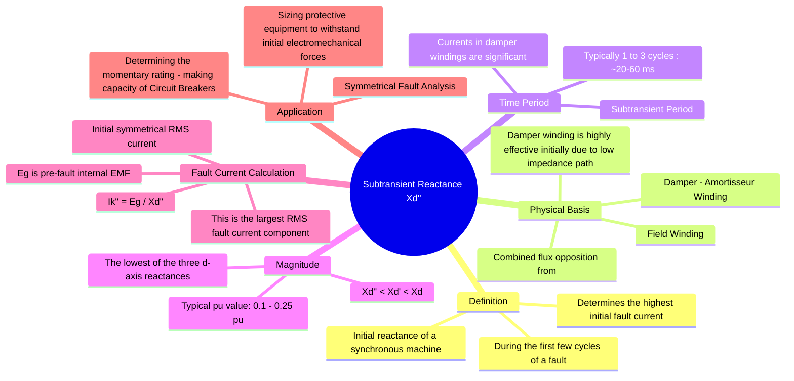

---
tags:
  - power-system
  - electrical-machines
  - fault-analysis
  - gate
created: 2026-06-05
aliases:
  - Xd''
  - Sub-transient Reactance
subject: "[[Electrical Machines]]"
parent: "[[Sequence Impedances and Networks of Synchronous Machines]]"
modified: 2026-07-21T15:28:21
---
### Subtransient Reactance ($X_d''$)
#synchronous-machine/reactance #fault-analysis #subtransient-reactance 

> <u>Subtransient Reactance, denoted as $X_d''$, is the apparent reactance of a synchronous machine's direct axis during the first few cycles immediately following a sudden three-phase short circuit.</u> ==It is the lowest reactance value exhibited by the machine and is used to calculate the highest possible initial fault current.==

---
#### Physical Basis
#synchronous-machine/damper-winding

When a fault occurs, the sudden change in armature [[magnetomotive force|MMF]] induces currents in both the rotor's field winding and the **[[damper windings|damper (or amortisseur) windings]]**. The damper winding is a low-impedance cage winding embedded in the rotor pole faces.

1.  **Initial Flux Opposition**: Both the field and [[damper windings]] act like short-circuited secondary windings of a transformer, producing MMFs that oppose the sudden change in flux linkage caused by the fault.
2.  **Damper Winding Dominance**: The damper winding has a very low leakage reactance and resistance, making it the most effective path for induced currents in the initial moments. This strong opposition to flux change results in a very low apparent reactance as seen from the stator.
3.  **Time Constant**: The induced DC currents in the damper windings decay very rapidly due to their low time constant ($\tau_d''$). This period, while the damper winding effect is significant, is called the **subtransient period** (typically 1 to 3 cycles).

The equivalent circuit during this period shows the magnetizing reactance in parallel with the leakage reactances of both the field and damper windings, resulting in the lowest overall reactance.

---
#### Mathematical Time-Decay Profile of Fault Current

#fault-analysis/mathematical-model

The symmetrical AC component of the total short-circuit current as a function of time $t$ after the fault occurs is expressed as:

$$i_{ac}(t) = \sqrt{2}E_g \left[ \left( \frac{1}{X_d''} - \frac{1}{X_d'} \right)e^{-t/\tau_d''} + \left( \frac{1}{X_d'} - \frac{1}{X_d} \right)e^{-t/\tau_d'} + \frac{1}{X_d} \right] \sin(\omega t + \alpha)$$

Where:

- $\tau_d''$ = Subtransient short-circuit time constant (decays in 1–3 cycles).
- $\tau_d'$ = Transient short-circuit time constant (decays in 1–2 seconds).

---
#### Role in Fault Analysis
#fault-analysis/symmetrical-fault

The subtransient reactance is the critical parameter for determining the initial symmetrical RMS current after a fault. The pre-fault [[Internal EMF]] of the generator ($E_g$) acts across this reactance.
$$\boxed{\quad I_{k}'' = \frac{E_g}{X_d''} \quad}$$
Where:
-   $I_k''$ is the subtransient symmetrical RMS fault current.
-   $E_g$ is the pre-fault internal generated voltage (often approximated as the pre-fault terminal voltage if the machine is unloaded or lightly loaded, typically $\approx 1.0$ pu).

> [!WARNING] Total Fault Current Peak (Circuit Breaker Making Capacity)
> 
> The *total* initial current contains both the AC symmetrical component ($I_k''$) and a DC offset component.
> 
> - **Momentary Symmetrical RMS Current:** $I_k'' = \frac{E_g}{X_d''}$
> - **Maximum Possible Peak (Making) Current (including DC offset):**
> $$I_{\text{making}} = 2.55 \times I_k'' \text{ (or } 1.6 \times I_k'' \text{ for RMS equivalent value)}$$
> This value determines the physical, mechanical bracing required for busbars and breaker mechanisms to withstand immediate electromechanical forces.

---
#### The Three Stages of Machine Reactance
#synchronous-machine/reactance-comparison

A synchronous machine exhibits three different reactance values following a disturbance, corresponding to three different time periods:

1.  **Subtransient Reactance ($X_d''$)**: The initial value, active during the subtransient period when both damper and field winding currents influence the flux. This is the **lowest** reactance.
2.  **Transient Reactance ($X_d'$)**: After the damper winding currents have decayed, the effect of the field winding's induced current persists for a longer duration (the transient period). This reactance is **intermediate** in value.
3.  **Synchronous Reactance ($X_d$)**: After all induced rotor currents have died out, the machine settles into a steady state where the only opposition to armature MMF is from the main field flux path. This is the **highest** reactance.

This gives the fundamental relationship for direct-axis reactances:
$$\boxed{\quad X_d'' < X_d' < X_d \quad}$$

---
### Related Concepts
#topic/related-concepts

> [[Transient Reactance]]
> [[Armature Reaction and Synchronous Reactance|Synchronous Reactance]]

[[Analysis of Symmetrical Faults|Analysis of Symmetrical Faults (Three-Phase Faults)]]
[[Internal EMF]]
[[Sequence Impedances and Networks of Synchronous Machines]]
[[Circuit Breaker Ratings|Circuit Breaker Ratings (Rated Voltage, Current, Breaking Capacity)]]
[[Damper Windings]]
[[Synchronous Machines]]
