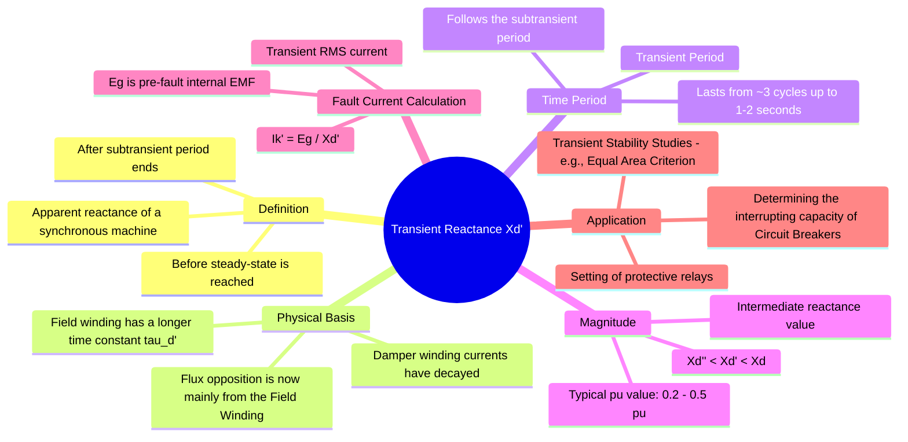

---
tags:
  - power-system
  - electrical-machines
  - fault-analysis
  - stability
  - gate
created: 2026-03-23
aliases:
  - Xd'
  - Transient Reactance
subject: "[[Electrical Machines]]"
parent: "[[Sequence Impedances and Networks of Synchronous Machines]]"
modified: 2026-07-23T20:51:47
---
### Transient Reactance ($X_d'$)
#synchronous-machine/reactance #fault-analysis #stability #transient-reactance 

> <u>Transient Reactance, denoted as $X_d'$, is the apparent reactance of a synchronous machine's direct axis that governs its behavior during the transient period of a fault.</u> This period begins after the initial, rapidly-decaying [[Sub-transient Reactance|subtransient]] effects have subsided but before the machine settles into its final steady state.

---

#### Physical Basis
#synchronous-machine/field-winding

Following a fault, induced currents appear in both the damper and field windings.
1.  **Decay of Subtransient Effects**: The induced currents in the damper windings have a very small time constant ($\tau_d''$) and decay to zero within the first few cycles.
2.  **Persistence of Field Winding Current**: The field winding has a much larger inductance and thus a significantly longer time constant ($\tau_d'$). The induced DC current in the field winding persists for a much longer time (0.5 to 2 seconds), continuing to oppose the change in flux caused by the fault.
3.  **Resulting Reactance**: During this transient period, the flux opposition is provided almost entirely by the field winding. Since the field winding path has a higher leakage reactance than the parallel combination of the field and damper windings, the transient reactance is greater than the subtransient reactance ($X_d' > X_d''$).

#### Role in Fault Analysis and Stability
#fault-analysis/transient-stability

The transient reactance is a critical parameter for system analysis that occurs after the first few cycles of a fault.

1.  **Circuit Breaker Interrupting Rating**: Most circuit breakers take several cycles to operate and interrupt the current. By the time their contacts separate, the fault current has decayed from its initial subtransient value. Therefore, the **interrupting rating** (or breaking capacity) of circuit breakers is determined by the transient fault current.
    $$\boxed{\quad I_{k}' = \frac{E_g}{X_d'} \quad}$$
    Where $I_k'$ is the transient symmetrical RMS fault current.

2.  **Protective Relay Setting**: The operating time of many protective relays falls within the transient period. Their settings and coordination are therefore based on fault currents calculated using $X_d'$.

3.  **Transient Stability Studies**: The electromechanical oscillations of a generator's rotor following a major disturbance (like a fault) are analyzed in transient stability studies. The power transfer capability of the machine during these dynamics is governed by $X_d'$. It is the reactance used in the **swing equation** and for applying the **equal area criterion** to determine if the machine will remain in synchronism after a fault is cleared.

#### The Three Stages of Machine Reactance
#synchronous-machine/reactance-comparison

Transient reactance is the intermediate value in the time-varying reactance model of a synchronous machine.

1.  **Subtransient Reactance ($X_d''$)**: Initial value, lowest magnitude. Governs momentary rating of circuit breakers.
2.  **Transient Reactance ($X_d'$)**: Intermediate value. Governs interrupting rating of circuit breakers and transient stability.
3.  **Synchronous Reactance ($X_d$)**: Final steady-state value, highest magnitude. Used for steady-state power flow and stability limit calculations.

The relationship between the reactances is always:
$$\boxed{\quad X_d'' < X_d' < X_d \quad}$$

---
### Related Concepts
#topic/related-concepts

> [[Sub-transient Reactance]]
> [[Armature Reaction and Synchronous Reactance|Synchronous Reactance]]

[[Methods to Improve Transient Stability|Transient Stability Improvement]]
[[Swing Equation]]
[[Equal Area Criterion for Stability Analysis]]
[[Circuit Breaker Ratings|Circuit Breaker Ratings (Rated Voltage, Current, Breaking Capacity)]]
[[Sequence Impedances and Networks of Synchronous Machines]]
[[Desirable Qualities of a Protective Relay]]