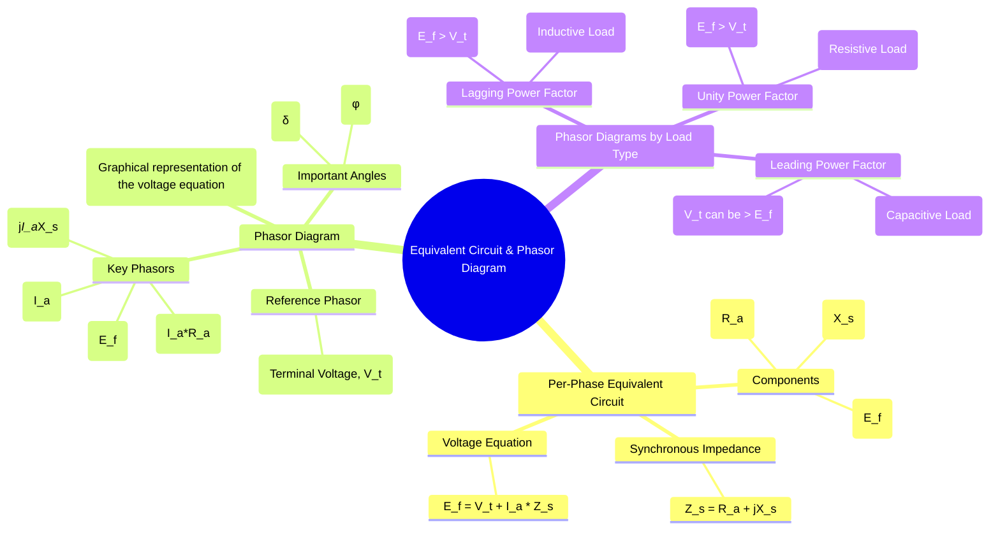

---
tags:
  - electrical-machines/synchronous-machines
  - alternator
  - equivalent-circuit
  - phasor-diagram
  - voltage-regulation
created: 2025-07-18
aliases:
  - Alternator Equivalent Circuit
  - Synchronous Generator Phasor Diagram
  - Phasor Diagram of an Alternator
  - Synchronous Motor Phasor Diagram
  - Equivalent Circuit of Synchronous Generator
subject: "[[Electrical Machines]]"
parent: "[[Synchronous Machines]]"
modified: 2026-07-21T11:17:26
---
### Equivalent Circuit and Phasor Diagram of an Alternator
#equivalent-circuit #phasor-diagram #alternator #synchronous-generator

> The steady-state performance of an alternator is analyzed using its ==per-phase equivalent circuit== and the corresponding phasor diagram. These tools are fundamental for understanding voltage drops within the machine and for calculating its [[Voltage Regulation of an Alternator|voltage regulation]] and power capabilities.

---
#### Per-Phase Equivalent Circuit
#equivalent-circuit

==The effects of armature resistance, [[Armature Reaction and Synchronous Reactance#^armature-leakage-reactance|armature leakage reactance]], [[Armature Reaction and Synchronous Reactance#^armature-reaction-reactance|and armature reaction]] are combined into a single impedance known as the **[[Armature Reaction and Synchronous Reactance#Synchronous Reactance ($X_s$) and Impedance ($Z_s$)|Synchronous Impedance]] ($Z_s$)**.== This allows the alternator to be modeled as a simple circuit consisting of an ideal voltage source in series with this impedance.

The per-phase equivalent circuit of a synchronous generator consists of:
1.  **Ideal EMF Source ($E_f$)**: ==Represents the no-load excitation EMF generated per phase. Its magnitude is determined by the DC field current.==
2.  **[[Armature Reaction and Synchronous Reactance#Synchronous Reactance ($X_s$) and Impedance ($Z_s$)|Synchronous Impedance]] ($Z_s$)**: The internal impedance of the armature winding per phase.
    $$\boxed{\quad Z_s = R_a + jX_s \quad}$$
    *   $R_a$: Effective AC resistance of the armature winding per phase.
    *   $X_s$: Synchronous reactance per phase, which combines the effect of armature leakage reactance ($X_{al}$) and the reactance of armature reaction ($X_{ar}$).

Applying [[Kirchhoff's Laws#Kirchhoff's Voltage Law (KVL)|Kirchhoff's Voltage Law (KVL)]] to this circuit gives the fundamental voltage equation of the alternator:
$$\boxed{\quad \vec{E_f} = \vec{V_t} + \vec{I_a} Z_s = \vec{V_t} + \vec{I_a} R_a + j\vec{I_a} X_s \quad}$$
where $\vec{V_t}$ is the terminal voltage per phase and $\vec{I_a}$ is the armature current per phase.

> [!pyq]- PYQ : 2020
> ![[ee_2020#^q49]]

---
#### Phasor Diagram
#phasor-diagram

The phasor diagram is a graphical representation of the voltage equation, showing the phase and magnitude relationships between $E_f$, $V_t$, $I_a$, and the impedance drops. The construction depends on the power factor of the load.

##### Key Angles
#synchronous-macine/key-angles

*   **Power Factor Angle ($\phi$)**: ==The angle between the terminal voltage $\vec{V_t}$ and the armature current $\vec{I_a}$.==
*   **Power Angle or Load Angle ($\delta$)**: ==The angle between the excitation EMF $\vec{E_f}$ and the terminal voltage $\vec{V_t}$.== This angle is a measure of the power being delivered by the generator.

---
##### 1. Lagging Power Factor (Inductive Load)
#phasor-diagram/lagging-power-factor #phasor-diagram/inductive-load 

This is the most common operating condition for an alternator.

![[Lagging Power Factor (Inductive Load).png]]

* The armature current $\vec{I_a}$ lags the terminal voltage $\vec{V_t}$ by an angle $\phi$.
* The resistive drop $\vec{I_a}R_a$ is in phase with $\vec{I_a}$.
* The reactive drop $j\vec{I_a}X_s$ leads $\vec{I_a}$ by 90°.
* The phasor sum $\vec{V_t} + \vec{I_a}R_a + j\vec{I_a}X_s$ gives $\vec{E_f}$.
* As seen from the diagram, ==for a lagging load, $|E_f| > |V_t|$==.

---
##### 2. Unity Power Factor (Resistive Load)
#phasor-diagram/unity-power-factor #phasor-diagram/resistive-load 

![[Unity Power Factor (Resistive Load).png]]

* The armature current $\vec{I_a}$ is in phase with the terminal voltage $\vec{V_t}$ ($\phi=0$).
* The construction follows the same principles.
* Again, $|E_f| > |V_t|$. The voltage drop is less severe than for a lagging load.

---
##### 3. Leading Power Factor (Capacitive Load)
#phasor-diagram/leading-power-factor #phasor-diagram/capacitive-load 

![[Leading Power Factor (Capacitive Load).png]]

* The armature current $\vec{I_a}$ leads the terminal voltage $\vec{V_t}$ by an angle $\phi$.
* The phasor diagram is constructed similarly.
* ==Due to the magnetizing effect of armature reaction with a leading current, the terminal voltage can be higher than the excitation EMF ($|V_t| > |E_f|$ is possible). This can result in zero or negative voltage regulation.==

> [!info]
> ==The diagrams below are qualitative and typically exaggerate the $R_a$ drop for clarity. In reality, $X_s \gg R_a$.==

> [!pyq]- PYQ : 2020
> ![[ee_2020#^q7]]

---
##### Phasor Diagram Examples
#phasor-diagram/example 

* **Lagging PF:** $\vec{V_t}$ is the reference. $\vec{I_a}$ is drawn lagging $\vec{V_t}$.
	$\vec{V_t}$ + $\vec{I_a}R_a$ + $j\vec{I_a}X_s$ = $\vec{E_f}$ 
* **Leading PF:** $\vec{V_t}$ is the reference. $\vec{I_a}$ is drawn leading $\vec{V_t}$.
	$\vec{V_t}$ + $\vec{I_a}R_a$ + $j\vec{I_a}X_s$ = $\vec{E_f}$ 

> [!examtip] Reference-choice Principle (system modeling)
> KVL can be written between $E'$ and **any known reference voltage**.
> 
> ==All reactances between the reference and $E'$ must be included.==
> 
> 1. **If reference is generator terminals ($V_t$):**
> $$E' = V_t + j X_d' I$$
> 2. **If reference is infinite bus ($V_\infty$):**
> $$E' = V_\infty + j I (X_d' +\text{all reactance in between})$$
> 
> > [!pyq]- PYQ : 2020
> > ![[ee_2020#^q51]]
> 
> > [!memory] Key insight
> > - $E'$ is fixed by excitation (via $E_f$)
> > - $V_\infty$ is fixed by the grid
> > - Power angle $\delta = \angle(E' - V_\infty)$
> 
> > [!trick] One-line rule
> > Use the sum of reactances **between the two voltages you are relating**.

---
### Related Concepts
#alternator/related-concepts

> [[Armature Reaction and Synchronous Reactance]]

[[Voltage Regulation of an Alternator]]
[[Open and Short Circuit Characteristics of an Alternator]]
[[Power-Angle Characteristics for Synchronous Machines]]
[[Voltage Regulation Methods]]
