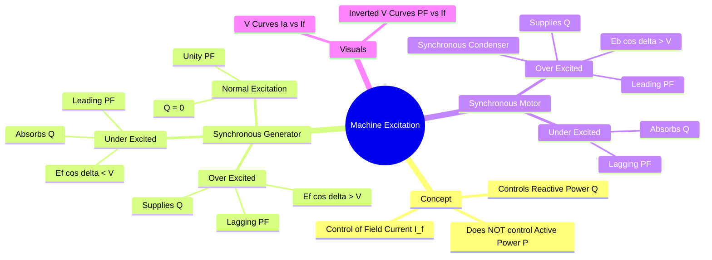

---
tags:
  - electrical-machines
  - synchronous-machine
  - power-system
  - gate
  - power-factor
aliases:
  - Over and Under Excitation
  - V Curves
  - Synchronous Motor Power Factor
  - Nature of Power Factor
subject: "[[Electrical Machines]]"
parent: "[[Synchronous Machines]]"
created: 2026-07-23T20:52:14
modified: 2026-07-23T20:52:14
---
### Machine Excitation Convention
#electrical-machines/synchronous #power-factor

> The **Excitation** of a synchronous machine (controlled by the DC field current, $I_f$) determines the machine's interaction with the grid's **Reactive Power ($Q$)**. It determines whether the machine acts as a source or a sink of reactive power, thereby dictating the Power Factor.

---
#### Fundamental Principle
#synchronous-machine/principle

*   **Active Power ($P$):** Controlled by the **Prime Mover** input (Generator) or **Mechanical Load** (Motor).
*   **Reactive Power ($Q$):** Controlled by the **Excitation** ($E_f$).

> [!success] The Golden Rule
> 1. **Over-Excitation:** The machine has "excess" magnetic field strength. It **generates (supplies)** Reactive Power ($Q$) to the bus.
> 2. **Under-Excitation:** The machine has "insufficient" magnetic field strength. It **absorbs (consumes)** Reactive Power ($Q$) from the bus to magnetize itself.

---
#### Synchronous Generator (Alternator)
#synchronous-generator

*   **Mode:** Delivers Active Power ($P_{out} > 0$).
*   **Reference:** Current leaving the positive terminal.

| Excitation Level | Condition | Reactive Power ($Q$) | Power Factor (Load) | Nature |
| :--- | :--- | :--- | :--- | :--- |
| **Over-Excited** | $E_f \cos\delta > V$ | **Supplied** (+ve) | **Lagging** | Inductive Source |
| **Normal** | $E_f \cos\delta = V$ | Zero | **Unity** | Resistive |
| **Under-Excited** | $E_f \cos\delta < V$ | **Absorbed** (-ve) | **Leading** | Capacitive Source |

> [!warning] Analogy
> A standard load is inductive (lagging). It needs Q. An over-excited generator supplies Q. Therefore, Over-excited Generator $\leftrightarrow$ Lagging PF.

---
#### Synchronous Motor
#synchronous-motor

*   **Mode:** Consumes Active Power ($P_{in} > 0$).
*   **Reference:** Current entering the positive terminal.

| Excitation Level | Condition | Reactive Power ($Q$) | Power Factor | Nature |
| :--- | :--- | :--- | :--- | :--- |
| **Over-Excited** | $E_b \cos\delta > V$ | **Supplied** (to grid) | **Leading** | **Capacitor** |
| **Normal** | $E_b \cos\delta = V$ | Zero | **Unity** | Resistor |
| **Under-Excited** | $E_b \cos\delta < V$ | **Absorbed** (from grid) | **Lagging** | Inductor |

> [!memory] Application
> An **Over-Excited Synchronous Motor** running at no-load is called a **[[Synchronous Condenser]]**. It draws leading current (supplies Q) and is used for power factor correction.

---
#### Summary Matrix (GATE Cheat Sheet)
#gate/shortcut

| Machine Type  | Over-Excitation                                                                                                                           | Under-Excitation          |
| :------------ | :---------------------------------------------------------------------------------------------------------------------------------------- | :------------------------ |
| **Generator** | Supplies Q (**+Q at terminals**; described as "lagging" in many machine texts — be careful to use terminal reference in system questions) | Absorbs Q (**Leading** I) |
| **Motor**     | Supplies Q (**Leading** I)                                                                                                                | Absorbs Q (**Lagging** I) |

* **Hint:** Supplying Q ⇒ machine is a VAr **source**. For system questions use terminal PF: $$\theta=\angle V-\angle I$$
    *   Generator supplying Lagging I = Source of Q.
    *   Motor drawing Leading I = Source of Q.

---
#### V-Curves and Inverted V-Curves
#synchronous-machine/v-curves

These curves visualize the variation of Armature Current ($I_a$) and Power Factor ($\cos\phi$) with respect to Excitation Current ($I_f$) for a constant power output.

![[V-Curves#Analysis of a Single V-Curve (Constant P)]]

---
### Related Concepts
#topic/related-concepts

> [[V-Curves]]

[[Power Factor]]
[[Synchronous Machines]]
[[Reactive Power Compensation]]
[[Voltage Regulation of an Alternator]]
[[Capability Curve of Synchronous Generator]]
[[Open and Short Circuit Characteristics of an Alternator]]