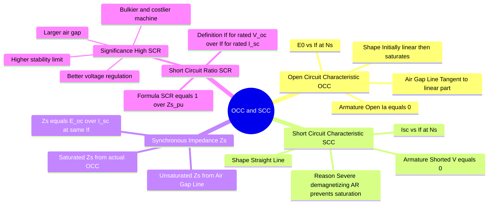

---
tags:
  - electrical-machines
  - synchronous-machine
  - testing
  - gate
created: 2026-07-21T11:18:55
aliases:
  - OCC and SCC of Alternator
  - Determination of Synchronous Impedance
  - Short Circuit Ratio
  - Open Circuit and Short Circuit Tests on Alternator
subject: "[[Electrical Machines]]"
parent:
  - "[[Synchronous Machines]]"
modified: 2026-07-21T11:18:55
---
### Open and Short Circuit Characteristics of an Alternator
#electrical-machines/synchronous #testing

> The **Open Circuit Characteristic (OCC)** and **Short Circuit Characteristic (SCC)** are fundamental tests performed on a Synchronous Generator (Alternator) to determine its internal parameters, specifically the **Synchronous Impedance ($Z_s$)** and the **Short Circuit Ratio (SCR)**. These parameters dictate the machine's voltage regulation and stability.

---

#### Open Circuit Characteristic (OCC)
#synchronous-machine/occ

The OCC, also known as the no-load magnetization curve, is the plot of the generated open-circuit phase EMF ($E_0$) against the field current ($I_f$), while the machine is driven at its rated **synchronous speed ($N_s$)**.

*   **Test Conditions:** Armature terminals are open ($I_a = 0$), Rotor speed = $N_s$.
*   **Curve Shape:** 
    *   **Initially Linear:** At low field currents, the magnetic circuit is unsaturated. The reluctance is primarily due to the air gap. The extended straight line is called the **Air Gap Line**.
    *   **Saturation:** As $I_f$ increases, the iron core begins to saturate, and the curve bends horizontally.
*   **Equation:** $E_0 = 4.44 f \phi T_{ph} K_w$. Since $f$ is constant, $E_0 \propto \phi \propto I_f$ (until saturation).

---
#### Short Circuit Characteristic (SCC)
#synchronous-machine/scc #gate/concept

The SCC is the plot of the short-circuit armature current ($I_{sc}$) against the field current ($I_f$), with the machine driven at rated synchronous speed.

*   **Test Conditions:** Armature terminals are short-circuited via an ammeter ($V_t = 0$), Rotor speed = $N_s$.
*   **Curve Shape:** The SCC is a **perfectly straight line** passing through the origin.
*   **Why is it linear? (GATE High-Yield):** 
    During a short circuit, the armature circuit is highly inductive (Synchronous Reactance $X_s \gg R_a$). Thus, the short-circuit current lags the generated EMF by almost $90^\circ$. 
    This creates an armature reaction that is **almost entirely purely demagnetizing**. This severe demagnetization opposes the main field flux, keeping the net flux in the air gap very low. Because the net flux is so low, the magnetic circuit **never saturates** during the short circuit test. Hence, the relationship between $I_a$ and $I_f$ remains linear.

---
#### Determination of Synchronous Impedance
#synchronous-machine/impedance

The synchronous impedance ($Z_s$) at any given field current is ==defined as the ratio of the open-circuit voltage to the short-circuit current at that *same* field current==.

$$\boxed{\quad Z_s = \left. \frac{E_{0(phase)}}{I_{sc(phase)}} \right|_{I_f = \text{constant}} \quad}$$

> [!warning] Problem-Solving Traps: Calculating $Z_s$
>> [!pyq]- PYQ : GATE EE 2014
> > ![[ee_2014(1)#^q13]]
>
> When calculating Synchronous Impedance ($Z_s$) from O.C. and S.C. test data:
> 1. **Phase Values:** The formula requires **per-phase** values. Always check the connection type! For a star-connected machine, ensure you convert line voltage to phase voltage: $V_{phase} = \frac{V_{line}}{\sqrt{3}}$.
> 2. **Different $I_f$ Values:** If the problem provides O.C. and S.C. data at *different* field currents, you must extrapolate to find both at the **same $I_f$**. Because the Short Circuit Characteristic (SCC) is linear (the core is unsaturated under S.C. conditions), you can safely use simple proportions: $$\boxed{\quad I_{sc2} = I_{sc1} \times \left(\frac{I_{f2}}{I_{f1}}\right) \quad}$$

* **Unsaturated Synchronous Impedance ($Z_{s,unsat}$):** Calculated using the $E_0$ value from the **Air Gap Line**. This value is constant.
* **Saturated Synchronous Impedance ($Z_{s,sat}$):** Calculated using the $E_0$ value from the actual **OCC curve**. As saturation increases, $E_0$ drops relative to the air gap line, so $Z_{s,sat}$ decreases as $I_f$ increases.
* **Synchronous Reactance ($X_s$):** Since $R_a$ is usually very small, $Z_s = \sqrt{R_a^2 + X_s^2} \approx X_s$.

---
#### Short Circuit Ratio (SCR)
#synchronous-machine/scr #gate/formulas

The Short Circuit Ratio (SCR) is a critical design parameter of a synchronous machine.

**Definition:** It is the ratio of the field current required to produce rated open-circuit voltage to the field current required to produce rated short-circuit armature current.

$$\boxed{\quad \text{SCR} = \frac{I_{f(V_{oc} = V_{rated})}}{I_{f(I_{sc} = I_{rated})}} \quad}$$

**Relation to Per Unit Synchronous Impedance:**
There is a direct inverse relationship between SCR and the per-unit saturated synchronous reactance.
$$\boxed{\quad \text{SCR} = \frac{1}{Z_{s(pu)}} \approx \frac{1}{X_{s(pu)}} \quad}$$

---
#### Physical Significance of SCR (GATE Focus)
#synchronous-machine/design

A machine can be designed with a high SCR or a low SCR. 
To achieve a **High SCR**, the machine must have a **small synchronous reactance ($X_s$)**. Since $X_s \propto \text{Armature Reaction Reactance} \propto \frac{1}{\text{Air Gap Length}}$, a high SCR requires a **larger air gap**.

**Characteristics of a High SCR Machine (e.g., Hydro-generators):**
1.  **Lower Armature Reaction:** Due to the large air gap.
2.  **Better Voltage Regulation:** A smaller $X_s$ means less internal voltage drop, so terminal voltage varies less with load changes.
3.  **Higher Stability Limit:** $P_{max} = \frac{EV}{X_s}$. A smaller $X_s$ leads to a higher steady-state stability limit.
4.  **Higher Short Circuit Current:** $I_{sc} = \frac{E}{X_s}$. A smaller $X_s$ means the machine feeds more current into a fault, requiring heavier circuit breakers.
5.  **Size and Cost:** A larger air gap requires a stronger magnetic field (more field copper) to maintain flux, resulting in a **bulkier, heavier, and more expensive** machine.

*(Note: Turbo-alternators typically have lower SCR to save size and cost, relying on fast AVRs for stability and voltage regulation).*

---
### Related Concepts
#topic/related-concepts

> [[Machine Excitation Convention]]

[[Synchronous Machines]]
[[Voltage Regulation of an Alternator]]
[[Voltage Regulation Methods]]
[[Steady-State Stability Limit]]
[[Armature Reaction and Synchronous Reactance|Armature Reaction in Alternators]]
[[Per-Unit System]]
[[Transformer Tests]] (Analogous testing concept)
