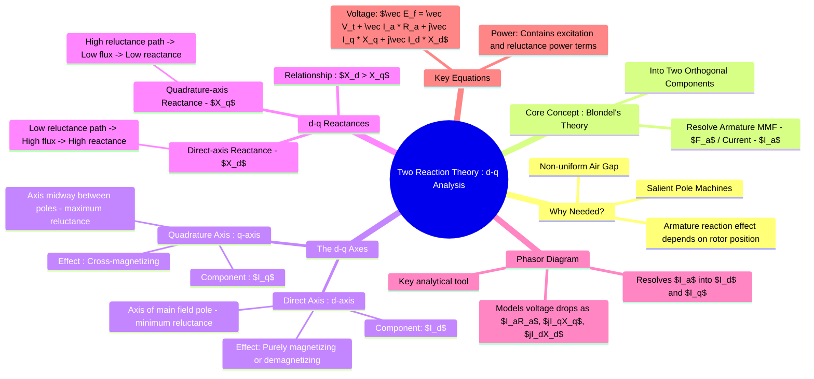

---
tags:
  - electrical-machines/synchronous-machines
  - salient-pole
  - two-reaction-theory
  - dq-analysis
created: 2025-07-21
aliases:
  - Two Reaction Theory
  - d-q axis analysis
  - Blondel's Two Reaction Theory
  - d-q model
  - Andre Blondel
  - Power-Angle Equation of a Salient Pole Synchronous Machine
  - Salient Pole Synchronous Machines
  - The Fictitious Voltage E_q Method
subject: "[[Electrical Machines]]"
parent: "[[Synchronous Machines]]"
modified: 2026-07-21T12:23:08
---
### Salient Pole Machines - Two Reaction Theory (d-q axis analysis)
#two-reaction-theory #salient-pole #dq-analysis #blondel

> In a [[Salient Pole Rotor.png|salient pole]] synchronous machine, ==the air gap is non-uniform. It is minimum along the pole axis and maximum in the region between the poles==. Consequently, the effect of the [[Armature Reaction]] is not uniform but depends on the spatial position of the armature [[magnetomotive force|MMF]] relative to the field poles. The simple synchronous reactance ($X_s$) model used for [[Synchronous Machine - Cylindrical Pole Rotor.png|cylindrical rotor]] machines is no longer accurate.

> [!related]
> [[Armature Reaction and Synchronous Reactance]]
> [[Constructional Features of Synchronous Machines]]

The **Two Reaction Theory**, proposed by André Blondel, provides a method to analyze salient pole machines by resolving the armature MMF (and hence the armature current) into two orthogonal components along two specific axes of the rotor.

> [!memory] Assumptions Used in Two-Reaction Theory
> 1. Balanced three-phase operation
> 2. Steady-state synchronous operation
> 3. Per-phase equivalent circuit analysis
> 4. Sinusoidally distributed MMF and flux
> 5. Magnetic circuit assumed linear for reactance-based modeling
> 6. Reactances represented by constant values $X_d$ and $X_q$

---

#### The Direct and Quadrature (d-q) Axes
#d-axis #q-axis

![[D-axis & Q-axis Salient Pole Machine.png]]

1. **Direct Axis (d-axis)**: This is the axis of symmetry of the field pole, aligned with the center of the rotor poles. The air gap along this axis is minimum, meaning the magnetic [[reluctance]] is minimum.
2. **Quadrature Axis (q-axis)**: This is the axis midway between two adjacent poles (the interpolar region). The air gap along this axis is maximum, meaning the magnetic reluctance is maximum.

The armature current phasor, $\vec{I_a}$, is resolved into two components:
* **Direct-axis component ($\vec{I_d}$)**: This component is along the d-axis. Its MMF is either in direct alignment with or in direct opposition to the main field MMF. Therefore, it has a **purely magnetizing or demagnetizing** effect.
* **Quadrature-axis component ($\vec{I_q}$)**: This component is along the q-axis. Its MMF is centered over the interpolar region, and it has a **cross-magnetizing** effect.

---
#### Direct-axis and Quadrature-axis Reactances ($X_d$ and $X_q$)
#direct-axis-reactance #quadrature-axis-reactance

Since the reluctance paths for the two MMF components are different, they give rise to different amounts of flux and hence are modeled by two different reactances:

* **Direct-axis Synchronous Reactance ($X_d$)**: The reactance offered to the d-axis component of the armature current ($I_d$). Since the reluctance along the d-axis is low, this reactance is large.
* **Quadrature-axis Synchronous Reactance ($X_q$)**: The reactance offered to the q-axis component of the armature current ($I_q$). Since the reluctance along the q-axis is high, this reactance is smaller.

==For a salient pole machine, it is always true that:==
$$\boxed{\quad X_d > X_q \quad}$$

> [!memory] Quick Memory Rule
> - d-axis $→$ minimum air gap $→$ minimum reluctance $→$ maximum flux $→$ maximum reactance
> - q-axis $→$ maximum air gap $→$ maximum reluctance $→$ minimum flux $→$ minimum reactance
>
> Therefore: $$X_d > X_q$$
> 
> > [!refer]- Salient Pole Machine - Flux along d and q
> > ![[Salient Pole Machine - Flux along d and q.png]]

Both $X_d$ and $X_q$ include the armature leakage reactance ($X_{al}$).

> [!related]
> [[Transient Reactance]]
> [[Sub-transient Reactance]] (for variations during fault conditions)

---
#### Phasor Diagram and Voltage Equation
#phasor-diagram/salient-pole

The phasor diagram for a salient pole generator is the key to its analysis. The voltage equation is developed by considering the voltage drops due to $R_a$, $I_d$, and $I_q$.

![[Salient Pole Machines - Generating Lagging PF.png]]

> [!refer]- Salient Pole Machines - Motoring Lagging PF Phasor Diagram
> ![[Salient Pole Machines - Motoring Lagging PF.png]]

The fundamental voltage equation is:
$$\boxed{\quad \vec{E_f} = \vec{V_t} + \vec{I_a}R_a + j\vec{I_q}X_q + j\vec{I_d}X_d \quad}$$
* The excitation EMF, $\vec E_f$, lies along the q-axis.
* The quadrature-axis reactance produces the voltage drop $j\vec I_q X_q$.
* The direct-axis reactance produces the voltage drop $j\vec I_d X_d$.
* Since multiplication by $j$ represents a $90^\circ$ phasor rotation, these voltage drops appear orthogonal to their respective current components in the phasor diagram.

> [!examtip] Sign Convention Used in this Note
> This note uses the **generator convention** for phasor diagrams and derivations.
>
> - $\delta$ is measured between $\vec E_f$ and $\vec V_t$
> - Lagging and leading power-factor formulas follow the generator phasor diagram
> - For motor operation, the power-angle sign convention may reverse depending on the adopted phasor reference
>
> Always verify the convention used in a textbook or examination before applying sign-sensitive formulas.

==The power angle $\delta$ is the angle between $\vec{E_f}$ (q-axis) and $\vec{V_t}$.==
<u>The angle between $\vec{I_a}$ and the q-axis is often denoted by $\psi$.</u>

The armature current components are: $$\boxed{\quad I_d = I_a \sin\psi \quad}$$ $$\boxed{\quad I_q = I_a \cos\psi \quad}$$

These relations are frequently required in numerical problems involving salient-pole synchronous machines.

> [!formula] Analytical Formulas for Problem Solving
> Since the excitation EMF $\vec{E_f}$ is unknown during initial calculation, we find the power angle $\delta$ using terminal parameters ($V_t, I_a, \phi$) and machine reactances ($X_d, X_q$).
> 
> > [!Hint] The Fictitious Voltage ($\vec{E}_q$) Method for Numericals
> > 
> > > [!pyq]- PYQ : 2016
> > > ![[ee_2016(1)#^q48]]
> > 
> > For numerical problem-solving, calculating a fictitious voltage $\vec{E}_q$ is much faster than using the universal $\tan\delta$ formula, as it utilizes standard complex phasor math. $\vec{E}_q$ is the internal voltage if the machine were non-salient with a synchronous reactance of $X_q$.
> > 
> > **Step 1: Calculate $\vec{E}_q$**
> > Use the terminal voltage $\vec{V}_t$ as the reference phasor ($V_t \angle 0^\circ$).
> > * **For Generator:** $$\vec{E}_q = \vec{V}_t + \vec{I}_a(R_a + jX_q)$$
> > * **For Motor:** $$\vec{E}_q = \vec{V}_t - \vec{I}_a(R_a + jX_q)$$
> > 
> > **Step 2: Find Load Angle ($\delta$)**
> > The angle of the resulting $\vec{E}_q$ phasor is exactly the load angle $\delta$.
> > 
> > **Step 3: Calculate Excitation Voltage ($E_f$)**
> > Once $\delta$ is known, find the internal power factor angle $\psi$ (angle between $\vec{I}_a$ and $\vec{E}_q$), project the direct-axis current $I_d = I_a \sin\psi$, and apply the scalar magnitude formula:
> > * **For Generator:** $$E_f = |\vec{E}_q| + I_d(X_d - X_q)$$
> > * **For Motor:** $$E_f = |\vec{E}_q| - I_d(X_d - X_q)$$
> ^the-victitious-voltage
> 
> ##### Universal Power Angle Equation
> $$\boxed{\quad \tan\delta = \frac{I_a X_q \cos\phi \mp I_a R_a \sin\phi}{V_t + I_a R_a \cos\phi \pm I_a X_q \sin\phi} \quad}$$
> * **Upper signs ($\top$):** Operating under a **Lagging Power Factor**
> * **Lower signs ($\bot$):** Operating under a **Leading Power Factor**
> * **Unity Power Factor (upf):** Set $\phi = 0^\circ$ (dropping all $\sin\phi$ terms)
> 
> > [!pyq]- PYQ : 2011
> > ![[ee_2011#^q42]]
> 
> Once $\delta$ is found, calculate the internal phase angle $\psi$ (the angle between $\vec{I_a}$ and $\vec{E_f}$):
> $$\psi = \phi \pm \delta \quad \text{(+ for lagging,  }- \text{ for leading)}$$
> 
> This yields the explicit $d\text{-}q$ axis current components and the true excitation EMF magnitude:
> * $I_d = I_a \sin\psi$
> * $I_q = I_a \cos\psi$
> * $E_f = V_t \cos\delta + I_a R_a \cos\psi + I_d X_d$
> 
> > [!memory] Internal Angle ($\psi$) Sign Conventions
> > The angle $\psi$ is the angle between the armature current $\vec{I}_a$ and the q-axis ($\vec{E}_q$). Its calculation depends on whether the machine is a motor or generator, and the power factor.
> > 
> > Let $\phi$ be the external power factor angle ($\cos^{-1}(\text{pf})$).
> > 
> > **For Generators:** (Usually $\vec{E}_q$ leads $\vec{V}_t$)
> > * Lagging PF: $\psi = \phi + \delta$
> > * Leading PF: $\psi = \phi - \delta$ (If $\delta > \phi$, $I_d$ becomes negative, meaning magnetizing effect)
> > 
> > **For Motors:** (Usually $\vec{E}_q$ lags $\vec{V}_t$)
> > * Lagging PF: $\psi = \phi - \delta$
> > * Leading PF: $\psi = \phi + \delta$
> 
> > [!derivation]- Exact Geometric Derivation
> > Because the resistance drop $\vec{I_a}R_a$ is physically in phase (parallel) with $\vec{I_a}$, its direct geometric projection onto the $d$-axis must use the internal angle $\psi$, where $\psi = \phi \pm \delta$.
> > 
> > ###### Step A: Projections along the $d$-axis (Perpendicular to $E_f$)
> > Taking geometric balance components along the $d$-axis line:
> > $$V_t \sin\delta \pm I_a R_a \sin\psi = I_q X_q$$
> > 
> > ###### Step B: Trigonometric Substitution to Eliminate $\psi$
> > Substituting $\psi = \phi \pm \delta$ and the quadrature current relationship $I_q = I_a \cos(\phi \pm \delta)$:
> > $$V_t \sin\delta \pm I_a R_a \sin(\phi \pm \delta) = I_a X_q \cos(\phi \pm \delta)$$
> > 
> > Expanding using the [[Trigonometric Identities#Angle Sum and Difference Identities|compound angle identities]] $\sin(A \pm B) = \sin A \cos B \pm \cos A \sin B$ and $\cos(A \pm B) = \cos A \cos B \mp \sin A \sin B$:
> > $$V_t \sin\delta \pm I_a R_a (\sin\phi \cos\delta \pm \cos\phi \sin\delta) = I_a X_q (\cos\phi \cos\delta \mp \sin\phi \sin\delta)$$
> > 
> > ###### Step C: Algebraic Grouping
> > Multiplying through and rearranging all terms with $\sin\delta$ to the left side and all terms with $\cos\delta$ to the right side:
> > $$\sin\delta (V_t + I_a R_a \cos\phi \pm I_a X_q \sin\phi) = \cos\delta (I_a X_q \cos\phi \mp I_a R_a \sin\phi)$$
> > 
> > Dividing both sides by $\cos\delta$ and the left parenthesis isolates $\tan\delta$, resulting in the universal equation.

> [!related]
> [[Internal EMF]]
> [[Equivalent Circuit and Phasor Diagram of an Alternator]]

---
#### Power-Angle Equation
#reluctance-power

> [!info] Equation Derivation
> The integration of $I_d$, $I_q$, $X_d$, and $X_q$ into the power flow yields the reluctance power term. 

![[Power-Angle Characteristics for Synchronous Machines#Power Equation for a Salient Pole Alternator]]

### Related Concepts
#two-reaction-theory/related-concepts

> [[Power-Angle Characteristics for Synchronous Machines]]

[[Constructional Features of Synchronous Machines]]
[[Armature Reaction and Synchronous Reactance]]
[[Equivalent Circuit and Phasor Diagram of an Alternator]]
