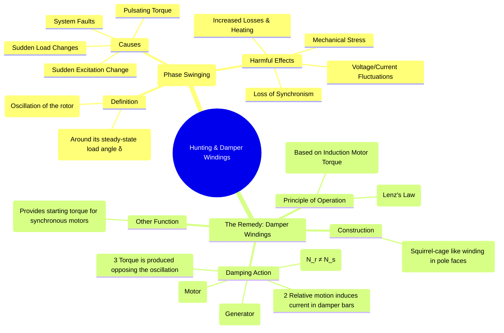

---
tags:
  - electrical-machines/synchronous-machines
  - stability
  - hunting
  - damper-winding
  - oscillations
created: 2025-07-23
aliases:
  - Hunting in Synchronous Machines
  - Phase Swinging in Synchronous Machines
  - Damper Windings in Synchronous Machines
  - Amortisseur Winding in Synchronous Machines
  - Hunting in Synchronous Machines and Damper Windings
  - Damper Bars in Synchronous Machines
  - Synchronous Machines design
subject: "[[Electrical Machines]]"
parent: "[[Synchronous Machines]]"
modified: 2026-07-23T20:53:13
---
### Hunting in Synchronous Machines and Damper Windings
#hunting #stability #damper-winding #synchronous-machine

> ==**Hunting** is the phenomenon of oscillation of the rotor of a synchronous machine about its final, steady-state equilibrium position.== Under normal operation, the rotor locks with the stator's rotating magnetic field and rotates at a constant synchronous speed with a fixed load angle $\delta$. ==If a sudden disturbance occurs, the rotor may swing or oscillate around this equilibrium value of $\delta$.== This oscillation is also known as **phase swinging**.

---
#### Causes of Hunting
#hunting/causes #causes/hunting 

==Hunting is initiated by any sudden change that creates a temporary torque imbalance ($P_a$) between the prime mover ($P_m$) and the electrical load ($P_e$).== This physical oscillation is mathematically governed by the [[Swing Equation]]. Common causes include:
1. **Sudden Changes in Mechanical Load**: A sudden increase or decrease in the mechanical load on a synchronous motor.
2. **Sudden Changes in Electrical Load**: A sudden change in the load supplied by a synchronous generator.
3. **Power System Faults**: Occurrence and subsequent clearing of a fault (like a short circuit) in the power system.
4. **Sudden Changes in Field Excitation**: A sudden change in the DC field current.
5. **Pulsating Loads or Prime Mover Torque**: When a motor drives a load with cyclic torque requirements (e.g., a reciprocating compressor) or a generator is driven by a prime mover with pulsating torque (e.g., a diesel engine).

---
#### Effects of Hunting
#hunting/effects #effects/hunting 

If the oscillations are not damped, they can become severe and lead to several undesirable effects:
* ==**Loss of Synchronism**==: The most severe effect. If the oscillations are large enough, the machine may "slip a pole" and fall out of synchronism with the power system.
* **Large Mechanical Stresses**: The oscillations can impose severe mechanical stresses on the rotor shaft and couplings.
* **System Disturbances**: It causes large fluctuations in the armature current and system voltage, which can affect other sensitive loads connected to the system (e.g., causing lights to flicker).
* **Increased Machine Losses**: The fluctuations in current and flux lead to increased copper and iron losses, causing the machine to overheat.

---
#### Damper Windings (Amortisseur Windings) - The Remedy
#damper-winding #amortisseur-winding

==To suppress hunting, synchronous machines are equipped with **damper windings**, also known as amortisseur windings.==

![[Damper Winding & DQ-Axis.png]]

* **Construction**: Damper windings consist of ==low-resistance copper or aluminum bars embedded in slots in the rotor pole faces. These bars are short-circuited at both ends by heavy end rings==, forming a structure similar to the [[Construction of Three-Phase Induction Motors#1. Squirrel Cage Rotor|squirrel cage of an induction motor]].
> [!pyq]- PYQ : 2014
> ![[ee_2014(3)#^q11]]

* **Principle of Operation (Damping Action)**:
    The damping action is based on producing a torque that opposes the rotor's oscillations, as per Lenz's Law.
    1. **Normal Operation**: When the machine runs at a constant synchronous speed ($N_s$), the rotor and the stator's rotating magnetic field (RMF) are stationary with respect to each other. There is no relative motion, so no EMF is induced in the damper bars.
    2. **During Hunting**: The rotor speed oscillates, momentarily becoming faster or slower than $N_s$.
        * If the rotor speed becomes greater than synchronous speed ($N_r > N_s$), the damper winding moves faster than the RMF. This relative motion induces currents in the damper bars, creating an **induction generator torque**. This torque acts as a brake, slowing the rotor down.
        * If the rotor speed becomes less than synchronous speed ($N_r < N_s$), the RMF moves faster than the damper winding. This induces currents that create an **induction motor torque**. This torque accelerates the rotor.

    In both cases, the torque produced by the damper winding always acts to oppose the oscillations, effectively "damping" them out and helping the rotor settle quickly into its new stable operating position.
> [!pyq]- PYQ : 2021
> ![[ee_2021#^q8]]

* **Additional Function**: In synchronous motors, the damper winding has the crucial secondary function of providing the starting torque, allowing the motor to start as a [[Construction of Three-Phase Induction Motors#1. Squirrel Cage Rotor|squirrel cage induction motor]].

---
### Related Concepts
#hunting/related-concepts

> [[Methods of Starting Synchronous Motors]]

[[Constructional Features of Synchronous Machines]]
[[Power-Angle Characteristics for Synchronous Machines]]
[[Steady-State Stability Limit]]
[[Methods to Improve Transient Stability|Transient Stability Improvement]]
[[Mitigation Techniques in Machines]]