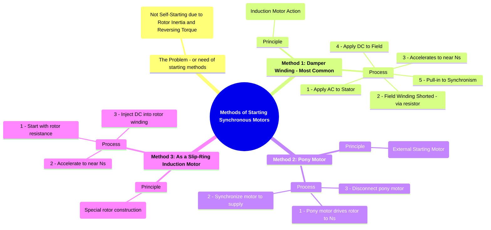

---
tags:
  - electrical-machines/synchronous-machines
  - synchronous-motor
  - motor-starting
created: 2025-07-22
aliases:
  - Synchronous Motor Starting
  - Starting Methods for Synchronous Motors
  - Pony Motor
subject: "[[Electrical Machines]]"
parent: "[[Synchronous Motors]]"
modified: 2026-07-23T20:53:17
---
### Methods of Starting Synchronous Motors
#motor-starting #synchronous-motor

> As established in the [[principle of operation of synchronous motors]], a synchronous motor is not self-starting. It develops zero average torque at standstill. Therefore, an auxiliary mechanism is required to accelerate the rotor to a speed close to the synchronous speed, at which point the rotor's DC field can "lock" with the stator's rotating magnetic field. The most common methods are described below.

---
#### 1. Starting with Damper Winding (Induction Motor Start)
#damper-winding #induction-start

This is the most widely used and effective method.

*   **Principle**: The motor is equipped with [[Damper Windings]], which are copper or aluminum bars embedded in the rotor pole faces and short-circuited at the ends, similar to a [[Construction of Three-Phase Induction Motors#1. Squirrel Cage Rotor|squirrel cage rotor]] (used in 3$\phi$ Induction Motor). When the 3-phase AC supply is switched on, the stator's rotating magnetic field (RMF) induces currents in these damper bars. The interaction between the RMF and the induced currents produces an induction motor torque, which accelerates the rotor.

*   **Starting Procedure**:
    1. A reduced voltage (using an [[Starting Methods for Induction Motors#3. Autotransformer Starter|autotransformer]] or [[Starting Methods for Induction Motors#2. Star-Delta (Y-$ Delta$) Starter|star-delta starter]]) is applied to the 3-phase stator winding.
    2. During this period, the rotor's main field winding is kept **de-energized**. It is typically short-circuited through a suitable **field discharge resistor**.
        * **Reason for shorting**: The stator RMF, rotating at synchronous speed, cuts the stationary, multi-turn field winding, inducing a dangerously high voltage. Shorting it through a resistor limits this voltage and prevents insulation failure. It also contributes a small amount of starting torque.
    3. The motor starts and accelerates as a squirrel cage induction motor to a speed slightly below the synchronous speed (typically 95-98% of $N_s$).
    4. Once the motor reaches this steady speed, the DC excitation is applied to the rotor field winding.
    5. The DC field poles are then attracted by the slowly passing RMF poles, and the rotor is pulled into synchronism. The motor locks in and runs at exactly synchronous speed.
    6. Once synchronized, the damper winding carries no current (as the relative speed between the rotor and RMF is zero) but serves its primary purpose of damping oscillations ([[hunting]]).

---
#### 2. Starting with a Pony Motor
#pony-motor

*   **Principle**: An external, smaller motor (called a "pony motor") is coupled to the shaft of the synchronous motor. This pony motor's sole job is to bring the main motor's rotor up to speed.

*   **Starting Procedure**:
    1.  The pony motor (usually a small induction motor) is started, which in turn drives the rotor of the main synchronous motor.
    2.  The rotor is accelerated to a speed very close to or exactly at the synchronous speed.
    3.  The DC excitation is applied to the synchronous motor's rotor, and the motor is then synchronized to the AC supply line just like an alternator.
    4.  Once the synchronous motor is successfully locked into the grid, the pony motor is either electrically disconnected or mechanically decoupled from the shaft.

*   **Note**: For the pony motor to bring the rotor to synchronous speed, it must have fewer poles than the main synchronous motor. For example, to start a 4-pole synchronous motor ($N_s = 1500$ rpm at 50 Hz), a 2-pole pony motor ($N_s = 3000$ rpm) could be used.

---
#### 3. Starting as a Slip-Ring Induction Motor
#synchronous-induction-motor

This method applies to a special type of machine called a **synchronous-induction motor**, which is constructed to function as both.
*   **Principle**: The rotor is wound with a 3-phase winding similar to a slip-ring induction motor, with terminals brought out to slip rings.
*   **Starting Procedure**:
    1.  The motor is started as a slip-ring induction motor by connecting external resistors to the rotor circuit via the slip rings. This provides high starting torque and limits starting current.
    2.  As the motor speeds up, the external resistance is gradually cut out.
    3.  When the motor reaches a speed close to synchronous, the slip rings are switched over from the starting resistors to a DC supply, which excites the rotor winding to create fixed N-S poles.
    4.  The motor pulls into synchronism and runs as a synchronous motor.

---
### Related Concepts
#motor-starting/related-concepts

> [[Principle of Operation of Synchronous Motors]]

[[Hunting in Synchronous Machines]]
[[Construction of Three-Phase Induction Motors]]
[[Starting Methods for Induction Motors]]
