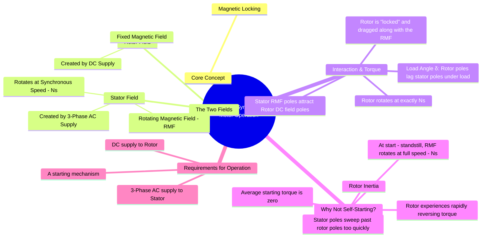

---
tags:
  - electrical-machines/synchronous-machines
  - synchronous-motor
  - motor-principle
  - magnetic-locking
created: 2025-07-21
aliases:
  - Synchronous Motor Operation
  - Principle of Synchronous Motor
  - Why a Synchronous Motor is Not Self-Starting?
subject: "[[Electrical Machines]]"
parent:
  - "[[Synchronous Motors]]"
modified: 2026-07-23T20:53:35
---
### Principle of Operation of Synchronous Motors
#synchronous-motor #motor-principle #magnetic-locking #electrical-machines

> A synchronous motor is a [[Singly and Doubly Excited Systems|doubly-excited]] machine that runs at a constant speed—the **synchronous speed**—from no load to full load, regardless of load variations. Its operation is based on the principle of **magnetic locking** between the rotating magnetic field produced by the stator and the DC-excited magnetic field of the rotor.

---

#### Interaction of Stator and Rotor Fields
#rotating-magnetic-field #magnetic-locking

1.  **Stator's Rotating Magnetic Field (RMF)**: When a three-phase AC supply is connected to the stator windings, it produces a magnetic field of constant magnitude that rotates at a synchronous speed ($N_s$). The speed is determined by the supply frequency ($f$) and the number of poles ($P$).
    $$\boxed{\quad N_s = \frac{120f}{P} \quad \text{rpm} \quad}$$
    The poles of this rotating field (let's call them $N_S$ and $S_S$ for stator) revolve in the air gap.

2.  **Rotor's DC Field**: The rotor winding is supplied with a DC current (excitation), which creates a fixed magnetic field with distinct North and South poles on the rotor (let's call them $N_R$ and $S_R$).

3.  **Magnetic Locking and Torque Production**:
    When the motor is running, the stator's RMF and the rotor's DC field interact. The $N_S$ pole of the stator field attracts the $S_R$ pole of the rotor, and the $S_S$ pole attracts the $N_R$ pole. This magnetic attraction creates a torque that "locks" the rotor poles with the oppositely charged, rotating stator poles.
    As a result, the rotor is compelled to rotate at the exact same speed as the stator's RMF, i.e., at synchronous speed ($N_s$).

When a mechanical load is applied to the shaft, the rotor poles momentarily slow down and slip back slightly in position relative to the stator poles by an angle called the **load angle** or **power angle ($\delta$)**. However, the magnetic lock remains, and the rotor continues to spin at synchronous speed. A larger load results in a larger load angle, which in turn develops more torque to meet the load demand (up to the pull-out torque limit).

---
#### Why a Synchronous Motor is Not Self-Starting
#self-starting/synchronous-motor

A key characteristic of a synchronous motor is that it has no inherent starting torque. The reason is twofold:

1.  **Rotor Inertia**: The rotor has a significant mass and therefore cannot instantly accelerate to synchronous speed.
2.  **Rapidly Reversing Torque**: At the moment of starting, the stator RMF is already rotating at full synchronous speed, while the rotor is stationary.
    *   As the stator's $N_S$ pole sweeps past the rotor's $S_R$ pole, it produces a torque in one direction (e.g., clockwise).
    *   An instant later, the stator's $S_S$ pole will be in the same position, which repels the rotor's $S_R$ pole, producing a torque in the opposite direction (counter-clockwise).
    *   Because the RMF is rotating very fast (e.g., 3000 rpm for a 2-pole, 50 Hz machine), the rotor is subjected to a very rapid succession of clockwise and counter-clockwise torques.
    *   Due to its inertia, the rotor cannot respond to these reversals and simply vibrates or remains stationary. The **average torque over a full cycle is zero**.

Therefore, a synchronous motor needs an auxiliary starting mechanism to accelerate the rotor to a speed very close to the synchronous speed before the DC field excitation is applied and magnetic locking can occur.

---
### Related Concepts
#synchronous-motor/related-concepts

> [[Methods of Starting Synchronous Motors]]

[[Rotating Magnetic Field (RMF)]]
[[Power-Angle Characteristics for Synchronous Machines]]
[[Effect of Excitation on Armature Current]]
[[Principle of Operation as a Generator (Alternator)]]
