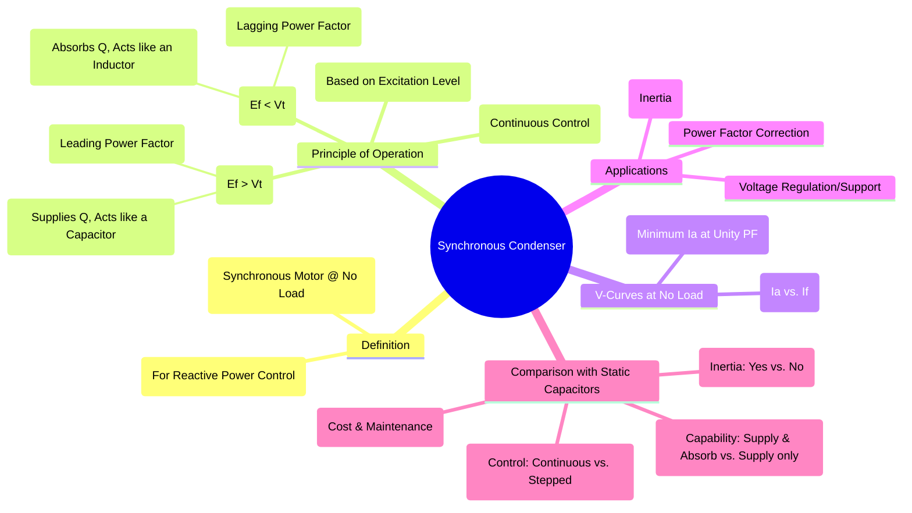

---
tags:
  - synchronous-machine
  - power-systems
  - reactive-power
  - pfc
  - voltage-control
created: 2025-09-15
aliases:
  - Synchronous Capacitor
  - Syncon
subject: "[[Electrical Machines]]"
parent:
  - "[[Synchronous Machines]]"
modified: 2026-07-23T20:53:49
---
### Synchronous Condenser
#synchronous-condenser #reactive-power-compensation

> A **Synchronous Condenser** (also known as a synchronous capacitor or syncon) is a [[Synchronous Motors|synchronous motor]] that ==runs without a mechanical load and is used for the sole purpose of generating or absorbing reactive power== to regulate voltage and improve the [[Power Factor#Power Factor (PF)|power factor]] of a power system.

It is a dynamic and flexible source of [[AC Power Analysis#Reactive Power, Q|reactive power]].

---
#### Principle of Operation
#voltage-control #excitation

The operation of a synchronous condenser is ==based on controlling the DC field excitation current ($I_f$)==. By varying the excitation, the magnitude of the internal generated EMF ($E_f$) of the motor is changed, which in turn controls the flow of reactive power ($Q$) between the machine and the power grid.

Recall the voltage equation for a [[synchronous motors#Torque and Power|synchronous motor]]: $$\vec{V_t} = \vec{E_f} + I_a Z_s$$ 
The relationship between $E_f$ and the terminal voltage $V_t$ determines the reactive power behavior.

1. **Over-Excited Condition ($|E_f| > |V_t|$):**
    When the field current is increased, the motor is over-excited. It operates at a **leading power factor** and **supplies reactive power (VARs)** to the system, acting like a large capacitor bank.

2. **Under-Excited Condition ($|E_f| < |V_t|$):**
    When the field current is decreased, the motor is under-excited. It operates at a **lagging power factor** and **absorbs reactive power** from the system, acting like a large inductor (shunt reactor).

3. **Normal Excitation ($|E_f| \approx |V_t|$):**
    The motor operates at or near unity power factor, exchanging minimal reactive power.

This ability to provide **continuous, smooth control** over reactive power (both supplying and absorbing) is its primary advantage.
$$\boxed{\quad \text{Control } I_f \implies \text{Control } E_f \implies \text{Control } Q \quad}$$

---
#### V-Curves at No Load
#v-curves

The [[V-Curves]] for a synchronous condenser are the same as for a synchronous motor operating at no-load. The plot of armature current ($I_a$) versus field current ($I_f$) shows that the minimum armature current occurs at unity power factor.
* Increasing $I_f$ beyond this point (over-excitation) causes the current to increase at a leading PF.
* Decreasing $I_f$ below this point (under-excitation) causes the current to increase at a lagging PF.

---
#### Applications
#power-factor-correction #voltage-regulation

1. **Power Factor Correction**: Installed in industrial facilities with large inductive loads (many motors) to supply the required reactive power locally, thereby improving the overall power factor and reducing electricity bills.
	> See [[ee_2016(2)#^q41]]
2. **Voltage Regulation**: Installed at the receiving end of long transmission lines to supply reactive power, which compensates for the $I^2X_L$ voltage drop and helps maintain a stable voltage profile under heavy load conditions. They can also absorb reactive power to mitigate the [[Ferranti Effect]] under light load conditions.
3. **[[Classification of Power System Stability|Power System Stability]]**: As a rotating machine, a synchronous condenser has significant mass and inertia. This rotational inertia helps to stabilize the grid voltage and frequency during transient system disturbances (like faults), an advantage that static capacitor banks do not offer.

---
#### Comparison with Static Capacitor Banks
#comparison/synchronous-condenser-with-static-capacitor-banks

| Feature | Synchronous Condenser | Static Capacitor Bank |
| :--- | :--- | :--- |
| **Control** | Smooth, continuous control | Stepped control (by switching banks) |
| **Q Capability** | Can both **supply** and **absorb** reactive power | Can only **supply** reactive power |
| **Inertia** | Provides rotational inertia, improving stability | Provides no inertia |
| **Harmonics** | Less susceptible to harmonic problems | Can create harmonic resonance issues |
| **Maintenance** | Higher (rotating parts, brushes) | Lower (static device) |
| **Losses** | Higher (rotational and excitation losses) | Lower |
| **Cost** | Higher initial cost | Lower initial cost |

---
### Related Concepts
#related-concepts

> [[Synchronous Motors]] 
> [[Synchronous Machines]] (The parent machine type)

[[Power Factor|Power Factor]] (The quantity it is designed to correct)
[[AC Power Analysis#Reactive Power (Q)|Reactive Power]] (The quantity it generates or absorbs)
[[V-Curves]] (Its characteristic operating curves)
[[Voltage Regulation]] (A primary application)
[[Classification of Power System Stability|Power System Stability]] (An inherent benefit it provides)