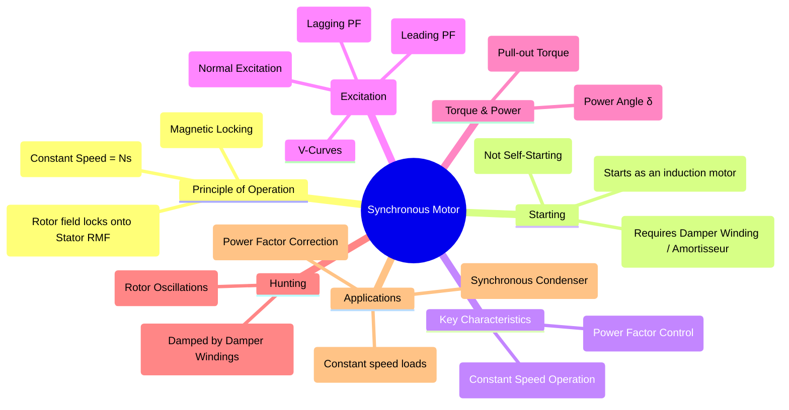

---
tags:
  - synchronous-motor
  - electrical-machines
  - ac-motor
  - constant-speed
  - pfc
created: 2025-09-17
aliases:
  - Synchronous Motors
  - Synch Motor
  - Power Factor Control and Excitation of Synchronous Motors
subject:
  - "[[5. Electrical Machines/Electrical Machines|Electrical Machines]]"
parent: "[[Synchronous Machines]]"
formula:
  - "Under-Excited Synchronous Motors (Lagging Power Factor) : $$|E_f| < |V_t|$$"
  - "Over-Excited Synchronous Motors (Leading Power Factor) : $$|E_f| > |V_t|$$"
  - "Normal-Excited Synchronous Motors (Unity Power Factor) : $$|E_f| \\approx |V_t|$$"
  - "Gross Power Developed by Synchronous Motors : $$P_{dev} = \\frac{3 |E_f| |V_t|}{X_s} \\sin\\delta$$"
modified: 2026-07-21T15:57:36
---
### Synchronous Motor
#synchronous-motor #constant-speed-drive

> A **Synchronous Motor** is a type of AC motor that ==runs at a constant speed==, known as the [[Synchronous Machines|synchronous speed]] ($N_s$), which is ==directly synchronized with the supply frequency==. Its two most important characteristics are its **constant speed operation** regardless of load and ==its ability to have its **power factor controlled** by varying the DC field excitation==.

---
#### Principle of Operation
#magnetic-locking

The operation of a synchronous motor is based on the principle of **magnetic locking**.
1. **Stator RMF**: A three-phase AC supply connected to the stator winding produces a [[Rotating Magnetic Field (RMF)]] (RMF) that rotates at synchronous speed ($N_s$).
2. **Rotor Field**: The rotor winding is supplied with a DC current, turning it into a constant electromagnet with fixed North and South poles.
3. **Locking**: The magnetic poles of the rotor are attracted to the rotating poles of the opposite polarity on the stator's RMF. This magnetic attraction "locks" the rotor to the RMF, forcing it to rotate at the exact same synchronous speed.

---
#### Starting of Synchronous Motors
#motor-starting #damper-winding

A synchronous motor is **not self-starting**. If the DC rotor field is energized at standstill, the stator RMF rotates so fast that the rotor's inertia prevents it from locking on. The rapidly passing RMF poles exert a rapidly reversing torque, resulting in zero net starting torque.

The most common starting method is by using [[Damper Windings|Damper Windings (or Amortisseur Windings)]]:
* **Construction**: These are copper bars embedded in the faces of the rotor poles and short-circuited by end rings, similar to a squirrel cage rotor.
* **Operation**:
    1. The DC field is initially un-energized.
    2. The motor is started as an **induction motor** using the damper windings. The rotor accelerates to a speed slightly below synchronous speed.
    3. Once the rotor is near synchronous speed, the DC field winding is energized.
    4. The rotor poles then "pull into synchronism" with the RMF poles, and the motor runs at exactly $N_s$.

---
#### Power Factor Control and Excitation
#power-factor-correction #excitation

> [!refer]
> [[Power Factor Correction]]
> [[Machine Excitation Convention#Synchronous Motor]]

The most significant feature of a synchronous motor is its ability to operate at any desired power factor (lagging, unity, or leading). This is controlled by adjusting the DC field excitation current ($I_f$), which changes the magnitude of the internal EMF ($E_f$).

1. **Under-Excitation ($|E_f| < |V_t|$)**: The motor operates at a **lagging power factor** and absorbs reactive power from the supply, behaving like an R-L load.
2. **Normal Excitation ($|E_f| \approx |V_t|$)**: The motor operates at **unity power factor**, drawing minimum armature current for a given load.
3. **Over-Excitation ($|E_f| > |V_t|$)**: The motor operates at a **leading power factor** and supplies reactive power to the supply, behaving like an R-C load.

This behavior is graphically represented by the motor's [[V-Curves]].

---
#### Torque and Power
#power-angle #pull-out-torque

The operation is governed by the motor's general phasor equation: $$\boxed{\quad \vec{V_t} = \vec{E_f} + \vec{I_a} Z_s \quad}$$
==*(where synchronous impedance $Z_s = R_a + jX_s$)*==

> [!pyq]- PYQ : 2019
> ![[ee_2019#^q48]]

> [!info] Simplified Equation
> For large synchronous machines, armature resistance $R_a$ is often negligible. When assuming $R_a \approx 0$, the equation simplifies to:
> $$\boxed{\quad \vec{V_t} = \vec{E_f} + j\vec{I_a} X_s \quad}$$

> [!warning] Unity Power Factor Motor Derivation Note
> For a synchronous motor at unity power factor:
> $$\vec{I}_a \parallel \vec{V}_{ph}$$
> Hence, the reactive drop vector $-jX_s\vec{I}_a$ is perpendicular to $\vec{V}_{ph}$ and points vertically downward.
> 
> This forms a right-angled triangle where the terminal voltage $V_{ph}$ is the **hypotenuse** and $E_f \cos\delta$ aligns with it:
> $$E_f \cos\delta = V_{ph} \implies E_f = \frac{V_{ph}}{\cos\delta}$$
> (Here, $\delta$ is the load angle. This relation is **valid only at UPF**).
> 
> > [!refer]
> > [[Machine Excitation Convention#Synchronous Motor]]

> [!tip] Quick Formula Shortcut for UPF
> When a cylindrical synchronous motor operates at **Unity Power Factor (UPF)** and $R_a = 0$, you can bypass calculating $E_f$ or $I_a$ entirely to find power. 
> 
> By substituting $E_f = \frac{V_{ph}}{\cos\delta}$ into the power formula, the total 3-phase power simplifies directly to:
> $$P_{total} = \frac{3 V_{ph}^2}{X_s} \tan\delta$$
> Use this directly for questions providing only terminal voltage, load angle, and reactance.

The mechanical power developed by the motor is a function of the **power angle** (or torque angle) $\delta$, which is the angle between the terminal voltage $V_t$ and the excitation EMF $E_f$.
$$P_{dev} = \frac{3 |E_f| |V_t|}{X_s} \sin\delta$$
* **Torque**: Since speed is constant, the torque developed is directly proportional to the power ($T = P/\omega_s$). As the mechanical load on the shaft increases, the power angle $\delta$ increases to produce more torque.
* **Pull-Out Torque**: There is a maximum torque the motor can develop, which occurs at $\delta = 90^\circ$ (for a cylindrical rotor). If the load torque exceeds this **pull-out torque**, the motor will lose synchronism, and the rotor will pull out of the RMF and stop. 
    * This maximum power limit is formally known as the [[Steady-State Stability Limit]].
    > [!danger] Exam Trap: SSSL with Armature Resistance
    > If the motor has significant armature resistance ($Z_s = R_a + jX_s$), the simple $\delta=90^\circ$ rule fails. See the exact quadratic formulation here: [[Steady-State Stability Limit#Determining the Stability Limit|SSSL for a Synchronous Motor (General Case)]].

> [!pyq]- PYQ : 2017
> [[ee_2017(1)#^q20]]

---
#### Hunting
#hunting

> [!refer]
> [[Hunting in Synchronous Machines#Causes of Hunting|Hunting in Synchronous Machines]] in details

**Hunting** is the phenomenon of the rotor oscillating (swinging back and forth) around its steady-state equilibrium position due to sudden changes in load or supply conditions. These oscillations can become severe and may cause the motor to lose synchronism. The **[[damper windings]]** are crucial for mitigating this; they produce an opposing torque that damps out these oscillations.

---
#### Applications

* **Constant Speed Drives**: Used for loads that require a constant speed, such as large compressors, fans, blowers, and pumps.
* **Power Factor Correction**: A large synchronous motor can be run over-excited to simultaneously drive a mechanical load and improve the overall power factor of an industrial plant.
* **[[Synchronous Condenser]]**: A special application where the motor has no mechanical load and is used purely for reactive power compensation and voltage regulation.
	> [!pyq]- PYQ : 2016
	> ![[ee_2016(2)#^q41]]

---
### Related Concepts
#related-concepts

> [[Synchronous Machines]] (Parent concept)

[[V-Curves]] (The key operating characteristic)
[[Synchronous Condenser]] (A special-purpose application)
[[Rotating Magnetic Field (RMF)]] (The fundamental principle)
[[Power Factor]]
[[Machine Excitation Convention]]