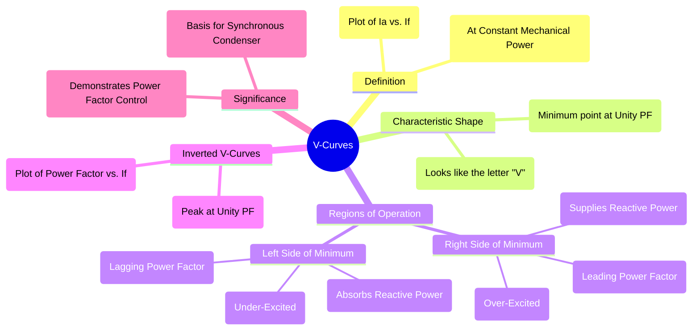

---
tags:
  - synchronous-machine
  - synchronous-motor
  - v-curves
  - power-factor
  - excitation
created: 2025-09-16
aliases:
  - V Curves
  - Inverted V-Curves
subject:
  - "[[Electrical Machines]]"
parent:
  - "[[Synchronous Machines]]"
modified: 2026-07-23T20:54:02
---
### V-Curves
#v-curves #synchronous-motor

> ==**V-Curves** are the characteristic plots of the armature current ($I_a$) versus the DC field current ($I_f$) for a [[Synchronous Motors|synchronous motor]] operating at a **constant mechanical power output (P)**.== They are called V-curves because of their distinctive "V" shape.

These curves are fundamental to understanding how a synchronous motor's power factor can be controlled by varying its field excitation.

---

#### Principle and Interpretation
#excitation-control

The operation is governed by the motor's phasor equation (neglecting $R_a$): $$\vec{V_t} = \vec{E_f} + jI_a X_s$$
The key factors are:
1. **Constant Real Power (P)**: The motor delivers a constant mechanical power, which means the input real power is also constant ($P = 3V_t I_a \cos\phi = \text{constant}$).
2. **Controlled Field Current ($I_f$)**: The operator can vary $I_f$, which directly controls the magnitude of the [[Internal EMF#1. EMF behind Synchronous Impedance ($E_f$)|internal excitation EMF]], $|E_f|$.

As we vary $I_f$ (and thus $|E_f|$), the motor's armature current ($I_a$) and power factor ($\cos\phi$) must adjust to keep the real power ($P$) constant.

---
##### Analysis of a Single V-Curve (Constant P)
#analysis/v-curve 

![[V-Curves.png]]

> [!info] Locus of Unity Power Factor (Compounding Curve)
> If you draw multiple V-curves for different power levels ($P=0$, $P=0.5P_{rated}$, $P=P_{rated}$), the minimum points do not align vertically. 
> * The locus of these minimum points shifts to the **right** (higher $I_f$) as the real power load increases.
> * This occurs because higher real power means higher active armature current, which increases the cross-magnetizing armature reaction. Additional field excitation is required to overcome this and maintain $\cos\phi = 1$.

1.  **Under-Excited Region (Left Side)**:
    * The field current ($I_f$) is low, so the excitation EMF ($E_f$) is small.
    * To deliver the required power, the motor draws a large armature current ($I_a$).
    * The motor operates at a **lagging power factor**, absorbing reactive power from the supply, behaving like an inductive load.
> [!memory] Steady-State Stability Limit
> The left side of the V-curve (under-excited region) gets truncated at higher load levels. 
> * As $I_f$ is reduced, the internal EMF $E_f$ decreases.
> * Since $P = \frac{V_t E_f}{X_s} \sin\delta$, reducing $E_f$ forces the load angle $\delta$ to increase to maintain constant $P$.
> * If $E_f$ is reduced too much, $\delta$ reaches $90^\circ$ (for cylindrical rotors). Any further reduction causes the motor to lose synchronism and stall. The V-curve physically ends at this stability limit line.

2.  **Minimum Point (Bottom of the "V")**:
    * As $I_f$ is increased, the motor operates more efficiently.
    * At a specific value of $I_f$, the armature current ($I_a$) reaches its minimum value.
    * At this point, the motor is operating at **unity power factor** ($\cos\phi = 1$). This is the point of "normal excitation".

3.  **Over-Excited Region (Right Side)**:
    * As $I_f$ is increased further beyond the minimum point, $E_f$ becomes large.
    * The armature current ($I_a$) begins to increase again.
    * The motor now operates at a **leading power factor**, supplying reactive power to the supply, behaving like a capacitive load.

> [!example] Boundary Condition: Zero & Reverse Excitation (Salient Pole)
> The standard V-curve maps positive $I_f$. If excitation is manipulated beyond these bounds at no-load:
> * **Zero Excitation ($I_f = 0$):** The armature current does not go to infinity. The machine operates purely as a reluctance motor. $I_a$ stabilizes at a high value (roughly $V_t / X_d$), drawing heavily lagging current just to magnetize the core.
> * **Reverse Excitation (Negative $I_f$):** The rotor poles begin to actively oppose the stator field. Reluctance torque fights the negative synchronous torque until a critical point is reached. The rotor then violently **slips by one pole pitch** (180 electrical degrees) to realign the physical poles with the opposite magnetic polarity, suddenly acting as positive excitation again and causing a steep drop in $I_a$.
> 
> 	> See [[Armature Winding Factors in Synchronous Machines]]
> 

---
#### Inverted V-Curves
#inverted-v-curves

An **Inverted V-Curve** is a plot of the **power factor (PF)** versus the field current ($I_f$) for a constant mechanical load.

![[Inverted V-Curve of Synchronous Motor.jpg]]

* It has the shape of an inverted "V".
* The peak of the curve corresponds to **unity power factor**, which occurs at the same field current as the minimum point on the corresponding V-curve.
* The power factor is lagging on the left (under-excited) and leading on the right (over-excited).

---
#### Significance and Applications
#significance #applications 

* **Power Factor Control**: The V-curves are the most important characteristic demonstrating the unique ability of a synchronous motor to control its own power factor.
* **Power Factor Correction**: By over-exciting a synchronous motor, it can be used to compensate for the lagging power factor of other inductive loads (like induction motors) in a facility.
* **Synchronous Condenser**: The V-curve for a no-load condition ($P=0$) describes the operation of a [[Synchronous Condenser]], which is a machine dedicated solely to reactive power control.

---
### Related Concepts
#related-concepts

> [[Synchronous Machines]] (Parent concept)

[[Synchronous Motors]]
[[Synchronous Condenser]] (The $P=0$ special case)
[[Power Factor]] (The parameter being controlled)
[[AC Power Analysis#Reactive Power, Q|Reactive Power]]
[[Machine Excitation Convention]] (The control mechanism)