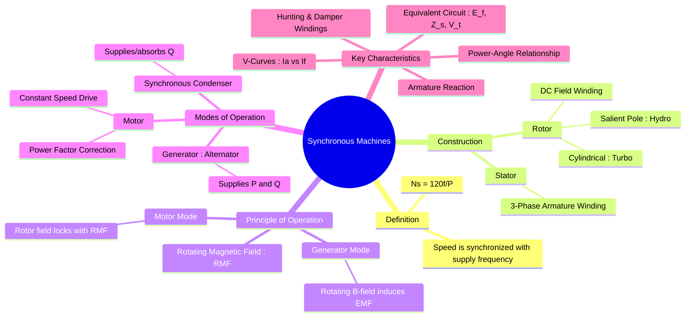

---
tags:
  - electrical-machines/synchronous-machines
  - map-of-content
  - ac-machines
  - alternator
  - synchronous-motor
created: 2025-09-08
aliases:
  - Synchronous Machine MOC
  - Synchronous Machine Master Note
  - Synchronous Speed
subject: "[[Electrical Machines]]"
parent: "[[AC Machines]]"
formula:
  - "Synchronous Speed : $$N_s = \\frac{120 f}{P} \\quad (\\text{in RPM})$$"
trends:
  - "[[trends - Synchronous Machines]]"
error:
  - "[[error - Synchronous Machines]]"
modified: 2026-07-16
---
### Synchronous Machines
#synchronous-machine #ac-machine

> A **Synchronous Machine** is a [[Singly and Doubly Excited Systems#Doubly Excited Systems|doubly-excited]] AC machine in which the rotor rotates at the exact same speed as the stator's Rotating Magnetic Field (RMF), known as the **synchronous speed**.

It can operate as both a generator and a motor.

---
#### Synchronous Speed
#synchronous-speed

The speed of the rotating magnetic field, and therefore the speed of the rotor, is called the synchronous speed ($N_s$). It is determined by the supply frequency ($f$) and the number of poles ($P$) in the machine.
$$\boxed{\quad N_s = \frac{120 f}{P} \quad (\text{in RPM})}$$

---
#### Core Foundations & Construction
#synchronous-machine/construction

Before evaluating performance, the physical features and mathematical foundations must be established.

**Physical Architecture:** Structural differences dictate whether a machine handles high-speed thermal operations or low-speed hydro operations.

> See [[Constructional Features of Synchronous Machines]]

**The Baseline Fields:** Understanding the fundamental air-gap interactions and winding distribution effects.

> See [[Armature Winding Factors in Synchronous Machines]]
> See [[Rotating Magnetic Field (RMF)]]

---
#### Principle & Mathematical Modeling
#synchronous-machine/principle

How the physical machine is translated into equations, phasor networks, and fundamental vector relationships.

##### A. Core Operations
**Generation:** Mechanical input converted to an induced AC voltage wave.

> See [[Principle of Operation as a Generator (Alternator)]]
> See [[EMF Equation of an Alternator]]

**Motoring:** Magnetic locking between stator and rotor fields.

> See [[Principle of Operation of Synchronous Motors]]

##### B. Steady-State Equivalent Networks
**Cylindrical (Uniform Air-Gap) Models:**

> See [[Internal EMF]]
> See [[Armature Reaction and Synchronous Reactance]]
> See [[Equivalent Circuit and Phasor Diagram of an Alternator]]

**Salient Pole (Non-Uniform Air-Gap) Models:**

> See [[Salient Pole Machines - Two Reaction Theory]]

---
#### Generator Behavior & Performance (Alternators)
#synchronous-impedance

Evaluating how a generator responds to loading, structural limitations, and synchronization conditions.

**Voltage Drops & Stability:** Tracking how terminal voltage changes from no-load to full-load conditions.

> See [[Phasor Diagram of Synchronous Machine]]
> See [[Voltage Regulation of an Alternator]]

**Grid Integration:** Laws governing how multiple machines share active and reactive power.

> See [[Parallel Operation of Alternators and Synchronization]]

**Power Limits:** Mathematical constraints of excitation power vs. reluctance power.

> See [[Power-Angle Characteristics for Synchronous Machines]]

---
#### Motor Behavior & Grid Dynamics
#alternator #synchronous-motor #synchronous-condenser

Analyzing the unique constant-speed properties, power factor flexibility, and system dynamics of synchronous motors.

**The Complete Motor Framework:**

> See [[Synchronous Motors]]

**Excitation Characteristics:** How changing the DC field current influences the armature current and operating power factor ($I_a$ vs $I_f$).

> See [[Effect of Excitation on Armature Current]]
> See [[V-Curves]]

**Starting Mechanisms:** Overcoming the zero-average starting torque limitation.

> See [[Methods of Starting Synchronous Motors]]

**Power Factor Correction:** Operating as a pure reactive power compensator.

> See [[Synchronous Condenser]]

---
#### Transient & Dynamic Phenomena

How synchronous machines behave during faults, load disturbances, and step-changes in power grids.

**Short-Circuit Time-Varying Impedances:** The changing reactances during a sub-transient, transient, and steady-state fault envelope.

> See [[Sub-transient Reactance]]
> See [[Transient Reactance]]

**Rotor Oscillations:** Physical causes and methods used to suppress mechanical oscillations around synchronous speed.

> See [[Hunting in Synchronous Machines]]

