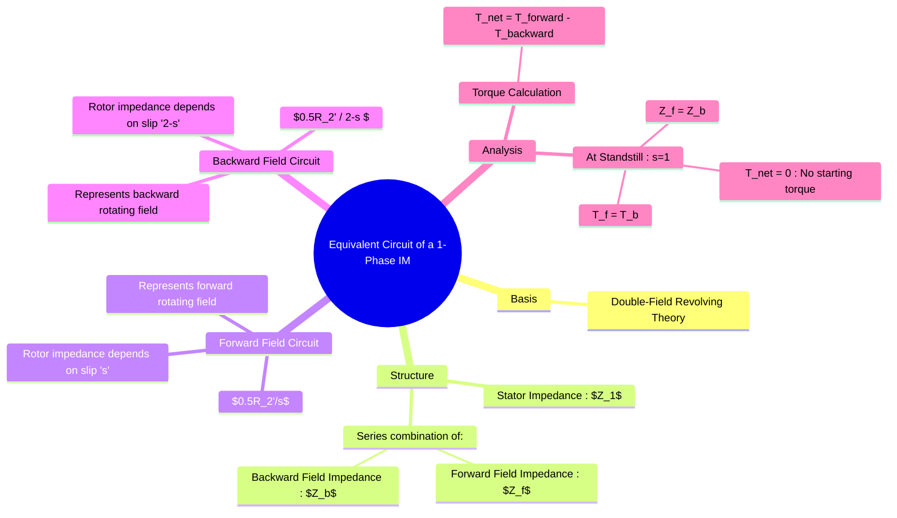

---
tags:
  - electrical-machines/induction-motors
  - single-phase-motor
  - equivalent-circuit
  - double-revolving-field-theory
  - machine-analysis
created: 2025-07-25
aliases:
  - Equivalent Circuit of a 1-Phase IM
  - Single Phase IM Equivalent Circuit
subject: "[[Electrical Machines]]"
parent:
  - Single-Phase Induction Motors
modified: 2026-07-23T20:54:24
---
### Equivalent Circuit of a Single-Phase Induction Motor
#equivalent-circuit #single-phase-motor #double-revolving-field-theory

> The performance and characteristics of a single-phase induction motor can be analyzed using an equivalent circuit. This circuit is derived from the **[[Principle of Operation of Single-Phase Induction Motor#1. Double-Field Revolving Theory|double-field revolving theory]]**, which treats the motor as two separate induction motors in one.

---
#### Basis of the Equivalent Circuit
#equivalent-circuit/basis 

The theory states that the pulsating stator MMF can be resolved into two counter-rotating MMFs of half the magnitude each.
*   The **forward field** rotates at synchronous speed ($+N_s$) and has a slip of $s$.
*   The **backward field** rotates at synchronous speed ($-N_s$) and has a slip of $s_b = 2-s$.

The equivalent circuit, therefore, models the single-phase motor as two three-phase motors connected in series, with their rotor circuits corresponding to the forward and backward slips.

---
#### The Equivalent Circuit Diagram
#equivalent-circuit-diagram #forward-field-impedance #backward-field-impedance 

The circuit consists of the stator impedance ($Z_1 = R_1 + jX_1$) connected in series with the parallel combination of the **forward field impedance ($Z_f$)** and the **backward field impedance ($Z_b$)**.

*   **$R_1$**: Stator winding resistance.
*   **$X_1$**: Stator winding leakage reactance.
*   **$X_m$**: Magnetizing reactance.
*   **$R_2'$**: Rotor resistance referred to the stator.
*   **$X_2'$**: Rotor leakage reactance referred to the stator.
*   **$s$**: Slip of the rotor.

The **forward impedance ($Z_f$)** is given by the parallel combination of the magnetizing branch and the forward rotor impedance:
$$Z_f = \left( j\frac{X_m}{2} \right) \parallel \left( \frac{R_2'}{2s} + j\frac{X_2'}{2} \right)$$
The **backward impedance ($Z_b$)** is given by the parallel combination of the magnetizing branch and the backward rotor impedance:
$$Z_b = \left( j\frac{X_m}{2} \right) \parallel \left( \frac{R_2'}{2(2-s)} + j\frac{X_2'}{2} \right)$$

> [!mistake] Note
> The factor of 1/2 is applied to all rotor and magnetizing parameters because each of the two rotating fields has half the amplitude of the main pulsating field.

The total input impedance of the motor is:
$$Z_{in} = (R_1 + jX_1) + Z_f + Z_b$$

---
#### Analysis from the Circuit
#analysis/circuit 

##### At Standstill (s=1)
#slip/standstill 

At the moment of starting, the rotor is stationary, so $s=1$.
The backward slip becomes $s_b = 2-s = 2-1 = 1$.
In this condition:
* Forward rotor impedance term: $\frac{R_2'}{2s} = \frac{R_2'}{2}$
* Backward rotor impedance term: $\frac{R_2'}{2(2-s)} = \frac{R_2'}{2}$
Since both slip-dependent terms are equal, the forward impedance $Z_f$ becomes equal to the backward impedance $Z_b$. This means the air-gap power transferred to the forward field ($P_{gf}$) is equal to the power transferred to the backward field ($P_{gb}$). Consequently, the forward torque ($T_f$) is equal in magnitude to the backward torque ($T_b$), resulting in zero net starting torque. This mathematically confirms why the motor is not self-starting.

---
##### During Operation (s < 1)
#slip/during-operation 

When the motor is running with a small slip $s$ (e.g., 0.05):
* The forward rotor impedance term $\frac{R_2'}{2s}$ is large (e.g., $10 \times R_2'$).
* The backward rotor impedance term $\frac{R_2'}{2(2-s)}$ is small (e.g., $\approx R_2'/4$).
Wait, the impedance of the rotor circuit is $\frac{R_2'}{s}$. So for small $s$, the forward rotor impedance is *high*, while for $s_b = 2-s$ (close to 2), the backward rotor impedance is *low*. This is incorrect. The impedance to current flow is what matters. A lower impedance path draws more current.

Let's re-evaluate. The total impedance of the backward field rotor circuit is much higher than the forward field circuit because the denominator in the resistance term is very large ($2-s \approx 2$). A small resistance $\frac{R_2'}{2(2-s)}$ means the backward field circuit is nearly short-circuited. No, this is also wrong.
Let's stick to the power.
* For small $s$, the resistance $\frac{R_2'}{2s}$ is a large value, representing a high power transfer.
* For $s_b=2-s$, the resistance $\frac{R_2'}{2(2-s)}$ is a small value, representing low power transfer and high current in the backward rotor circuit.

The torque is proportional to the air-gap power.
* **Forward Air-Gap Power ($P_{gf}$)**: Power dissipated in the effective resistance $\frac{R_2'}{2s}$.
* **Backward Air-Gap Power ($P_{gb}$)**: Power dissipated in the effective resistance $\frac{R_2'}{2(2-s)}$.
The torque is then calculated from this power.

---
#### Torque and Power Calculations
#torque-calculation #power-calculation 

The air-gap powers for the forward and backward fields can be calculated from the circuit. If $I_1$ is the stator current:
* $P_{gf} = I_1^2 \times \text{Re}(Z_f)$
* $P_{gb} = I_1^2 \times \text{Re}(Z_b)$

The corresponding torques are:
$$\boxed{\quad T_f = \frac{P_{gf}}{\omega_s} \quad \text{and} \quad T_b = \frac{P_{gb}}{\omega_s} \quad}$$
Where $\omega_s$ is the synchronous speed in rad/s.

The **net mechanical torque** available at the shaft is the difference between the forward and backward torques.
$$\boxed{\quad T_{net} = T_f - T_b \quad}$$
The mechanical power developed is $P_{mech} = T_{net} \times \omega_r = T_{net} \times \omega_s (1-s)$.

---
### Related Concepts
#equivalent-circuit/related-concepts

> [[Principle of Operation of Single-Phase Induction Motor]]

[[Why Single-Phase Induction Motors are Not Self-Starting]]
[[Torque-Slip Characteristics of Induction Motor]]
[[Types of Single-Phase Induction Motors]]
