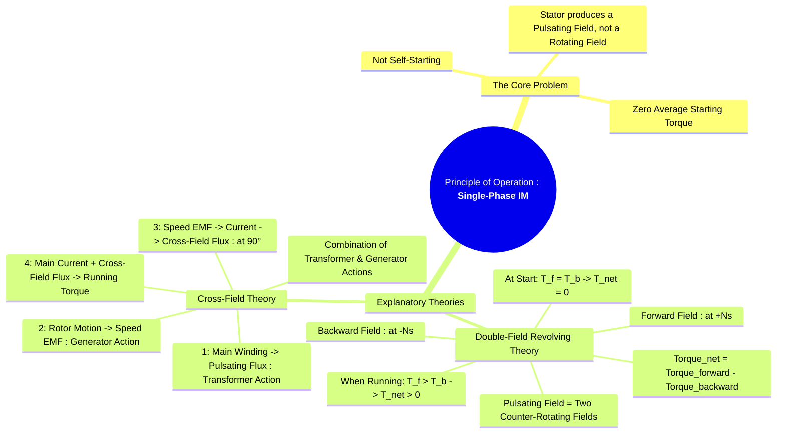

---
tags:
  - electrical-machines/induction-motors
  - single-phase-motor
  - motor-principle
  - double-revolving-field-theory
  - cross-field-theory
created: 2025-07-23
aliases:
  - Single-Phase IM Operation
  - Double Revolving Field Theory in Induction Motors
  - Cross Field Theory in Induction Motors
  - Principle of Operation of Induction Motors
  - Double-Field Revolving Theory
  - Cross-Field Theory
subject: "[[Electrical Machines]]"
parent:
  - Single-Phase Induction Motors
formula:
  - "Forward Slip (Double-Field Revolving Theory) : $$s_f = s = \\frac{N_s - N_r}{N_s}$$"
  - "Backward Slip (Double-Field Revolving Theory) : $$s_b = \\frac{N_s - (-N_r)}{N_s} = \\frac{N_s + N_r}{N_s} = 2 - s$$"
modified: 2026-07-23T20:54:44
---
### Principle of Operation of Single-Phase Induction Motor
#single-phase-motor #motor-principle

> The fundamental difference between a three-phase and a single-phase induction motor is the nature of the magnetic field produced by the stator. While a three-phase winding produces a true [[Rotating Magnetic Field (RMF)|rotating magnetic field (RMF)]], a single-phase winding supplied with single-phase AC produces only a **pulsating magnetic field**. This field alternates along a single spatial axis and does not rotate. This is the reason [[Why Single-Phase Induction Motors are Not Self-Starting]].

Once the motor is started by some external means, it develops a net torque and continues to run. Two primary theories explain this behavior: the **Double-Field Revolving Theory** and the **Cross-Field Theory**.

---
#### 1. Double-Field Revolving Theory
#double-revolving-field-theory

This theory is the most common way to explain the operation of a single-phase induction motor. It postulates that a stationary, pulsating magnetic field can be resolved into two rotating magnetic fields of half the magnitude.
* One field, the **forward field**, rotates at synchronous speed ($+N_s$) in one direction.
* The other field, the **backward field**, rotates at synchronous speed ($-N_s$) in the opposite direction.

##### At Standstill
#slip/standstill 

> **Rotor Speed $N_r=0$, Slip $s=1$**

* The rotor is stationary, so the relative speed between the rotor and both rotating fields is the same ($N_s$).
* Each field induces equal EMFs and currents in the rotor cage.
* This results in two equal and opposite torques: a forward torque ($T_f$) and a backward torque ($T_b$).
* The net torque is zero: $T_{net} = T_f - T_b = 0$. This confirms the motor has no starting torque.

---
##### During Operation
#slip/during-operation 

> **Rotor running at $N_r$**

Let's assume the motor is started in the forward direction. The slip with respect to each field is now different:
###### Forward Slip
#slip/forward #forward-slip 

The slip of the rotor with respect to the forward field.
    $$s_f = s = \frac{N_s - N_r}{N_s}$$
    This is a small value, typically 0.02 to 0.05.

---
###### Backward Slip
#slip/backward #backward-slip 

The slip of the rotor with respect to the backward field.
    $$s_b = \frac{N_s - (-N_r)}{N_s} = \frac{N_s + N_r}{N_s}$$
    Substituting $N_r = N_s(1-s)$, we get:
    $$\boxed{\quad s_b = 2-s \quad}$$
    This is a very large value, close to 2.

Since the torque developed by an induction motor is highly dependent on slip, the two torque components are now unequal:
* The forward torque ($T_f$), corresponding to a small slip $s$, is very large.
* The backward torque ($T_b$), corresponding to a large slip $(2-s)$, is very small and acts as a braking torque.

The net torque is $T_{net} = T_f - T_b$. Since $T_f \gg T_b$, there is a net torque in the forward direction that keeps the motor running and allows it to drive a mechanical load. The [[Equivalent Circuit of a Single-Phase Induction Motor]] is based on this theory.

---
#### 2. Cross-Field Theory
#cross-field-theory

This theory explains the operation by considering the combined effect of transformer and generator actions within the motor.
1. **Transformer Action**: The main stator winding acts like the primary of a transformer. Its pulsating magnetic field along the main axis induces an EMF and currents in the rotor conductors.
2. **Initial Push & Generator Action**: Assume the rotor is given an initial push. As the current-carrying rotor conductors rotate, they cut the main stator flux. This induces a new EMF in the rotor called the **speed EMF** or rotational EMF. This speed EMF is in phase with the main stator flux.
3. **Creation of the Cross-Field**: The speed EMF drives a current in the highly inductive rotor circuit. This rotor current lags the speed EMF by nearly 90°. This current produces its own magnetic field, which is oriented at 90° (in space quadrature) to the main stator field. This new field is called the **cross-field**.
4. **Torque Production**: The presence of the cross-field transforms the stator's field into a resultant field that is effectively rotating. The main torque that keeps the motor running is produced by the interaction between the current in the main stator winding and the cross-field flux established by the rotor.

Both theories successfully explain the motor's behavior, but the Double-Field Revolving Theory is more widely used for quantitative analysis and performance prediction.

---
### Related Concepts
#single-phase-motor/related-concepts

> [[Why Single-Phase Induction Motors are Not Self-Starting]]

[[Types of Single-Phase Induction Motors]]
[[Equivalent Circuit of a Single-Phase Induction Motor]]
[[Rotating Magnetic Field (RMF)]]
[[Torque-Slip Characteristics of Induction Motor]]
