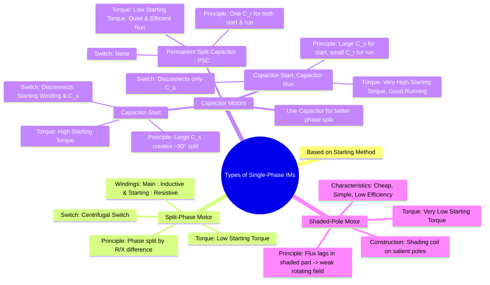

---
tags:
  - electrical-machines/induction-motors
  - single-phase-motor
  - motor-types
  - split-phase-motor
  - capacitor-motor
  - shaded-pole-motor
created: 2025-07-24
aliases:
  - Types of 1-Phase IMs
  - Single-Phase Motor Types
  - Split-Phase Type of Single Phase Induction Motors
  - Capacitor-Start Type of Single Phase Induction Motors
  - Capacitor-Start-Capacitor-Run Type of Single Phase Induction Motors
  - Shaded-Poles Type of Single Phase Induction Motors
subject: "[[Electrical Machines]]"
parent:
  - Single-Phase Induction Motors
modified: 2026-07-23T20:55:00
---
### Types of Single-Phase Induction Motors
#single-phase-motor #motor-types

> Since a [[Why Single-Phase Induction Motors are Not Self-Starting|single-phase induction motor is not self-starting]], its different types are classified based on the auxiliary means used to produce a starting torque. The common goal is to create a second, time-phase-shifted magnetic field to simulate a [[Rotating Magnetic Field (RMF)|rotating magnetic field]], at least during the starting period. This is typically achieved using a second **starting (or auxiliary) winding** placed in space quadrature (90° electrical) to the **main (or running) winding**.

---
#### 1. Split-Phase Induction Motor
#split-phase-motor

This is one of the simplest and most common types.

* **Construction**: It has two stator windings: a main winding and a starting winding.
    * **Main Winding**: Highly inductive (more turns, thicker wire, low resistance). Its current ($I_m$) lags the supply voltage ($V$) significantly.
    * **Starting Winding**: Highly resistive (fewer turns, thinner wire, high resistance). Its current ($I_s$) lags the voltage by a smaller angle.

	![[Split-Phase Induction Motor.png]]

* **Principle**: The difference in the impedance (specifically the X/R ratio) of the two windings causes the currents $I_m$ and $I_s$ to be out of phase with each other by a time angle $\alpha$ (typically 25°-30°). This phase difference is sufficient to produce a weak, elliptical rotating magnetic field, which generates a starting torque.
* **Operation**: A **centrifugal switch** is connected in series with the starting winding. When the motor reaches about 75-80% of its synchronous speed, the switch opens, disconnecting the starting winding. The motor then continues to run on the main winding alone.
* **Characteristics**: Low starting torque, low cost, suitable for easily started loads.
* **Applications**: Small fans, blowers, grinders, washing machines.

---
#### 2. Capacitor Motors
These motors use a capacitor in series with the starting winding to achieve a much better phase split and superior performance.

##### Capacitor-Start Motor
#capacitor-start-motor

* **Construction**: Similar to a split-phase motor, but a capacitor ($C_s$) of suitable value is connected in series with the starting winding.

	![[Capacitor-Start-Induction-Motor.png]]

* **Principle**: The capacitor causes the current in the starting winding ($I_s$) to *lead* the voltage. This creates a large phase angle difference ($\alpha \approx 80^\circ-90^\circ$) between the starting current ($I_s$) and the main winding current ($I_m$). This large phase split produces a more uniform rotating field and a much higher starting torque.
* **Operation**: A centrifugal switch disconnects both the starting winding and the capacitor once the motor reaches about 75% of synchronous speed.
* **Characteristics**: High starting torque (up to 3-4 times the full-load torque), making it suitable for hard-to-start loads.
* **Applications**: Compressors, refrigerators, pumps, conveyors.

---
##### Capacitor-Start, Capacitor-Run Motor
#capacitor-start-capacitor-run-motor

*   **Construction**: This motor has two capacitors: a high-value **starting capacitor ($C_s$)** and a low-value **running capacitor ($C_r$)**. The starting winding is never disconnected.

	![[Capacitor-Start Capacitor-Run Motor Induction Motor.png]]

*   **Principle**:
    *   **At Start**: Both capacitors ($C_s$ and $C_r$, in parallel) are in the circuit, providing a large capacitance for a very high starting torque.
    *   **During Run**: A centrifugal switch disconnects only the starting capacitor ($C_s$) at about 75% speed. The motor continues to run with the running capacitor ($C_r$) and the starting winding still in the circuit. This makes the motor behave like a balanced two-phase motor, improving its efficiency, power factor, and reducing noise.
*   **Characteristics**: Excellent starting torque, high efficiency, high running power factor, quiet operation. It is the best but most expensive single-phase motor.
*   **Applications**: Air conditioners, large compressors, and other high-performance applications.

---
##### Permanent Split Capacitor (PSC) Motor
#permanent-split-capacitor-motor

*   **Construction**: It uses a single running capacitor ($C_r$) which is permanently connected in series with the starting winding.
*   **Operation**: There is no centrifugal switch. Both windings and the capacitor are active for both starting and running. The capacitor value is a compromise between the optimal starting and running requirements.
*   **Characteristics**: Lower starting torque compared to capacitor-start motors, but has good running performance. It is reliable, quiet, and easily reversible.
*   **Applications**: Direct-drive fans and blowers where starting torque is not a major concern (e.g., ceiling fans, air circulators).

---
#### 3. Shaded-Pole Motor
#shaded-pole-motor

* **Construction**: The stator has salient (projecting) poles. A part of each pole face is wrapped with a single, short-circuited copper strap called a **shading coil**.

	![[Shaded-Pole Induction Motor.png]]

* **Principle**: The main winding creates a [[Why Single-Phase Induction Motors are Not Self-Starting|pulsating flux]]. According to Lenz's law, the changing flux induces a current in the shading coil. This induced current creates its own flux that opposes the main flux *in the shaded portion*. This opposition causes the flux in the shaded part of the pole to lag behind the flux in the unshaded part. The result is a weak magnetic field that effectively sweeps across the pole face from the unshaded to the shaded section, producing a very small starting torque.
* **Characteristics**: Extremely simple, cheap, and rugged. However, it has very low starting torque, low efficiency, and a low power factor. The direction of rotation is fixed (from unshaded to shaded part).
* **Applications**: Small, low-torque devices like small fans, toys, hair dryers, and electric clocks.

---
#### Comparison Table
#comparison

| Parameter | Split-Phase Induction Motor | Capacitor-Start Motor | Capacitor-Start Capacitor-Run (CSCR) Motor | Permanent Split Capacitor (PSC) Motor | Shaded-Pole Motor |
|---------|-----------------------------|-----------------------|-------------------------------------------|--------------------------------------|------------------|
| Starting Torque | Moderate (150–200% FLT) | High (250–300% FLT) | Very High (300–350% FLT) | Low to Moderate | Very Low |
| Starting Current | High (6–8 × In) | Moderate (4–5 × In) | Moderate | Low | Very Low |
| Starting Method | Auxiliary winding (resistive) | Auxiliary winding + start capacitor | Start capacitor + run capacitor | Run capacitor only | Shading coil |
| Capacitor Used | ❌ None | ✅ Start capacitor (short-time) | ✅ Start + Run capacitors | ✅ Run capacitor (continuous) | ❌ None |
| Centrifugal Switch | ✅ Yes | ✅ Yes | ✅ Yes | ❌ No | ❌ No |
| Power Factor (PF) | Poor to Fair (≈ 0.6–0.7) | Fair (≈ 0.7–0.75) | **Good (≈ 0.8–0.9)** | **Good (≈ 0.8–0.9)** | Very Poor (≈ 0.4–0.5) |
| Efficiency | Moderate | Good | **High** | Good | Very Low |
| Torque Pulsations | Moderate | Low | Very Low | Low | High |
| Speed Regulation | Fair | Good | **Very Good** | Good | Poor |
| Cost | Low | Moderate | High | Moderate | Very Low |
| Noise & Vibration | Moderate | Low | Very Low | Low | High |
| Direction Reversal | Possible | Possible | Possible | Possible | Difficult |
| Typical Power Rating | Up to 0.5 HP | Up to 3 HP | Up to 5 HP | Up to 1 HP | < 0.1 HP |
| Typical Applications | Fans, blowers | Compressors, pumps | Refrigeration, air-conditioners | Fans, HVAC blowers | Toys, clocks, small fans |
| Exam Preference | Medium | High | **Very High** | High | Low |

---
### Related Concepts
#single-phase-motor/related-concepts

> [[Why Single-Phase Induction Motors are Not Self-Starting]]

[[Principle of Operation of Single-Phase Induction Motor]]
[[Equivalent Circuit of a Single-Phase Induction Motor]]
[[Torque-Slip Characteristics of Induction Motor]]
