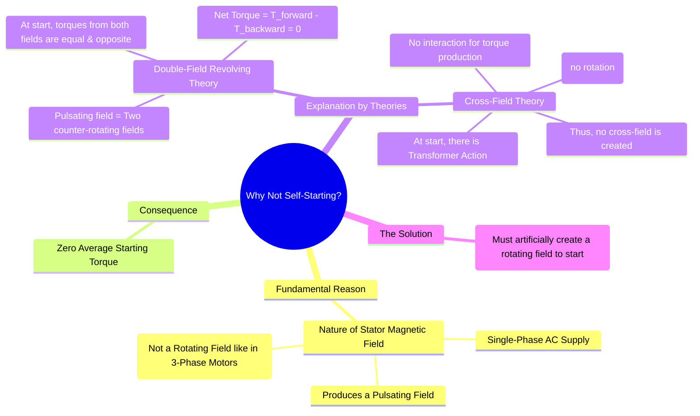

---
tags:
  - electrical-machines/induction-motors
  - single-phase-motor
  - motor-starting
  - self-starting
  - pulsating-field
created: 2025-07-24
aliases:
  - Why Single-phase IM is not self-starting?
  - Single phase motor starting problem
subject: "[[Electrical Machines]]"
parent:
  - Single-Phase Induction Motors
modified: 2026-07-23T20:55:32
---
### Why Single-Phase Induction Motors are Not Self-Starting?
#self-starting #single-phase-motor #pulsating-field

> A single-phase induction motor, when supplied with a single-phase AC source, is fundamentally not self-starting. This is the primary characteristic that distinguishes it from a three-phase induction motor and necessitates the various starting mechanisms that define its different types. The core reason lies in the nature of the magnetic field produced by its stator winding.

---
#### 🔥The Pulsating Magnetic Field
#magnetic-field/pulsating 

A three-phase winding, when fed with a balanced three-phase supply, produces a [[Rotating Magnetic Field (RMF)|rotating magnetic field (RMF)]] of constant magnitude. This RMF is what makes a three-phase motor self-starting.

In contrast, a single-phase winding fed with single-phase AC produces a **pulsating magnetic field**. This field is stationary in space; its axis is fixed, and its magnitude varies sinusoidally with time. Such a field can induce currents in a stationary rotor, but it cannot produce a net unidirectional torque required to start the rotation.

---

#### Explanation using
##### [[Principle of Operation of Single-Phase Induction Motor|Double-Field Revolving Theory]]
#double-field-revolving-theory 

This is the most common way to explain the lack of starting torque.
1. The theory states that a pulsating magnetic field can be mathematically resolved into two rotating magnetic fields.
2. These two fields are of equal magnitude (each half the peak magnitude of the pulsating field).
3. They rotate in **opposite directions** at the same synchronous speed ($N_s$).

###### At Standstill (Start)

* The stationary rotor is subjected to both the forward-rotating field and the backward-rotating field.
* Each field induces currents in the rotor and attempts to produce a torque.
* The forward field produces a forward torque ($T_f$).
* The backward field produces a backward torque ($T_b$).
* Since the relative speed between the rotor and both fields is the same (equal to $N_s$), the induced currents and the resulting torques are equal in magnitude but opposite in direction.

The net starting torque ($T_{st}$) on the rotor is the sum of these two torques:
$$T_{st} = T_f - T_b = 0$$
$$\boxed{\quad \text{Since the net starting torque is zero, the motor will not start to rotate.} \quad}$$
It will only hum and may overheat if left connected to the supply. If an initial push is given in either direction, the motor will continue to run in that direction because the torque in that direction will become greater than the opposing torque.

---
##### [[Principle of Operation of Single-Phase Induction Motor|Cross-Field Theory]]
#cross-field-theory 

This theory provides an alternative perspective.
1. Torque is produced by the interaction of a magnetic field and a current that are in space quadrature (90° apart).
2. At standstill, the main stator winding produces a pulsating flux along its axis (the "direct-axis").
3. This flux induces currents in the rotor windings by transformer action.
4. However, since the rotor is not moving, there is no "speed EMF" or generator action.
5. Without this rotational EMF, there is no current component to create a magnetic field in the quadrature axis (the "cross-field").
6. With only a direct-axis field and no cross-field, there is no interaction to produce a starting torque.

> [!warning] Conclusion
> Both theories conclude that a single winding is insufficient to produce a starting torque. To make the motor self-starting, a second, phase-shifted magnetic field must be created to simulate a rotating magnetic field, at least during the starting period. This is the principle behind the different [[Types of Single-Phase Induction Motors]].

---
### Related Concepts
#self-starting/related-concepts

> [[Principle of Operation of Single-Phase Induction Motor]]

[[Types of Single-Phase Induction Motors (Split-phase, Capacitor-start, etc.)]]
[[Concept of Rotating Magnetic Field (RMF)]]
[[Torque-Slip Characteristics of Induction Motor]]
