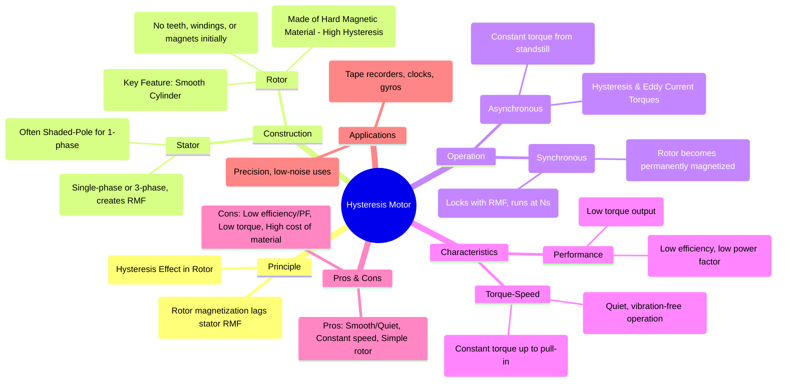

---
tags:
  - electrical-machines/special-machines
  - hysteresis-motor
  - synchronous-motor
  - constant-torque-motor
created: 2025-07-28
aliases:
  - Hysteresis Motor
subject: "[[Electrical Machines]]"
parent:
  - Single-Phase Induction Motors and Special Machines
modified: 2026-07-23T20:57:50
---
### Hysteresis Motor
#hysteresis-motor #synchronous-motor #special-machines

> A hysteresis motor is a small, single-phase synchronous motor that utilizes the **hysteresis effect** in a hard magnetic material to produce torque. Its most notable characteristics are its extremely smooth, quiet, and vibration-free operation, and its ability to produce a nearly constant torque from standstill all the way up to its synchronous speed.

---
#### Principle of Operation
#hysteresis-principle

The motor's operation relies on the phenomenon of magnetic hysteresis.
1.  **Stator Field**: The stator winding (typically a split-phase or shaded-pole type for single-phase) produces a [[Concept of Rotating Magnetic Field (RMF)|Rotating Magnetic Field (RMF)]].
2.  **Rotor Action (Hysteresis Lag)**: The RMF magnetizes the hard steel rotor. Due to hysteresis, the axis of magnetization induced in the rotor **lags behind** the axis of the stator's RMF by a hysteresis lag angle, $\alpha$.
3.  **Torque Production**: This lag angle between the stator's magnetic field poles ($N_S, S_S$) and the rotor's induced magnetic poles ($N_R, S_R$) creates a magnetic attraction. This attraction produces a torque on the rotor, causing it to follow the RMF.
    The hysteresis torque ($T_h$) is independent of the rotor speed and is given by:
    $$\boxed{\quad T_h \propto B_{max}^{1.6} \cdot f \cdot V \quad}$$
    Where $B_{max}$ is the peak flux density, $f$ is the supply frequency, and $V$ is the volume of the rotor material.

---
#### Construction
#hysteresis-motor/construction

*   **Stator**: The stator can be of any type that produces an RMF. For single-phase motors, a permanent-split capacitor (PSC) or shaded-pole design is common.
*   **Rotor**: The rotor is the key feature. It is a **smooth, solid cylinder** made of a hard magnetic material (like chrome steel or cobalt steel) that has a large B-H loop area (i.e., high hysteresis loss). It has no teeth, windings, or salient poles.

---
#### Starting and Running Conditions
A hysteresis motor has two distinct modes of operation.

##### 1. Starting (Asynchronous Operation)
*   When the stator is energized, the RMF sweeps across the rotor. Both **hysteresis torque** and **eddy current torque** are produced.
*   The hysteresis torque is constant at all speeds, from standstill up to synchronous speed.
*   The eddy current torque, similar to an induction motor, is proportional to the slip and becomes zero at synchronous speed.
*   The total starting torque is the sum of these two, which allows the motor to accelerate.

##### 2. Running (Synchronous Operation)
*   As the rotor speed approaches the synchronous speed ($N_s$), the slip becomes very small, and the rate at which the RMF cuts the rotor decreases.
*   When the rotor reaches synchronous speed, the slip is zero. The RMF and the rotor are now stationary with respect to each other.
*   The high retentivity of the rotor material causes it to become **permanently magnetized** with a fixed number of poles, corresponding to the stator poles.
*   These newly formed permanent rotor poles lock with the opposite poles of the RMF, and the motor continues to run at synchronous speed as a permanent magnet synchronous motor. The eddy current torque vanishes completely.

---
#### Characteristics
#hysteresis-motor/characteristics

*   **Torque-Speed Curve**: The motor exhibits a nearly constant torque from standstill until it pulls into synchronism.
*   **Quiet Operation**: Since the rotor is a smooth, perfectly balanced cylinder with no teeth or windings, the motor is extremely quiet and free from mechanical and magnetic vibrations.
*   **Constant Speed**: It runs at a precise synchronous speed, determined only by the supply frequency and number of poles ($N_s = 120f/P$).
*   **Performance**: Hysteresis motors generally have low efficiency, a low power factor, and a low torque output. They are only suitable for very low-power applications.

---
### Advantages and Disadvantages

**Advantages**:
*   Extremely quiet and smooth operation.
*   Constant, non-fluctuating speed.
*   Constant torque from standstill to synchronous speed.
*   Simple and rugged rotor construction.

**Disadvantages**:
*   Very low efficiency (typically 1-30%).
*   Low power factor.
*   Low torque and power output.
*   High cost of rotor material.

---
### Applications
#hysteresis-motor/applications
The unique characteristics of the hysteresis motor make it ideal for high-fidelity, precision applications where quiet and smooth operation is critical:
*   **Audio and Video Equipment**: High-quality tape recorders, turntables.
*   **Timing Devices**: Electric clocks, timers.
*   **Instrumentation**: Gyroscopes, and other sensitive scientific and medical instruments.

---
### Related Concepts
#hysteresis-motor/related-concepts

> [[Magnetic Hysteresis]]

[[Permanent Magnet Synchronous Motor (PMSM)]]
[[Types of Single-Phase Induction Motors]]
[[Concept of Rotating Magnetic Field (RMF)]]
