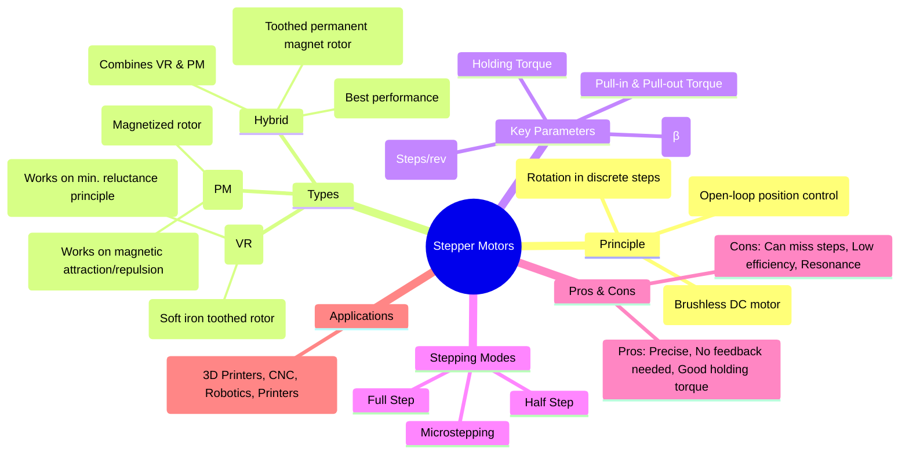

---
tags:
  - electrical-machines/special-machines
  - stepper-motor
  - position-control
  - robotics
  - mechatronics
created: 2025-07-27
aliases:
  - Stepper Motor
  - Step Motor
  - Variable Reluctance Types of Stepper Motors
  - Permanent Magnet Types of Stepper Motors
  - Hybrid Types of Stepper Motors
subject: "[[Electrical Machines]]"
parent:
  - Single-Phase Induction Motors and Special Machines
modified: 2026-07-23T20:57:09
---
### Stepper Motors
#stepper-motor #position-control #digital-control

> A stepper motor is a brushless DC electric motor that divides a full rotation into a number of equal, discrete steps. This allows the motor's position to be controlled precisely without any feedback mechanism (open-loop control), as long as the motor is sized correctly for the application. It is a fundamental component in digital control systems, robotics, and automation.

---
#### Principle of Operation
#stepper-principle

The operation of a stepper motor is based on energizing a set of stator windings in a specific sequence.
1.  The stator is composed of multiple windings arranged in "phases".
2.  When a particular phase is energized with DC current, it creates an electromagnetic field.
3.  The rotor, which is designed to interact with this field, moves and aligns itself with the energized stator poles.
4.  By sequentially switching the current to different phases, the stator's magnetic field is made to "step" or rotate. The rotor follows these steps, resulting in discrete angular movements.

The sequence and timing of the pulses sent to the stator windings determine the direction and speed of rotation.

![[Stepper Motor.png]]
![[Stepper Motor - Permanent Magnet Hybrid Type.png]]

---
### Types of Stepper Motors

Stepper motors are primarily classified by their rotor construction.

##### 1. Variable Reluctance (VR) Stepper Motor
#variable-reluctance-stepper

*   **Construction**: The rotor is made of soft iron and has multiple teeth. It is not magnetized. The number of rotor teeth ($N_r$) is different from the number of stator poles ($N_s$).
*   **Principle**: When a stator winding is energized, it creates a magnetic field. The rotor moves to the position where the magnetic reluctance of the path between the stator and rotor teeth is minimized. This occurs when a set of rotor teeth aligns perfectly with the energized stator poles.
*   **Characteristics**: Can operate at high speeds, but generally has lower torque and larger step angles (lower resolution) compared to other types.

##### 2. Permanent Magnet (PM) Stepper Motor
#permanent-magnet-stepper

*   **Construction**: The rotor is a cylindrical permanent magnet, with alternating North and South poles arranged along its circumference.
*   **Principle**: The motor operates on the principle of magnetic attraction and repulsion between the permanent magnet rotor poles and the electromagnetic stator poles. The rotor locks into position when its poles align with the oppositely charged stator poles.
*   **Characteristics**: Provides higher torque than VR motors, but typically has lower speed and resolution.

##### 3. Hybrid Stepper Motor
#hybrid-stepper

*   **Construction**: This is the most common type and combines the best features of VR and PM motors. The rotor has a cylindrical permanent magnet core, but it is enclosed by two soft iron "cups" or "caps" with fine teeth. The teeth on one cup are offset by half a tooth pitch from the teeth on the other. One cup is magnetized as a North pole, the other as a South pole.
*   **Principle**: It uses both the variable reluctance and permanent magnet principles. The permanent magnet provides a strong detent and holding torque, while the fine teeth provide high resolution (small step angles).
*   **Characteristics**: Offers the best all-around performance with high resolution, high torque, and good speed capabilities.

---
### Key Parameters and Terminology
#step-angle #stepper-torque

*   **Step Angle ($\beta$)**: The angle through which the rotor moves for each control pulse (step). It is the most important specification.
    $$\boxed{\quad \beta = \frac{|N_s - N_r|}{N_s \cdot N_r} \times 360^\circ \quad}$$
    Where $N_s$ = number of stator poles/teeth, $N_r$ = number of rotor poles/teeth.
    A more common formula is:
    $$\boxed{\quad \beta = \frac{360^\circ}{\text{No. of Phases} \times \text{No. of Rotor Teeth}} \quad}$$
*   **Resolution**: The number of steps required for one complete revolution of the rotor shaft.
    $$\text{Steps per Revolution (SPR)} = \frac{360^\circ}{\beta}$$
*   **Holding Torque**: The maximum static torque that can be applied to an energized stationary motor without causing it to rotate.
*   **Pull-in Torque**: The maximum torque at which the motor can start, synchronize, and run without losing steps.
*   **Pull-out Torque**: The maximum torque that can be applied to a motor running at a given speed without causing it to lose synchronism.

---
#### Stepping Modes
1.  **Full Step**: One or two phases are energized at a time. Provides maximum torque but has lower resolution.
2.  **Half Step**: Alternates between energizing one and two phases. This doubles the resolution (halves the step angle) and provides smoother operation, but with slightly reduced torque.
3.  **Microstepping**: The currents in the windings are varied in a sine/cosine relationship. This allows the rotor to be positioned between full steps, resulting in very high resolution and extremely smooth motion.

---
### Advantages and Disadvantages

**Advantages**:
*   Precise, repeatable positioning.
*   Excellent for open-loop control; no complex feedback systems needed.
*   Good holding torque at standstill.
*   Mechanically simple and reliable.

**Disadvantages**:
*   **Can miss steps** if the load torque is too high, leading to a loss of position accuracy.
*   Low efficiency; consumes power even when stationary to maintain holding torque.
*   Torque decreases as speed increases.
*   Can exhibit resonance at certain speeds, leading to vibration and noise.

---
### Applications
#stepper-motor/applications
Stepper motors are used wherever precise positioning is required:
*   **3D Printers and CNC Machines**
*   **Robotics and Automation**
*   **Computer Peripherals**: Printers, scanners, disk drives.
*   **Medical Equipment**: Analyzers, samplers.
*   **Textile Machines**

---
### Related Concepts
#stepper-motor/related-concepts

> [[Brushless DC (BLDC) Motors]]

[[Reluctance Motor]]
[[Control System]] (Open-loop vs. Closed-loop)
[[Digital Electronics]] (For generating the pulse sequences)
