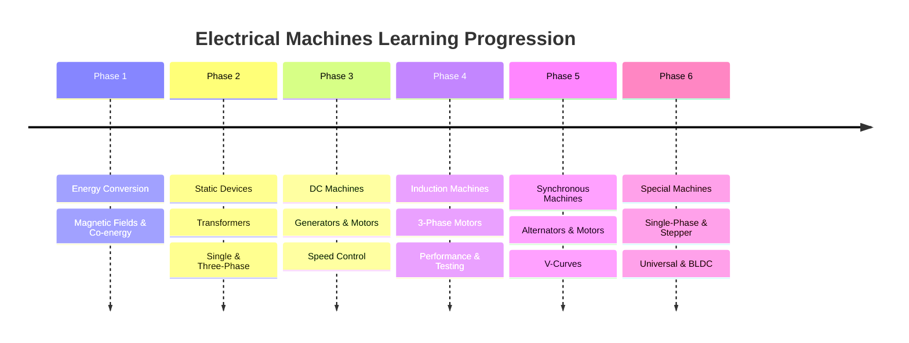

---
tags:
  - syllabus
  - electrical-machines
  - gate
  - moc
created: 2026-07-23T22:34:46
syllabus: electrical machines
modified: 2026-07-23T22:34:46
---
### Electrical Machines

> [!info]
> This Map of Content (MOC) follows the recommended learning progression for GATE Electrical Engineering - Electrical Machines.
> 
> Learn each section sequentially. Every topic links to its detailed note.

---

### 1. Fundamentals of Electromechanical Energy Conversion

> Principles of energy transfer between electrical and mechanical systems.

- [[Concept of Co-energy]]
- [[Energy Balance in Electromechanical Systems]]
- [[Force and Torque in Magnetic Field Systems]]
- [[Generated EMF and Torque Equations]]
- [[Singly and Doubly Excited Systems]]

---

### 2. [[Transformers]]

> Static electrical devices transferring power between circuits via electromagnetic induction.

#### 1. Single-phase Transformers
- [[All-Day Efficiency]]
- [[Constructional Features of Transformers]]
- [[Equivalent Circuit of a Transformer]]
- [[Ideal and Practical Transformers]]
- [[Losses and Efficiency in a Transformer]]
- [[Modeling of Transformers]]
- [[Phasor Diagram of a Transformer]]
- [[Principle of Operation of a Transformer]]
- [[Transformer Tests]]
- [[Voltage Regulation of a Transformer]]

#### 2. Three-phase Transformers
- [[Harmonics in Transformers]]
- [[Parallel Operation of Transformers]]
- [[Three-phase Transformer Connections]]
- [[Three-Winding Transformers]]
- [[Vector Groups of Three-phase Transformers]]

#### 3. Autotransformers
- [[Autotransformers]]
- [[Conversion to Autotransformer]]
- [[Copper Saving in Autotransformers]]
- [[Three-phase Autotransformer Connections]]

---

### 3. [[DC Machines]]

> Direct current generators and motors, their characteristics and applications.

#### 1. Fundamentals
- [[Armature Reaction]]
- [[Armature Winding (Lap and Wave)]]
- [[Commutation and Methods of Improvement]]
- [[Compensating Windings]]
- [[Constructional Features of DC Machines]]
- [[EMF and Torque Equations of a DC Machine]]
- [[Principle of Operation of DC Generators]]
- [[Principle of Operation of DC Motors]]

#### 2. DC Generators
- [[Applications of DC Generators]]
- [[Characteristics of DC Generators]]
- [[Types of DC Generators]]
- [[Voltage Build-up in a Shunt Generator]]

#### 3. DC Motors
- [[Characteristics of DC Motors]]
- [[DC Motors]]
- [[DC Series Motor]]
- [[DC Shunt Motor]]
- [[Dynamic Braking]]
- [[Losses, Efficiency, and Testing of DC Machines]]
- [[Regenerative Braking]]
- [[Speed Control of DC Motors]]
- [[Starting of DC Motors]]
- [[Types of DC Motors]]

---

### 4. Three-Phase Induction Motors

> The most widely used AC motors in industrial applications.

#### 1. Fundamentals
- [[Concept of Slip]]
- [[Construction of Three-Phase Induction Motors]]
- [[Frequency of Rotor Current and EMF]]
- [[Rotating Magnetic Field (RMF)]]

#### 2. Performance & Analysis
- [[Derivation of Exact Condition for Maximum Torque]]
- [[Effect of Rotor Resistance on Torque-Slip Curve]]
- [[Equivalent Circuit of a Three-Phase Induction Motor]]
- [[Induction Generator Operation]]
- [[Modes of Operation of Induction Machines]]
- [[Power Flow Diagram and Torque Development]]
- [[Starting Torque, Maximum Torque and Full Load Torque]]
- [[Torque-Slip Characteristics of Induction Motor]]

#### 3. Starting & Speed Control
- [[Cogging and Crawling Phenomena]]
- [[Induction Motor Drives]]
- [[Speed Control of Induction Motors]]
- [[Starting Methods for Induction Motors]]

#### 4. Testing
- [[Circle Diagram of an Induction Motor]]
- [[Losses and Efficiency of Induction Motors]]
- [[No-Load and Blocked Rotor Tests]]

---

### 5. Synchronous Machine

> Constant-speed AC machines operating as generators or motors.

#### 1. Fundamentals
- [[Armature Reaction and Synchronous Reactance]]
- [[Armature Winding Factors in Synchronous Machines]]
- [[Constructional Features of Synchronous Machines]]
- [[EMF Equation of an Alternator]]
- [[Internal EMF]]
- [[Principle of Operation as a Generator (Alternator)]]
- [[Sub-transient Reactance]]
- [[Transient Reactance]]

#### 2. Alternator
- [[Equivalent Circuit and Phasor Diagram of an Alternator]]
- [[Machine Excitation Convention]]
- [[Open and Short Circuit Characteristics of an Alternator]]
- [[Parallel Operation of Alternators and Synchronization]]
- [[Power-Angle Characteristics for Synchronous Machines]]
- [[Salient Pole Machines - Two Reaction Theory]]
- [[Voltage Regulation Methods]]
- [[Voltage Regulation of an Alternator]]

#### 3. Synchronous Motors
- [[Effect of Excitation on Armature Current]]
- [[Hunting in Synchronous Machines]]
- [[Methods of Starting Synchronous Motors]]
- [[Principle of Operation of Synchronous Motors]]
- [[Synchronous Condenser]]
- [[Synchronous Motors]]
- [[V-Curves]]

---

### 6. Single-Phase Motors & Special Machines

> Specialized motors for specific and low-power applications.

#### 1. Single-Phase Induction Motors
- [[Equivalent Circuit of a Single-Phase Induction Motor]]
- [[Principle of Operation of Single-Phase Induction Motor]]
- [[Types of Single-Phase Induction Motors]]
- [[Why Single-Phase Induction Motors are Not Self-Starting]]

#### 2. Special Machines
- [[Brushless DC (BLDC) Motors]]
- [[Hysteresis Motor]]
- [[Reluctance Motor]]
- [[Stepper Motors]]
- [[Universal Motor]]

---

### 7. Archive

#### 1. Deprecated
- [[AC Machines]]
- [[Speed Regulation]]
- [[Transformers]]
- [[Voltage Regulation]]

#### 2. Extra Topics
- [[Clarke Transformation]]
- [[Mitigation Techniques in Machines]]
- [[Modeling of Electrical Machines]]
- [[Park Transformation]]
- [[Reference Frame Theory]]
- [[Vector Control of Drives]]

#### 3. Subject Overview

- Fundamentals of Electromechanical Energy Conversion
- [[Transformers]]
- DC Machines
- [[Induction Machines]]
- [[Synchronous Machines]]
- Single-Phase Motors & Special Machines
