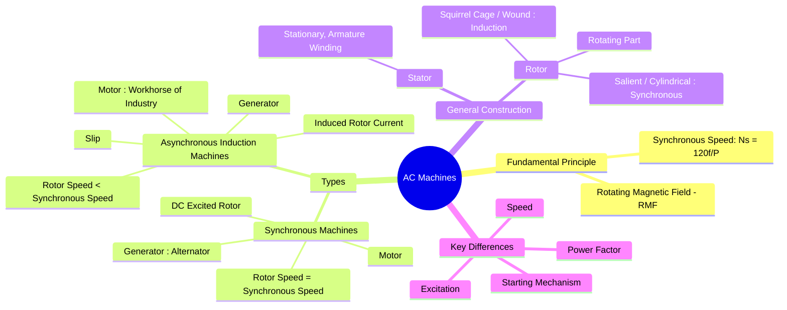

---
tags:
  - electrical-machines
  - ac-machines
  - induction-motor
  - synchronous-machine
created: 2025-09-08
aliases:
  - AC Machine
  - Alternating Current Machines
subject: "[[Electrical Machines]]"
parent: "[[Electrical Machines]]"
modified: 2026-07-23T20:59:08
---
### AC Machines
#ac-machine #electrical-engineering

> **AC Machines** are a class of electrical machines that operate using an alternating current (AC) supply. They are designed to convert energy, either from mechanical to AC electrical (generators) or from AC electrical to mechanical (motors). The operation of nearly all AC machines is based on the principle of the **[[Rotating Magnetic Field (RMF)]]**.

---

#### Fundamental Principle: Rotating Magnetic Field (RMF) (RMF)
#rmf #synchronous-speed

The core principle behind AC machines is the creation of a magnetic field that rotates in space. This RMF is produced when a polyphase (typically three-phase) AC supply is connected to a set of windings that are spatially distributed around a stationary structure (the stator).
The speed of this field is called the **synchronous speed ($N_s$)** and is determined by the supply frequency ($f$) and the number of poles ($P$) for which the machine is wound.
$$\boxed{\quad N_s = \frac{120 f}{P} \quad (\text{in RPM})\quad}$$

---
#### Main Types of AC Machines

##### 1. [[Synchronous Machines]]
#synchronous-machine

In a synchronous machine, the rotor rotates at the **same speed** as the RMF ($N_{rotor} = N_s$).
* **Rotor Excitation**: Requires a separate DC power source to energize the field windings on the rotor, creating a strong electromagnet.
* **Modes of Operation**:
    * **[[Principle of Operation as a Generator (Alternator)|Synchronous Generator (Alternator)]]**: The primary source of electricity in power plants. Converts mechanical power into AC electrical power.
    * **[[Synchronous Motors|Synchronous Motor]]**: Runs at a constant speed irrespective of the load. Used for high-precision, constant-speed applications and for power factor correction.

##### 2. [[Induction Machines|Asynchronous (Induction) Machines]]
#induction-machine #asynchronous-machine

In an asynchronous machine, the rotor rotates at a speed **less than** the synchronous speed ($N_{rotor} < N_s$). The difference in speed is essential for its operation.
* **Rotor Excitation**: The currents in the rotor are *induced* by the RMF from the stator (similar to a transformer). Most common types (squirrel cage) do not require any external electrical connection to the rotor.
* **[[Concept of Slip|Slip]] ($s$)**: The fractional difference between synchronous speed and rotor speed.
    $$\boxed{\quad s = \frac{N_s - N_r}{N_s} \quad}$$
* **[[Modes of Operation of Induction Machines#Modes of Operation of Induction Machines|Modes of Operation]]**:
    * **[[Modes of Operation of Induction Machines#1. Motoring Mode|Induction Motor]]**: The most widely used motor in industrial and domestic applications due to its ruggedness, low cost, and simple construction. It is the "workhorse of the industry".
    * **[[Modes of Operation of Induction Machines#2. Generating Mode (Induction Generator)|Induction Generator]]**: Used in specific applications like wind turbines.

---
#### General Construction
#ac-machines/general-construction

* **Stator**: The stationary outer part made of a laminated steel core with slots to hold the **armature winding**. This winding is connected to the AC supply/load.
* **Rotor**: The rotating inner part. Its construction distinguishes the machine type:
    * **[[Construction of Three-Phase Induction Motors#Rotor Construction|Induction Motor Rotors]]**:
        * **[[Construction of Three-Phase Induction Motors#1. Squirrel Cage Rotor|Squirrel Cage]]**: Consists of conducting bars short-circuited by end rings. Simple and rugged.
        * **[[Construction of Three-Phase Induction Motors#2. Slip Ring (or Wound) Rotor|Wound Rotor (Slip Ring)]]**: Has a 3-phase winding similar to the stator, with terminals brought out via slip rings. Allows for external resistance to be added for starting speed/torque control.
    * **[[Constructional Features of Synchronous Machines#Rotor Construction|Synchronous Machine Rotors]]**:
        * **[[Constructional Features of Synchronous Machines#1. Salient Pole Rotor|Salient Pole]]**: Protruding poles for low-speed applications (e.g., hydro generators).
        * **[[Constructional Features of Synchronous Machines#2. Cylindrical (Non-Salient) Rotor|Cylindrical]]**: Smooth rotor for high-speed applications (e.g., turbo generators).

---
#### Comparison: Synchronous vs. Induction Machines
#comparison 

| Feature | Synchronous Machine | Induction Machine |
| :--- | :--- | :--- |
| **Speed** | Constant (Synchronous speed) | Varies with load (always < $N_s$) |
| **Rotor Excitation** | Requires a DC source (externally excited) | No external source needed (current is induced) |
| **Starting** | Not self-starting | Self-starting |
| **Power Factor** | Can be controlled (lagging, unity, leading) | Operates only at lagging power factor |
| **Construction** | More complex | Simpler and more rugged (especially squirrel cage) |
| **Applications** | Power generation, constant speed drives, PF correction | Pumps, fans, compressors, conveyors (most industrial drives) |

---
### Related Concepts
#related-concepts

> [[Rotating Magnetic Field (RMF)]] (The fundamental working principle)

[[Synchronous Machines]] (Detailed note)
[[Induction Machines]] (Detailed note)
[[Concept of Slip]] (Key concept for Induction Machines)
