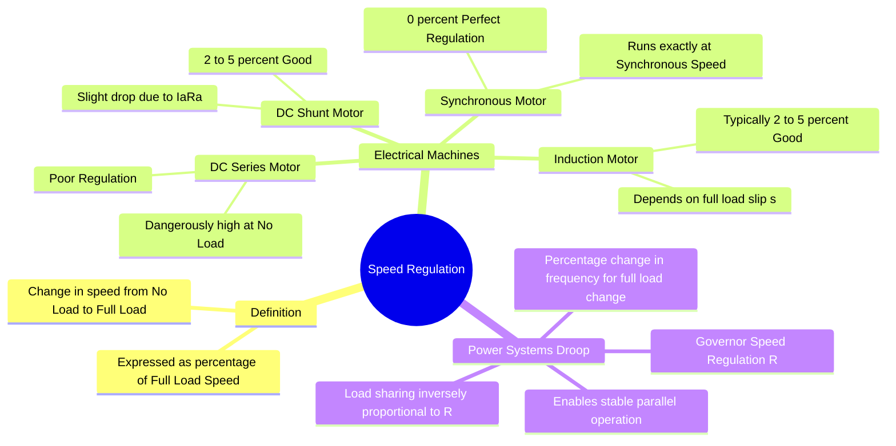

---
tags:
  - electrical-machines
  - power-system
  - gate
  - performance-parameter
created: 2026-07-23T21:09:46
aliases:
  - Droop Characteristic
  - Speed Droop
  - Motor Speed Regulation
  - Voltage Regulation equivalent for Speed
subject: "[[Electrical Machines]]"
parent: Electrical Machines General Concepts
modified: 2026-07-23T21:09:46
---
### Speed Regulation
#electrical-machines/performance #power-system/control

> ==**Speed Regulation** is a performance metric that quantifies how much the speed of a motor (or prime mover) drops when a mechanical load is applied.==
> 1. In **[[Electrical Machines]]**, it evaluates motor stiffness against load variations.
> 2. In **[[Power System|Power Systems]]**, it refers to the **[[Speed Regulation (Droop)|Governor Droop Characteristic]]**, which dictates how frequency changes with active power demand and governs load sharing among parallel generators.

---
#### Mathematical Definition (Motors)
#electrical-machines/speed-regulation

==For an electrical motor, Speed Regulation is defined as the change in speed from No-Load ($N_{NL}$) to Full-Load ($N_{FL}$), expressed as a percentage of the Full-Load speed.==

$$\boxed{\quad \% \text{ Speed Regulation} = \frac{N_{NL} - N_{FL}}{N_{FL}} \times 100\% \quad}$$

*   **Ideal Case:** An ideal motor would maintain constant speed regardless of load, yielding a **$0\%$ speed regulation**.
*   **Significance:** A smaller percentage indicates a "stiffer" or more stable speed characteristic.

> [!pyq]- PYQ : 2020
> ![[ee_2020#^q17]]

> [!related]- Voltage Regulation
> ![[Voltage Regulation#General Definition]]

---
#### Speed Regulation in Various Motors
#electrical-machines/comparison

##### A. Synchronous Motors
*   Operate strictly at synchronous speed ($N_s = 120f/P$) regardless of the load (up to the pull-out torque).
*   **Regulation:** **Exactly 0%**.

##### B. DC Shunt Motors
*   Flux is nearly constant. Speed drops slightly due to the armature resistance voltage drop ($I_a R_a$).
*   **Regulation:** Good (Typically **2% to 5%**).

##### C. DC Series Motors
*   Flux is proportional to armature current. At no-load, current is nearly zero, flux approaches zero, and speed approaches infinity ($N \propto 1/\phi$).
*   **Regulation:** Extremely **Poor** (Cannot be safely operated at absolute zero load).

##### D. Three-Phase Induction Motors
*   Speed drops from $N_s$ to $N_r$ as load increases, determined by the full-load slip ($s$).
*   Since full-load slip is typically small (2% - 5%), the speed regulation is **Good**.

##### E. DC Differential Compound Motors
*   Series flux opposes shunt flux. As load increases, net flux decreases, which can cause the speed to actually *increase* with load.
*   **Regulation:** Can be **Negative**, leading to severe instability.

---
#### 3. Speed Regulation in Power Systems (Governor Droop)
#power-system/droop #lfc

> [!refer]
> [[Speed Regulation (Droop)]]

In Power Systems, prime movers (turbines) driving synchronous generators are equipped with governors that intentionally reduce the speed (frequency) as the active power load increases. This is called **Speed Droop** or **Governor Regulation ($R$)**.

> [!faq] Why intentional droop?
> If all generators operated with $0\%$ regulation (isochronous), they would fight each other to control the system frequency, leading to instability in parallel operation. Droop allows them to share load peacefully.

**Definition of Droop ($R$):**
The droop parameter $R$ is defined as the ratio of frequency deviation to change in power output.
$$\boxed{\quad R = -\frac{\Delta f}{\Delta P} \quad \text{Hz/MW} \quad}$$
*(The negative sign indicates frequency drops as power increases).*

**Per-Unit (Percentage) Droop:**
Expressed as the percentage change in frequency from no-load to full-load, relative to the nominal frequency, when the unit is loaded to its rated power.
$$\boxed{\quad \% R = \frac{(f_{NL} - f_{FL}) / f_{rated}}{P_{rated} / P_{base}} \times 100\% \quad}$$

---
#### 4. Load Sharing among Parallel Generators
#power-system/load-sharing #gate/formulas

When two or more generators operate in parallel on the same grid, they must operate at the exact same system frequency ($f_{sys}$). 
For a change in system load ($\Delta P_L$), the change in frequency ($\Delta f$) is common to all generators. The change in power picked up by the $i$-th generator is:
$$\Delta P_i = -\frac{\Delta f}{R_i}$$

For two generators in parallel, the total load change $\Delta P_L = \Delta P_1 + \Delta P_2$:
$$\Delta P_L = -\Delta f \left( \frac{1}{R_1} + \frac{1}{R_2} \right)$$
$$\boxed{\quad \frac{\Delta P_1}{\Delta P_2} = \frac{R_2}{R_1} \quad}$$

> [!examtip] GATE Core Concept
> Parallel generators share load changes **inversely proportional to their droop constants ($R$)**. A generator with a smaller droop (flatter characteristic) will pick up a larger share of the load change. If $R$ values are given in per-unit (pu) on their respective machine bases, load sharing is proportional to their MVA ratings if the pu droops are equal.

---
### Related Concepts
#topic/related-concepts

> [[Speed Control of DC Motors]]
> [[Speed Control of Induction Motors]]

[[Load Frequency Control (LFC)]]
[[Governor Control System]]
[[Characteristics of DC Motors]]
[[Torque-Slip Characteristics of Induction Motor]]
[[Synchronous Machines]]
[[Parallel Operation of Alternators and Synchronization]]
[[Single Area Load Frequency Control (Uncontrolled and Controlled Case)]]
