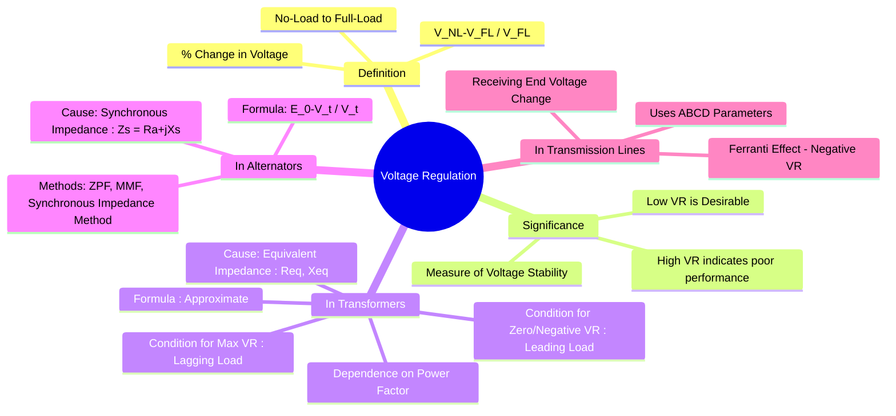

---
tags:
  - electrical-machines
  - power-systems
  - performance-metric
  - voltage-stability
created: 2025-09-06
aliases:
  - VR
  - Voltage Drop
subject: "[[Electrical Machines]]"
parent: Performance Metrics
modified: 2026-07-23T21:14:07
---
### Voltage Regulation
#voltage-regulation #performance-metric

> ==**Voltage Regulation (VR)** is a measure of the change in the terminal voltage of a device (like a transformer, alternator, or transmission line) when the load changes from no-load to full-load, keeping the input voltage and frequency constant.== It is expressed as a percentage of the full-load rated voltage.

A low voltage regulation is desirable as it indicates that the output voltage remains stable despite changes in load current.

---

#### General Definition
#voltage-regulation/definition

The percentage voltage regulation is given by the formula:
$$\boxed{\quad \% \text{VR} = \frac{|V_{\text{no-load}}| - |V_{\text{full-load}}|}{|V_{\text{full-load}}|} \times 100\% \quad}$$
where:
* $|V_{\text{no-load}}|$ is the magnitude of the terminal voltage at no load.
* $|V_{\text{full-load}}|$ is the magnitude of the terminal voltage at full load.

> [!related]- Speed Regulation
> ![[Speed Regulation#Mathematical Definition (Motors)]]

---
#### Voltage Regulation of a Transformer
#transformer/performance

> See [[Voltage Regulation of a Transformer]]

For a transformer, the voltage drop is caused by its equivalent series impedance referred to the secondary, $Z_{eq,2} = R_{eq,2} + jX_{eq,2}$ 

An approximate expression for voltage regulation is:
$$\boxed{\quad \text{VR} \approx \frac{I_2(R_{eq,2} \cos\phi_2 \pm X_{eq,2} \sin\phi_2)}{V_2} \quad}$$
or in per-unit (p.u.) system:
$$\boxed{\quad \text{VR (p.u.)} \approx \epsilon_r \cos\phi_2 \pm \epsilon_x \sin\phi_2 \quad}$$
where $\epsilon_r$ and $\epsilon_x$ are the per-unit resistance and reactance, and $\phi_2$ is the load power factor angle.
*   Use **(+)** for **lagging** power factor loads (Inductive).
*   Use **(-)** for **leading** power factor loads (Capacitive).

##### 1. Maximum Voltage Regulation
#max-voltage-regulation

Maximum VR occurs when the load power factor angle is equal to the equivalent impedance angle of the transformer ($\phi_2 = \theta_{eq}$), which corresponds to a **lagging power factor**.
* Condition: $$\tan\phi_2 = \frac{X_{eq}}{R_{eq}}$$
* Maximum VR Value: $$\text{VR}_{\max} = \frac{I_2 |Z_{eq,2}|}{V_2} = \sqrt{\epsilon_r^2 + \epsilon_x^2}$$

##### 2. Zero Voltage Regulation (ZVR)
#zero-voltage-regulation

Zero VR occurs when the no-load voltage equals the full-load voltage. This can only happen for a **leading (capacitive) power factor load**, where the voltage rise due to the leading current flowing through the reactance ($X_{eq}$) compensates for the voltage drops.
*   Condition for ZVR: $$\boxed{\quad \tan\phi_2 = -\frac{R_{eq}}{X_{eq}} \quad (\text{leading})}$$
*   **Negative Voltage Regulation**: If the load is more capacitive than required for ZVR, the full-load voltage will be *higher* than the no-load voltage, resulting in negative VR.

---
#### Voltage Regulation of an Alternator
#alternator/performance

For a [[Principle of Operation as a Generator (Alternator)|synchronous generator]] (alternator), the voltage regulation is defined as the change in terminal voltage when a full load at a specified power factor is removed.
$$\boxed{\quad \% \text{VR} = \frac{|E_0| - |V_t|}{|V_t|} \times 100\% \quad}$$
where:
* $|E_0|$ is the magnitude of the no-load generated EMF.
* $|V_t|$ is the magnitude of the full-load terminal voltage.
The regulation depends on the armature resistance ($R_a$) and the synchronous reactance ($X_s$). Since $X_s \gg R_a$, the regulation is highly dependent on $X_s$ and the load power factor. Like transformers, VR is positive for lagging loads and can become zero or negative for leading loads.

---
#### Voltage Regulation in Transmission Lines
#power-systems/transmission-line

For a transmission line, voltage regulation refers to the voltage change at the **receiving end**.
$$\boxed{\quad \% \text{VR} = \frac{|V_{R, \text{NL}}| - |V_{R, \text{FL}}|}{|V_{R, \text{FL}}|} \times 100\% \quad}$$
Using [[ABCD Parameters (Generalized Circuit Constants)|ABCD Parameters]], the receiving end voltage at no-load ($I_R=0$) is given by $|V_{R, \text{NL}}| = |V_S|/|A|$. The formula becomes:
$$\text{VR} = \frac{|V_S|/|A| - |V_{R, \text{FL}}|}{|V_{R, \text{FL}}|}$$
Under light load or no-load conditions, long transmission lines can experience a voltage rise at the receiving end due to the line's capacitance, a phenomenon known as the [[Ferranti Effect]], which results in negative voltage regulation.

---
### Related Concepts
#related-concepts

> [[Transformers]]

[[Voltage Regulation of an Alternator]]
[[Voltage Regulation of a Transformer]]
[[Voltage Regulation and Transmission Efficiency]]
[[Synchronous Machines]]
[[Transmission Lines]]
[[Per-Unit System]]
[[Transmission Parameters (ABCD-parameters)|ABCD Parameters in Electric Circuits]]
[[ABCD Parameters (Generalized Circuit Constants)|ABCD Parameters in Power System]]
[[Ferranti Effect]]
[[Armature Reaction and Synchronous Reactance|Synchronous Impedance]]
