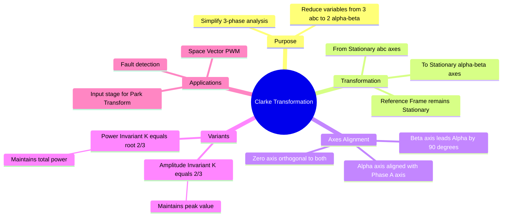

---
tags:
  - electrical-machines
  - power-electronics
  - control-system
  - electric-drives
  - gate
  - mathematics
created: 2026-07-23T21:00:09
aliases:
  - Alpha-Beta Transformation
  - Stationary Reference Frame Transformation
  - 3-phase to 2-phase Transformation
subject: "[[Electrical Machines]]"
parent: "[[Vector Control of Drives]]"
modified: 2026-07-23T21:00:09
---
### Clarke Transformation
#electric-drives/transformations #mathematics/linear-algebra

> The **Clarke Transformation** converts time-domain balanced three-phase quantities ($abc$) into two-phase stationary orthogonal quantities ($\alpha\beta$). Unlike the Park transformation, the Clarke reference frame is **stationary** (it does not rotate with the rotor). It is the first step in Vector Control (FOC) and is widely used in Space Vector PWM.

---
#### 1. Geometric Concept
#transformations/geometry

Consider three axes $a, b, c$ separated by $120^\circ$ in a plane. We want to project these onto two orthogonal axes $\alpha$ and $\beta$.
*   **$\alpha$-axis:** Aligned with the **$a$-phase** axis.
*   **$\beta$-axis:** Orthogonal ($90^\circ$ leading) to the $\alpha$-axis.

Any space vector $\vec{F}$ can be represented as:
$$\vec{F} = f_a + f_b e^{j2\pi/3} + f_c e^{-j2\pi/3} = f_\alpha + j f_\beta$$

#### 2. The Transformation Matrix (Forward)
#formulas/matrices

To convert instantaneous phase quantities ($f_a, f_b, f_c$) to stationary frame quantities ($f_\alpha, f_\beta, f_0$):

$$\boxed{\quad \begin{bmatrix} f_\alpha \\ f_\beta \\ f_0 \end{bmatrix} = K \begin{bmatrix} 1 & -\frac{1}{2} & -\frac{1}{2} \\ 0 & \frac{\sqrt{3}}{2} & -\frac{\sqrt{3}}{2} \\ \frac{1}{2} & \frac{1}{2} & \frac{1}{2} \end{bmatrix} \begin{bmatrix} f_a \\ f_b \\ f_c \end{bmatrix} \quad}$$

**The Scaling Factor ($K$):**
There are two conventions used in textbooks and exams. You must identify which one is required (usually Amplitude Invariant for Drives/Control).

**A. Amplitude Invariant Form ($K = \frac{2}{3}$):**
Used in control systems so that the magnitude of the $\alpha\beta$ vector equals the magnitude of the phase peak values.
*   $f_\alpha = \frac{2}{3}(f_a - \frac{1}{2}f_b - \frac{1}{2}f_c)$
*   $f_\beta = \frac{2}{3}(\frac{\sqrt{3}}{2}f_b - \frac{\sqrt{3}}{2}f_c) = \frac{1}{\sqrt{3}}(f_b - f_c)$
*   **Simplification:** If the system is balanced ($f_a + f_b + f_c = 0$), then:
    $$\boxed{\quad f_\alpha = f_a \quad}$$
    $$\boxed{\quad f_\beta = \frac{1}{\sqrt{3}}(f_a + 2f_b) \quad}$$

**B. Power Invariant Form ($K = \sqrt{\frac{2}{3}}$):**
Used so that the total power calculation is identical in both systems ($P_{abc} = P_{\alpha\beta}$).
*   $P = v_a i_a + v_b i_b + v_c i_c = v_\alpha i_\alpha + v_\beta i_\beta + v_0 i_0$.
*   If using Amplitude Invariant ($K=2/3$), then $P = \frac{3}{2} (v_\alpha i_\alpha + v_\beta i_\beta)$.

#### 3. Inverse Clarke Transformation
#transformations/inverse

To convert back from $\alpha\beta0$ to $abc$:

$$\boxed{\quad \begin{bmatrix} f_a \\ f_b \\ f_c \end{bmatrix} = \begin{bmatrix} 1 & 0 & 1 \\ -\frac{1}{2} & \frac{\sqrt{3}}{2} & 1 \\ -\frac{1}{2} & -\frac{\sqrt{3}}{2} & 1 \end{bmatrix} \begin{bmatrix} f_\alpha \\ f_\beta \\ f_0 \end{bmatrix} \quad}$$
*(Note: This inverse matrix assumes the Amplitude Invariant form was used).*

#### 4. Comparison with Other Transforms

| Feature | Clarke ($\alpha\beta$) | Park ($dq$) | Symmetrical Components (+-0) |
| :--- | :--- | :--- | :--- |
| **Input** | Instantaneous ($abc$) | Instantaneous ($abc$) | Phasors (Complex) |
| **Output** | Stationary Orthogonal | **Rotating** Orthogonal | Counter-rotating Phasors |
| **DC/AC** | Output is **AC** (Sinusoidal) | Output is **DC** (Constant) | Output is Phasors |
| **Usage** | SVPWM, Pre-Park step | FOC, Grid Synchronization | Fault Analysis |

---
### Related Concepts
#topic/related-concepts

> [[Park Transformation]] (The next step: Rotating Reference Frame)

[[Space Vector PWM (SVPWM)]] (Uses $\alpha\beta$ directly)
[[Concept of Symmetrical Components]] (Similar mathematical structure but for phasors)
[[Vector Control of Drives]]
[[Matrix Operations|Matrices]]
