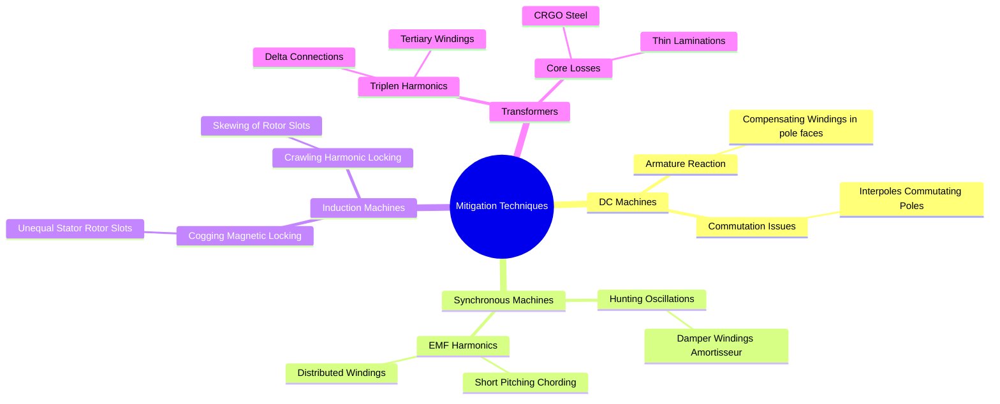

---
tags:
  - electrical-machines
  - design
  - gate
  - troubleshooting
created: 2026-07-22T17:43:34
aliases:
  - Machine Mitigation Strategies
  - Compensating Windings and Interpoles
  - Damper Windings
  - Skewing and Chording
subject: "[[Electrical Machines]]"
parent:
  - "[[Electrical Machines]]"
modified: 2026-07-22T17:43:34
---
### Mitigation Techniques in Electrical Machines
#electrical-machines/design #troubleshooting

> ==Electrical machines suffer from various non-ideal phenomena such as armature reaction, harmonic generation, magnetic locking, and mechanical oscillations.== **Mitigation Techniques** are specific design modifications (structural or winding arrangements) implemented to counteract these undesirable effects, ensuring smooth, efficient, and stable operation.

---

#### 1. DC Machines: Armature Reaction & Commutation
#dc-machines/armature-reaction #dc-machines/commutation

> See [[Armature Reaction]] in *DC Machines*
> & [[Commutation and Methods of Improvement]] in *DC Machines*

The flow of armature current creates an armature flux that distorts (cross-magnetizes) and weakens (demagnetizes) the main field flux, causing sparking at the brushes.

1.  **Compensating Windings:**
    *   **Purpose:** Neutralizes cross-magnetizing armature reaction **under the pole faces** to prevent flux distortion and flashover under heavy load/transient conditions.
    *   **Implementation:** Copper bars embedded in slots punched into the main pole shoes.
    *   **Connection:** Connected in **series with the armature** so its MMF is equal and opposite to the armature MMF.
2.  **Interpoles (Commutating Poles / Compoles):**
    *   **Purpose:** Improves commutation (reduces sparking) by neutralizing cross-magnetization **in the interpolar region** (commutating zone) and generating a rotational EMF (reversal EMF) to cancel the reactance voltage $L(di/dt)$ of the commutating coil.
    *   **Implementation:** Narrow poles placed exactly midway between main poles.
    *   **Connection:** Connected in **series with the armature**. Their polarity must be the same as the *next main pole ahead* in the direction of rotation (for a generator).
3.  **Laminated Pole Shoes:**
    *   **Purpose:** Reduces eddy current losses in the pole shoes caused by flux pulsations due to armature slot openings sweeping past them.

---
#### 2. Synchronous Machines: Hunting & Harmonics
#synchronous-machine/hunting #synchronous-machine/harmonics

> See [[Hunting in Synchronous Machines#Causes of Hunting|Hunting in Synchronous Machines]]
> & [[Hunting in Synchronous Machines#Damper Windings (Amortisseur Windings) - The Remedy|Damper Windings in Synchronous Machines]]

Synchronous machines must maintain a rigid synchronous speed, but load transients can cause rotor oscillations, and slot geometries can inject harmonics into the generated AC voltage.

1.  **Damper Windings (Amortisseur Windings):**
    *   **Purpose 1 (Generators):** Suppresses **Hunting** (rotor oscillations following a disturbance). If the rotor speed deviates from synchronous speed ($N_s$), slip is created, inducing currents in the damper winding. By Lenz's law, this creates a damping torque opposing the change in speed.
    *   **Purpose 2 (Motors):** Provides **Starting Torque**. Synchronous motors are not self-starting. Damper windings act like an induction motor's squirrel cage to accelerate the rotor close to $N_s$ before DC excitation pulls it into synchronism.
    *   **Implementation:** Short-circuited heavy copper bars embedded in the rotor pole faces.
2.  **Short-Pitched Coils (Chording):**
    *   **Purpose:** Eliminates specific space harmonics in the generated EMF wave to make it more purely sinusoidal.
    *   **Implementation:** Coil span is made less than a full pole pitch ($180^\circ$ electrical).
    *   **Formula:** To eliminate the $n^{th}$ harmonic, the coil is short-pitched by angle $\alpha$ where:
        $$\boxed{\quad \alpha = \frac{180^\circ}{n} \quad}$$
        *(e.g., To eliminate 5th harmonic, $\alpha = 36^\circ$ or $1/5$th of pole pitch).*
3.  **Distributed Windings:**
    *   **Purpose:** Distributes the MMF wave more sinusoidally across the air gap, further reducing harmonics and improving cooling, compared to concentrated windings.

---
#### 3. Induction Machines: Cogging & Crawling
#induction-machine/harmonics

> See [[Cogging and Crawling Phenomena]] in *Three-Phase Induction Motors*

Induction motors are susceptible to parasitic torques caused by space harmonics (due to slot geometries and non-sinusoidal MMFs).

1.  **Mitigating Cogging (Magnetic Locking):**
    *   **Problem:** If the number of stator slots ($S_1$) equals the number of rotor slots ($S_2$), or shares a common harmonic integer, the reluctance paths align perfectly, causing the rotor to lock magnetically with the stator at zero speed.
    *   **Solution:** Ensure $S_1 \neq S_2$. Specifically, avoid relationships like $S_1 - S_2 = \pm P, \pm 2P, \dots$
2.  **Skewing of Rotor Slots:**
    *   **Purpose 1:** Eliminates **Cogging**.
    *   **Purpose 2:** Reduces **Crawling** (the tendency to lock onto the 7th space harmonic and run stably at $1/7^{th}$ synchronous speed).
    *   **Purpose 3:** Reduces magnetic noise and hum.
    *   **Implementation:** Rotor slots are not made parallel to the shaft but are given a slight twist (skew angle).
    *   *Trade-off:* Increases leakage reactance, slightly reducing starting torque and breakdown torque.

---
#### 4. Transformers: Harmonics & Transients
#transformer/harmonics #transformer/construction

> See [[Harmonics in Transformers]]

1.  **Tertiary Windings & Delta Connections:**
    *   **Purpose:** To mitigate **3rd Harmonic** (Triplen) currents and voltages. In a star-star ($Y-Y$) transformer, unbalanced loads cause the neutral to oscillate due to 3rd harmonics.
    *   **Implementation:** A Delta ($\Delta$) connection provides a closed-loop path for triplen harmonic currents to circulate, preventing them from appearing in the line voltages. If $Y-Y$ must be used, a Delta-connected **Tertiary Winding** is added specifically to trap these harmonics.
2.  **CRGO Steel & Thin Laminations:**
    *   **Purpose:** Mitigates **Core Losses**. Cold-Rolled Grain-Oriented (CRGO) steel minimizes hysteresis loss, while thin varnish-coated laminations minimize eddy current loss.

---
### Related Concepts
#topic/related-concepts

> [[Armature Reaction|Armature Reaction in DC Machines]]

[[Hunting in Synchronous Machines]] (Hunting and Damper Windings)
[[Cogging and Crawling Phenomena]] (Three-Phase Induction Motor)
[[Armature Winding Factors in Synchronous Machines]] (Pitch Factor and Distribution Factor - Mathematical representation of chording/distribution)
[[Harmonics in Transformers]]
[[Constructional Features of Transformers]]
